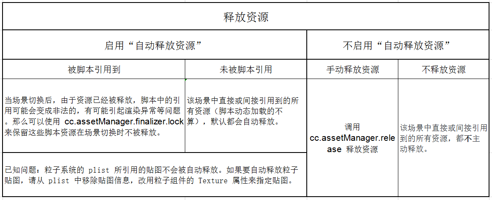

# 创建和管理场景

## 创建场景

方法一：选择主菜单 **文件 -> 新建场景**

方法二：在 **资源管理器** 中点击创建菜单，创建新场景。

## 保存场景

方法一：使用快捷键 `Ctrl + S` (Windows) 或 `Command + S` (Mac)

方法二：选择主菜单 **文件 -> 保存场景**

## 切换场景

在 **资源管理器** 中，双击需要打开的场景。

## 修改场景资源自动释放策略

如果项目中的场景很多，随着新场景的切换，内存占用就会不断上升。除了使用 `cc.assetManager.releaseAsset` 等 API 来精确释放不使用的资源，我们还可以使用场景的自动释放功能。 
要配置自动释放，可以在 **资源管理器** 中选中所需场景，然后在 **属性检查器** 中设置 **自动释放资源** 选项，该项默认开启。

从当前场景切换到下一个场景时，如果当前场景不自动释放资源，则该场景中直接或间接引用到的所有资源（脚本动态加载的不算），**默认** 都不主动释放。反之如果启用了自动释放，则这些引用到的资源 **默认** 都会自动释放。

> 已知问题：粒子系统的 plist 所引用的贴图不会被自动释放。如果要自动释放粒子贴图，请从 plist 中移除贴图信息，改用粒子组件的 Texture 属性来指定贴图。

### 防止特定资源被自动释放

启用了某个场景的资源自动释放后，如果在脚本中保存了对该场景的资源的“特殊引用”，则当场景切换后，由于资源已经被释放，这些引用可能会变成非法的，有可能引起渲染异常等问题。为了让这部分资源在场景切换时不被释放，我们可以使用 [Asset.addRef](../../../api/zh/classes/Asset.html#addref) 增加引用计数来锁住这些资源。

> “特殊引用”指的是以全局变量、单例、闭包、“动态资源”等形式进行的引用。“动态资源”指的是在脚本中动态创建或动态修改的资源。

以上关于场景资源自动释放部分的内容可以归纳为下图中的几种情况：

关于资源释放，详细请查看 [资源释放](../asset-manager/release-manager.md)。

## 修改场景加载策略

在 **资源管理器** 中，选中指定场景，可以在 **属性检查器** 中看到 **延迟加载资源** 选项，该项默认关闭。

### 不延迟加载资源

加载场景时，如果这个选项关闭，则这个场景直接或间接递归依赖的所有资源都将被加载，全部加载完成后才会触发场景切换。

### 延迟加载依赖的资源

加载场景时，如果选项开启，则这个场景直接或间接依赖的所有贴图、粒子和声音都将被延迟到场景切换后才加载，使场景切换速度极大提升。 
同时，玩家进入场景后可能会看到一些资源陆续显示出来，并且激活新界面时也可能会看到界面中的元素陆续显示出来，因此这种加载方式更适合网页游戏。 
使用这种加载方式后，为了能在场景中更快地显示需要的资源，建议一开始就让场景中暂时不需要显示的渲染组件（如 Sprite）保持非激活状态。

> **注意**：Spine 和 TiledMap 依赖的资源永远都不会被延迟加载。
