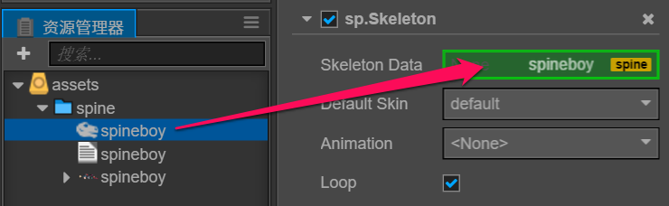

# 骨骼动画资源（Spine）

骨骼动画资源是由 [Spine®](http://zh.esotericsoftware.com/) 所导出的数据格式。

## 导入骨骼动画资源

  骨骼动画所需资源有：

- .json 骨骼数据
- .png  图集纹理
- .txt/.atlas  图集数据

## 创建骨骼动画资源

   第一种方式：从 **资源管理器** 里将骨骼动画资源拖动到层级管理器中:

   第二种方式：从 **资源管理器** 里将骨骼动画资源拖动到场景中:

   第三种方式：从 **资源管理器** 里将骨骼动画资源拖动到已创建 Spine 组件中 Skeleton Data 属性中：

