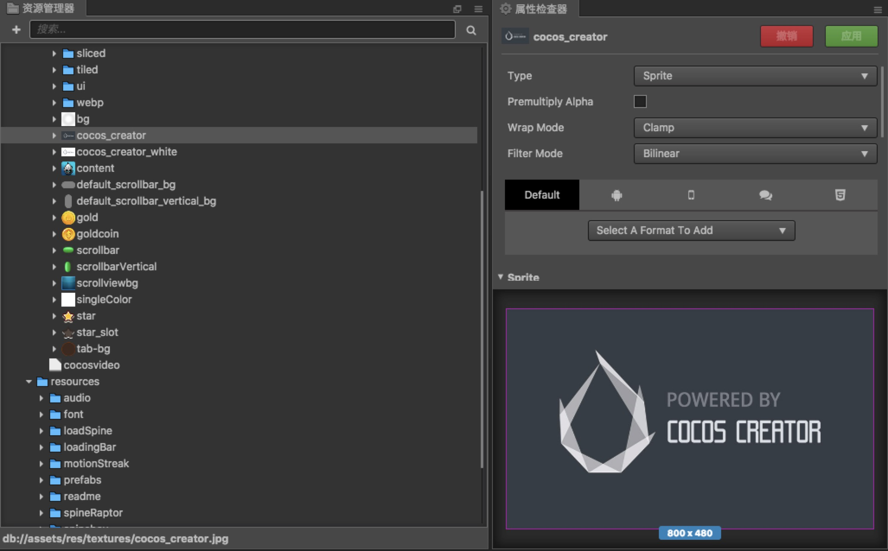

# 图像资源（Texture）

图像资源又经常被称作贴图、图片，是游戏中绝大部分图像渲染的数据源。图像资源一般由图像处理软件（比如 Photoshop，Windows 上自带的画图）制作而成并输出成 Cocos Creator 可以使用的文件格式，目前包括 **JPG** 和 **PNG** 两种。

## 导入图像资源

使用默认的资源导入方式就可以将图像资源导入到项目中，之后我们就可以在 **资源管理器** 中看到如下图所示的图像资源。

图像资源在 **资源管理器** 中会以自身图片的缩略图作为图标。在 **资源管理器** 中选中图像资源后，**属性检查器** 下方会显示该图片的缩略图。目前图像资源的属性设置功能还没有完善，请不要在 **属性检查器** 手动修改图像资源的属性设置。

## Texture 和 SpriteFrame 资源类型

在 **资源管理器** 中，图像资源的左边会显示一个和文件夹类似的三角图标，点击就可以展开看到它的子资源（sub asset），每个图像资源导入后编辑器会自动在它下面创建同名的 SpriteFrame 资源。

SpriteFrame 是核心渲染组件 **Sprite** 所使用的资源，设置或替换 **Sprite** 组件中的 `spriteFrame` 属性，就可以切换显示的图像。**Sprite** 组件的设置方式请参考[Sprite 组件参考](../components/sprite.md)。

为什么会有 SpriteFrame 这种资源？这样的设置是因为除了每个文件产生一个 SpriteFrame 的图像资源（Texture）之外，我们还有包含多个 SpriteFrame 的图集资源（Atlas）类型。参考[图集资源（Atlas）文档](atlas.md)来了解更多信息。

下面是 Texture 和 SpriteFrame 的 API 接口文档：

- [Texture 资源类型](http://www.cocos.com/docs/creator/api/classes/Texture2D.html)
- [SpriteFrame 资源类型](http://www.cocos.com/docs/creator/api/classes/SpriteFrame.html)

## 使用 SpriteFrame

直接将 SpriteFrame 或图像资源从 **资源管理器** 中拖拽到 **层级管理器** 或 **场景编辑器** 中，就可以直接用所选的图像在场景中创建 **Sprite** 节点。

之后可以拖拽其他的 SpriteFrame 或图像资源到该 **Sprite** 组件的 `Sprite Frame` 属性栏中，来切换该 Sprite 显示的图像。

在 **动画编辑器** 中也可以拖拽 SpriteFrame 资源到已创建好的 Sprite Frame 动画轨道上，详见[编辑序列帧动画](../animation/sprite-animation.md)文档。

### 性能优化注意事项

使用单独存在的 Texture 作为 Sprite 资源，在预览和发布游戏时，将无法对这些 Sprite 进行批量渲染优化的操作。目前编辑器不支持转换原有的单张 Texture 引用到 Atlas 里的 SpriteFrame 引用，所以在开发正式项目时，应该尽早把需要使用的图片合成 Atlas（图集），并通过 Atlas 里的 SpriteFrame 引用使用。详情请继续阅读下一篇。