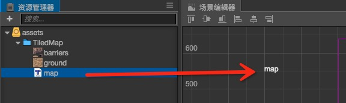

# 瓦片图资源（TiledMap）

瓦片图资源是由 [TiledMap](https://www.mapeditor.org/) 所导出的数据格式（Creator v2.1 及以下支持 TiledMap v1.0.0，Creator v2.2.0 及以上支持 TiledMap v1.2.0）。

## 导入地图资源

地图所需资源有：

- .tmx 地图数据
- .png 图集纹理
- .tsx tileset 数据配置文件（部分 tmx 文件需要）

## 创建瓦片图资源

   第一种方式：从 **资源管理器** 里将地图资源拖动到层级管理器中:

 

   第二种方式：从 **资源管理器** 里将地图资源拖动到场景中:

   第三种方式：从 **资源管理器** 里将地图资源拖动到已创建 TiledMap 组件的 Tmx File 属性中：

## 在项目中的存放

为了提高资源管理效率，建议将导入的 `tmx`、`tsx` 和 `png` 文件存放在单独的目录下，不要和其他资源混在一起。
