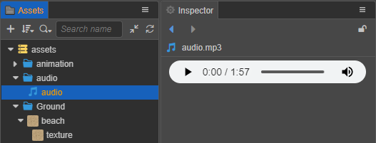

# 音频资源（AudioClip）

Cocos Creator 支持导入大多数常见的音频文件格式，将其直接拖拽到 **资源管理器** 面板即可，导入后会在 **资源管理器** 中生成相应的音频资源（AudioClip）。

我们根据音频的长短将其分为长度较长的 **音乐** 和长度短的 **音效**，Creator 通过 AudioSource 组件控制播放不同的音频资源来实现游戏内的背景音乐和音效。详情请参考 [AudioSource 组件参考](../audio-system/audiosource.md)。

## 支持的音频资源的格式

目前 Cocos Creator 支持导入以下格式的音频文件：

| 音频格式 | 说明 |
| :------ | :-- |
| `.ogg` | `.ogg` 是一种开源的有损音频压缩格式，与同类型的音频压缩格式相比，优点在于支持多声道编码，采用更加先进的声学模型来减少损失音质，同时文件大小在相同条件下比 `.mp3` 格式小。目前 Android 系统所有的内置铃声也都使用 `.ogg` 文件。      |
| `.mp3` | `.mp3` 是最常见的一种数字音频编码和有损压缩格式。通过舍弃 PCM 音频资料中对人类听觉不重要的部分，达到压缩成较小文件的目的。但对于大多数用户的听觉感受来说，压缩后的音质与压缩前的相比并没有明显的下降。MP3 被大量软硬件支持，应用广泛，是目前的主流。            |
| `.wav` | `.wav` 是微软与 IBM 公司专门为 Windows 开发的一种标准数字音频文件，该文件能记录各种单声道或立体声的声音信息，并能保证声音不失真，因为音频格式未经过压缩。但文件占用相对较大。 |
| `.mp4` | `.mp4` 是一套用于音频、视频信息的压缩编码标准，对于不同的对象可采用不同的编码算法，从而进一步提高压缩效率。   |
| `.m4a` | `.m4a` 是仅有音频的 MP4 文件。音频质量是压缩格式中非常高的，同时在相同的比特率下，文件占用更小。  |

采用不同的音频编码格式，在相同的条件下，生成的音频文件大小和音质都各有不同。
