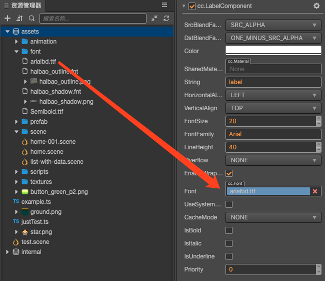

# 字体资源

使用 Cocos Creator 制作的游戏中可以使用三类字体资源：系统字体，动态字体和位图字体。

其中系统字体是通过调用游戏运行平台自带的系统字体来渲染文字，不需要用户在项目中添加任何相关资源。要使用系统字体，请使用 [Label组件](../ui-system/components/label.md) 中的 **Use System Font** 属性。

## 导入字体资源

### 动态字体

目前 Cocos Creator 支持 **TTF** 格式的动态字体。只要将扩展名为 **TTF** 的字体文件拖拽到 **资源管理器** 中，即可完成字体资源的导入。

### 位图字体

位图字体由 **fnt** 格式的字体文件和一张 **png** 图片组成，fnt 文件提供了对每一个字符小图的索引。这种格式的字体可以由专门的软件生成，请参考：

- [Glyph Designer](https://71squared.com/glyphdesigner)
- [Hiero](https://github.com/libgdx/libgdx/wiki/Hiero)
- [BMFont (Windows)](http://www.angelcode.com/products/bmfont/)

在导入位图字体时，请务必将 fnt 文件和 png 文件同时拖拽到 **资源管理器** 中。

**请注意，在导入位图字体之后，需要将 png 文件的类型更改为 sprite-frame，否则位图字体将无法正常使用。**

导入后的字体在 **资源管理器** 中显示如下：

**注意** 为了提高资源管理效率，建议将导入的 `fnt` 和 `png` 文件存放在单独的目录下，不要和其他资源混在一起。

## 使用字体资源

字体资源需要通过 Label 组件来渲染，下面是在场景中创建带有 Label 组件的节点的方法。

### 使用菜单创建 Label（字体）节点

在 **层级管理器** 中点击左上角的 **创建节点** 按钮，并选择 `创建渲染节点/Label（文字）`，就会在场景中创建出一个带有 **Label** 组件的节点。

您也可以通过主菜单的 `节点/创建渲染节点/Label（文字）` 来完成创建，效果和上面的方法一样。

### 关联字体资源

使用上面方法创建的字体组件默认使用系统字体作为关联的资源，如果想要使用导入到项目中的 TTF 或位图字体，可以将您的字体资源拖拽到创建的 **Label** 组件中的 `Font` 属性栏中。

这时场景中的字体会立刻用刚才指定的字体资源进行渲染。您也可以根据项目需要，自由的切换同一个 **Label** 组件的 `Font` 属性，来使用 TTF 或位图字体。切换字体文件时，Label 组件的其他属性不受影响。

如果要恢复使用系统字体，可以点击 `Use System Font` 的属性复选框，来清除 `Font` 属性中指定的字体文件。

### 拖拽创建 Label（字体）节点

另外一种快捷使用指定资源创建字体节点的方法，是直接从 **资源管理器** 中拖拽字体文件（TTF 或位图字体都可以）到 **层级管理器** 中。和上面用菜单创建的唯一区别，是使用拖拽方式创建的文字节点会自动使用拖拽的字体资源来设置 **Label** 组件的 `Font` 属性。

<!-- ## 位图字体合并渲染

如果位图字体使用的贴图和其他 Sprite 使用的贴图是同一张，而且位图字体和 Sprite 之间没有插入使用其他贴图的渲染对象时，位图字体就可以和 Sprite 合并渲染批次。在放置位图字体资源时，请把 `.fnt` 文件、`.png` 文件和 Sprite 所使用的贴图文件放在一个文件夹下，然后参考 [自动图集工作流程](auto-atlas.md) 将位图字体的贴图和 Sprite 使用的贴图打包成一个图集，即可在原生和 WebGL 渲染环境下自动享受位图字体合并渲染的性能提升。 -->

<!-- 详情请参考 [BMFont 与 UI 合图自动批处理](../advanced-topics/ui-auto-batch.md)。 -->
