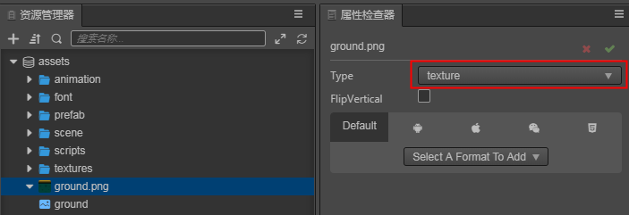

# 图像资源

图像资源又经常被称作贴图、图片，是游戏中绝大部分图像渲染的数据源。图像资源一般由图像处理软件（比如 Photoshop，Windows 上自带的画图）制作而成并输出成 Cocos Creator 可以使用的文件格式，目前支持 JPG、PNG、BMP、TGA、HDR 格式。

## 导入图像资源

使用默认的资源导入方式就可以将图像资源导入到项目中，之后我们就可以在 **资源管理器** 中看到如下图所示的图像资源。

## 图像资源的类型

选中导入的图像资源，在右侧的属性检查器面板上，可以选择图像资源不同的使用方式，目前共有 4 种使用方式供开发者使用，如下所示：

各类型图像资源的详情在下面的章节中有详细介绍：
- raw 类型为原始图片类型，无作用，用户不需使用
- texture 类型为图像资源类型，也为导入的默认类型，详情可参考 [Texture](texture.md)
- normal map 类型为法线贴图类型
- sprite-frame 类型为精灵帧资源，用于 UI 制作上，详情可参考 [SpriteFrame](sprite-frame.md)
- texture cube 类型为立方贴图类型，使用在全景图上，用于制作天空盒上，详情可参考 [天空盒](../concepts/scene/skybox.md#修改天空盒的环境贴图)

在 **资源管理器** 中，图像资源的左边会显示一个和文件夹类似的三角图标，点击就可以展开看到它的子资源（sub asset），每个图像资源导入后编辑器会自动在它下面创建同名的 **选中类型** 的资源。选中资源本身可进行更改资源类型、设置图像翻转及设置图像在各平台的质量的操作。子资源的详细属性说明请参考 [子资源属性面板](texture.md#)。

