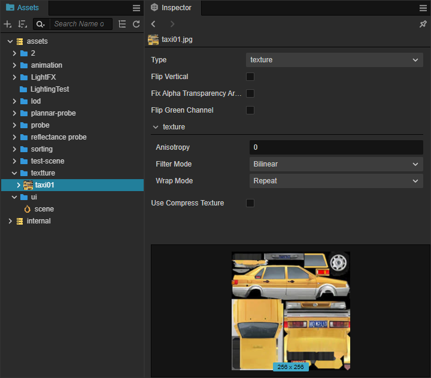
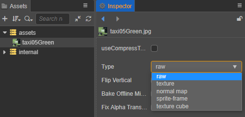
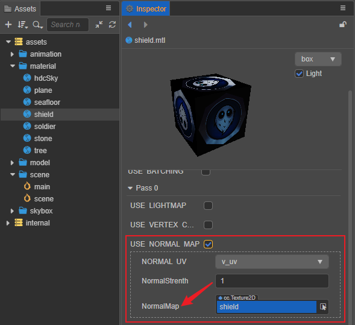
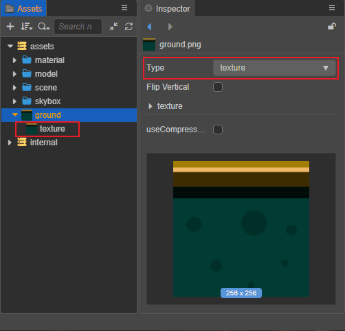

# 图像资源

图像资源又经常被称作贴图、图片，是游戏中绝大部分图像渲染的数据源。图像资源一般由图像处理软件（比如 Photoshop，Windows 上自带的画图）制作而成并输出成 Cocos Creator 可以使用的文件格式，目前支持 **JPG**、**PNG**、**BMP** 格式。

## 导入图像资源

将图像资源直接拖拽到 **资源管理器** 即可将其导入到项目中，之后我们就可以在 **资源管理器** 中看到如下图所示的图像资源：

**属性检查器** 中图像资源的相关属性说明如下：

| 属性 | 说明 |
| :--- | :--- |
| Type | 用于设置图像资源的类型，包括 **raw**、**texture**（默认）、**normal map**、**sprite-frame**、**texture cube**，具体说明可参考下文 **图像资源类型** 部分的内容。 |
| Flip Vertical | 是否沿 X 轴垂直翻转导入的高度贴图。 |
| useComponentTexture | 是否使用压缩纹理，详情请参考 [压缩纹理](compress-texture.md)。 |

## 图像资源的类型

在 **资源管理器** 面板选中导入的图像资源，在 **属性检查器** 面板中便可根据需要设置图像资源的使用类型，目前支持以下几种：

- **raw**：原始图片类型，无作用，用户不需要关心。

- **texture**：图像资源类型，也是导入的图像资源的默认类型，详情可参考 [纹理贴图资源](texture.md)。

- **normal map**：法线贴图类型，常用于渲染 3D 模型，可在模型材质中勾选 `USE NORMAL MAP` 属性使用。需要注意的是，如果材质中没有定义 `USE NORMAL MAP` 的话就没有该项。

  

- **sprite-frame**：精灵帧资源，用于 UI 制作上，详情可参考 [SpriteFrame](sprite-frame.md)。

- **texture cube**：立方贴图类型，使用在全景图上，常用于制作天空盒。详情可参考 [立方体贴图](texture-cube.md)。

## 子资源

每个图像资源导入后或者设置图像资源类型后，编辑器便会自动在其下方创建相应类型的子资源。在 **资源管理器** 中点击图像资源左侧的三角图标，即可展开查看图像资源的子资源。

下图以 texture 类型的图像资源为例：

子资源的详细属性说明请参考对应资源类型的文档说明。**normal map** 的子资源属性与 **texture** 一致，可参考 [纹理贴图资源](texture.md)
