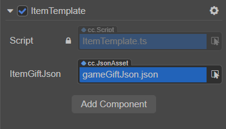

# JSON 资源

Creator 支持使用 Json 文件，通过 [资源导入](./asset-workflow.md#%E5%AF%BC%E5%85%A5%E8%B5%84%E6%BA%90) 的方式将其导入到编辑器，所有的 JSON 文件都会导入为 `cc.JsonAsset` 格式的资源。

## 使用方式

开发者可通过 **编辑器挂载** 和 **代码中动态加载** 两种方式获取 Json 数据。

### 通过编辑器

首先在 **资源管理器** 中新建一个 TypeScript，脚本内容示例如下：

```ts

import { _decorator, Component, JsonAsset } from 'cc';
const { ccclass, property } = _decorator;

@ccclass('ItemTemplate')
export class ItemTemplate extends Component {

    // 声明属性 ‘itemGiftJson‘ 的类型为 JsonAsset
    @property(JsonAsset)
    itemGiftJson: JsonAsset = null!;

    start () {

        // 获取到 Json 数据
        const jsonData: object = this.itemGiftJson.json!;

    }
}

```

保存脚本内容后回到编辑器，将脚本挂载到相应的节点上，然后将 **资源管理器** 中的 Json 资源拖拽到脚本组件相应的属性框中。例如下图：


### 通过代码动态加载

开发者也可以直接通过代码 [动态加载](./dynamic-load-resources.md#%E5%8A%A8%E6%80%81%E5%8A%A0%E8%BD%BD-resources) 来获取 Json 数据，代码示例如下：

```ts
import { _decorator, Component, JsonAsset, resources, error } from 'cc';
const { ccclass, property } = _decorator;

@ccclass('ItemTemplate')
export class ItemTemplate extends Component {

    start () {

        resources.load('gameGiftJson', (err: any, res: JsonAsset) => {
            if (err) {
                error(err.message || err);
                return;
            }
            // 获取到 Json 数据
            const jsonData: object = res.json!;

        })

    }
}
```
