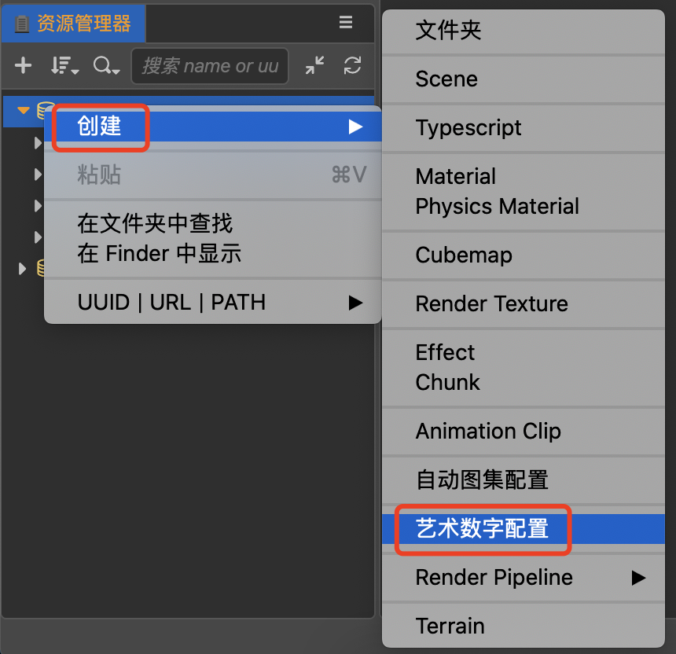
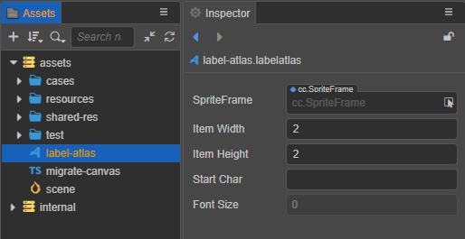
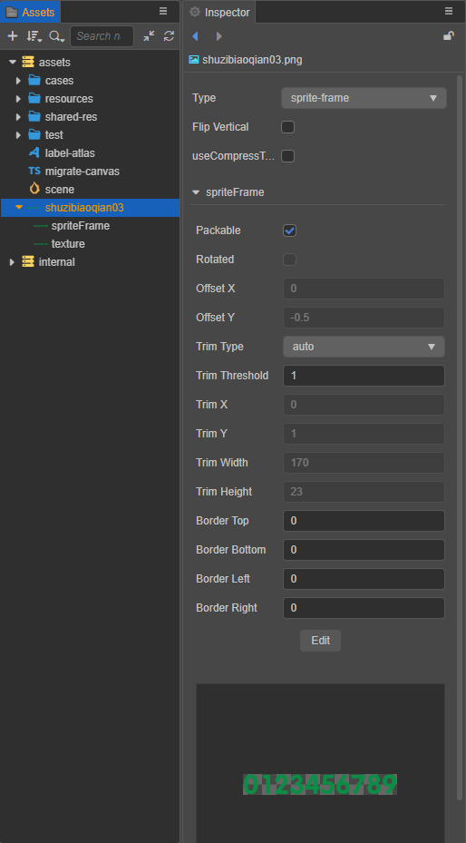
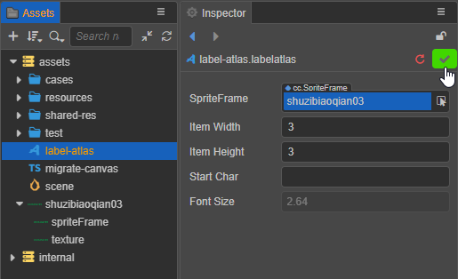

# 艺术数字资源 (LabelAtlas)

**艺术数字资源** 是一种用户自定义的资源，它可以用来配置艺术数字字体的属性。

## 创建艺术数字资源

在 **资源管理器** 中点击右键，然后选择 **创建 -> 艺术数字配置**，或者点击 **资源管理器** 左上角的加号按钮：

即可新建一个艺术数字资源：

## 属性

| 属性         | 功能说明
| :---------- | :----------
| SpriteFrame | 设置事先绘制好的包含所需字体样式的图片
| Item Width  | 指定每一个字符的宽度
| Item Height | 指定每一个字符的高度
| Start Char  | 指定艺术数字字体里面的第一个字符，如果字符是空格，也需要在这个属性里面输入空格字符
| Font Size   | 显示每个字符的大小，由 **Item Width** 和 **Item Height** 自动计算得出，不可编辑

**艺术数字资源** 在使用之前需要先配置包含所需字体样式的 SpriteFrame 贴图，如下图：

然后将其拖拽到 **艺术数字资源** 的 **SpriteFrame** 属性框中：

设置完成后请点击右上角的绿色打钩按钮保存。

## 使用艺术数字资源

使用艺术数字资源只需要在 **层级管理器** 中新建一个 Label 节点，然后在 **属性检查器** 中将新建好的艺术数字资源拖拽到节点 Label 组件的 Font 属性上即可。详情可参考 [Label 组件](../ui-system/components/editor/label.md)。
