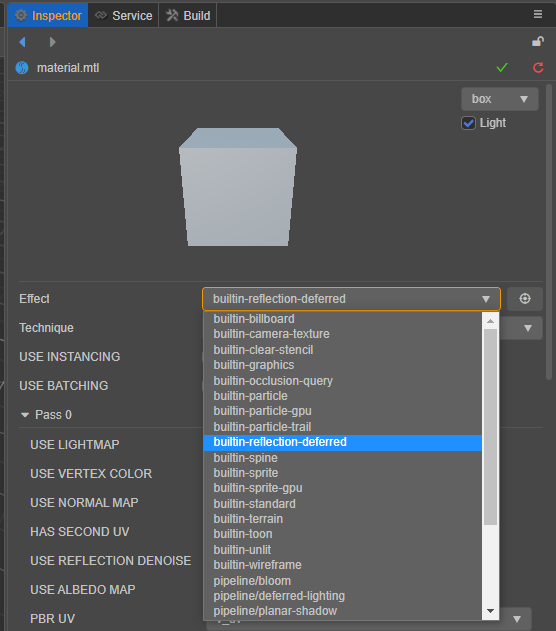

# 材质资源

## 材质创建

材质创建方式如下：

或

材质控制着每个模型最终的着色，材质由 Effect 构成，由材质操控 Effect 的着色流程。材质本身也可以看作是 Effect 资源的容器，材质可以任意切换当前要使用的 Effect 资源。下图就是我们创建的材质默认选择的 Effect 资源。

同时，我们还可以通过点击 Effect 属性右边的框要切换当前材质的 Effect。

## Effect 创建

Effect 的创建方式跟 Material 的创建方式类似。

创建出来的 Effect 默认是一个 PBR 的 Effect。

以上就是一个材质的创建流程，更多信息可以参考：[Effect 书写格式与语法](../shader/index.md)

## 使用材质

### 在 3D 模型中使用

通过 [网格/蒙皮网格/批量蒙皮网格渲染器组件](../module-map/mesh/) 上的 `Materials` 属性，我们可以指定当前 3D 模型所使用的材质。点击 `Materials` 属性框右侧的箭头图标按钮，可以看到当前项目中所有的材质资源，根据需要选择即可。或者也可以将所需的材质资源从 **资源管理器** 直接拖拽到 `Materials` 属性框中。

#### 导出模型资源中的材质

通常 [模型资源](../asset/model/mesh.md) 都是由第三方工具制作并导出，然后导入到 Creator 中使用的（支持 FBX 和 glTF 格式）。若模型资源文件中自带了材质资源，则导入后材质为 **只读** 状态，不可编辑。

若要编辑模型资源自带的材质，我们需要先将其提取到模型资源外。 在 **资源管理器** 中选中模型资源，然后在 **属性检查器** 的 **材质** 分页中勾选 **提取材质**，并设置 **材质提取目录**，最后点击右上角的绿色打钩按钮，即可将模型资源的材质提取到指定目录。详情请参考 [模型资源 - Material 模块](../asset/model/mesh.md)。

材质提取完成后，会自动和模型节点的网格渲染器组件中的 `Materials` 属性绑定。例如：

材质提取前：

材质提取后：

### 在 2D 以及 UI 渲染组件中使用

`UI` 和 `2D` 系统在默认情况下只支持一个单独的自定义材质。若留空则会使用引擎内置的标准材质。

若要进行自定义，在组件 **属性检查器上**，通过选择 `Custom Material` 的下拉框选择相应的材质。

### 在粒子系统中使用

粒子系统内通常有两个材质可选： 用于渲染粒子的 **粒子材质** 和用于渲染拖尾的的 **拖尾材质**，可以在 **属性查看器** 找到渲染器属性组下的 **粒子材质** 或 **拖尾材质** 修改即可。

详情可参考：[粒子发射器](../particle-system/index.md)

## 属性调整

下图所示的 **属性检查器** 内的可编辑属性都来自于着色器。如果想要自定义材质的 **属性查看器**，请查看 [着色器](../shader/index.md) 。

### 选择着色器

在属性检查器内的着色器下拉框中，可以选择当前引擎内置的着色器以及用户自定义着色器。

对于内置着色器的用法可查看：[内置着色器](../shader/effect-builtin.md)

### 更改预览材质的模型

在属性检查器的右上角可以选择下拉菜单选择不同的预览模型：

### 保存和重置（Reset）材质

在对材质进行修改后，属性检查器的右上角会出现保存和重置的按钮。

#### 保存材质

在修改材质后，点击右上角的绿色的勾可以将材质资源进行保存。

>注意：一旦保存，则不能再重置。

#### 重置（Reset）材质

若对修改不满意，则可以点击红色按钮进行重置。

重置会将材质的属性重置到上一次保存的状态。

>注意：未保存的修改会丢失。

