# 材质资源

## 材质创建

通过在 **资源管理器 -> assets** 内点击右键可创建材质：

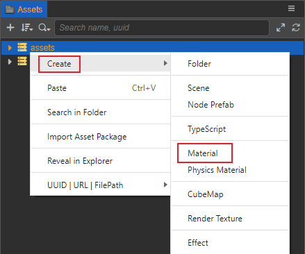

或点击 **资源管理器** 左上角的 `+` 号按钮也可以创建材质：

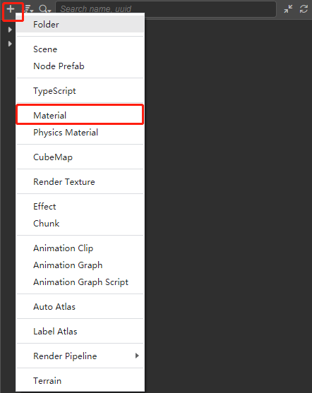

此时便会在 **资源管理器** 中创建一个默认名为 `material` 的材质资源：

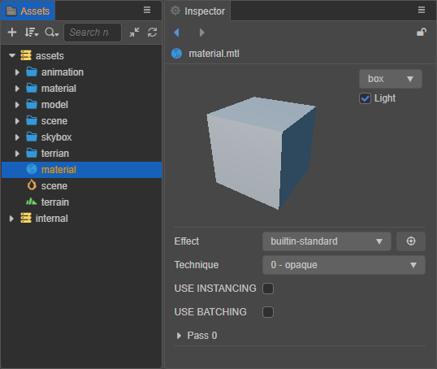

材质控制着每个模型最终的着色，材质由着色器构成，通过材质和着色器控制最终的着色流程。默认创建时，材质会使用引擎内置的 [标准着色器](../shader/effect-builtin-pbr.md)。

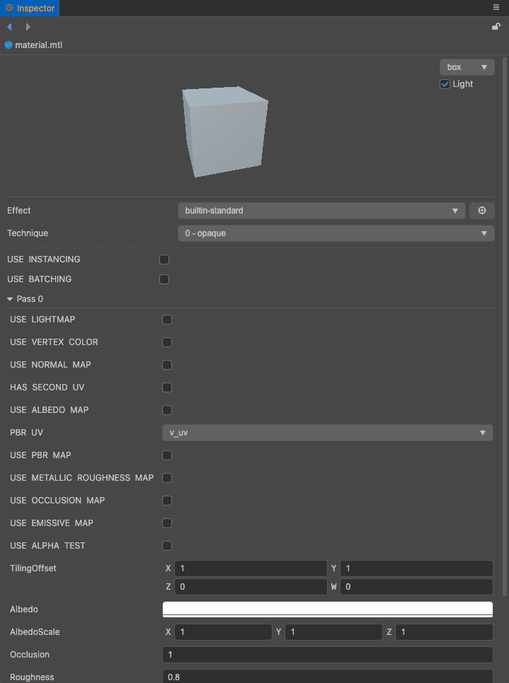

同时，还可以通过在材质的 **属性查看器** 上点击 Effect 右边的下拉框选择想要的着色器。

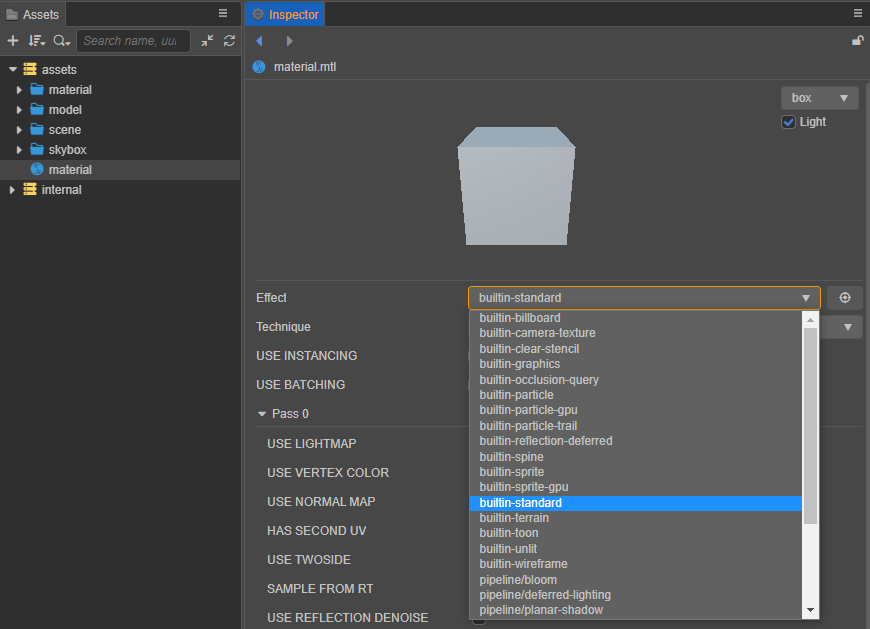

## 着色器创建

着色器的创建方式跟材质的创建方式类似。

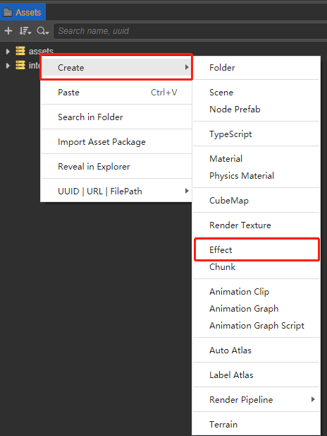

创建出来的 Effect 默认是一个 PBR 的 Effect。

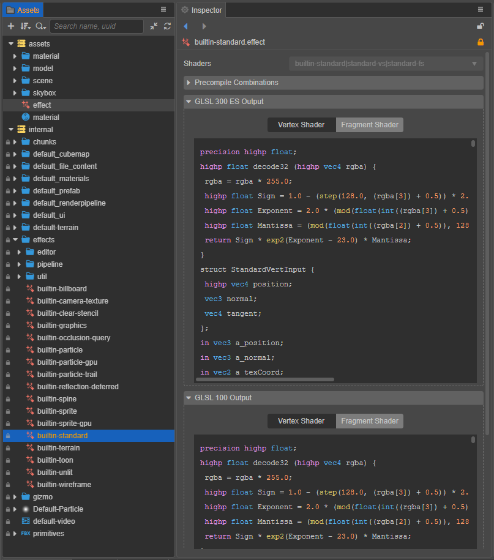

以上就是一个材质的创建流程，更多信息可以参考：[Effect 书写格式与语法](../shader/index.md)

## 材质资源属性

| 属性 | 说明 |
| :-- | :-- |
| Effect（着色器） | 当前材质所使用的着色器，默认使用的是内置 PBR 着色器 `builtin-standard.effect`。 点击 Effect 的下拉框，可以看到当前项目中所有的着色器，开发者可根据需要选择使用。当切换了着色器后其他属性也会同步更新，详情请参考 [着色器语法](../shader/effect-syntax.md)。 点击右侧的 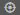 按钮，会在 **资源管理器** 中定位当前使用的着色器。 |
| Technique | Technique 下拉框会列出当前使用的着色器中所有的 Technique。一个着色器中可能会存在多个 Technique，每个 Technique 适用于不同的情况，例如效果差一点但是性能更好的 Technique 更适合用于手机平台。当切换了 Technique 后 Pass 列表也会同步更新。 |
| USE INSTANCING | 是否启用动态 Instancing。需要注意的是，Instancing 只应该在场景中有大量相同模型的实例时启用，适当合理地应用 Instancing 可以有不错的性能提升，但过度使用反而很可能会因为额外的开销维护导致性能下降 |
| USE BATCHING | 是否启用动态 VB 合并式合批。 |
| Pass | Pass 列表会列出当前使用的 Technique 中所有的 Pass（例如 Pass 0、Pass 1、Pass 2......）。 每个 Pass 可能会有不同的属性和定义，开发者可以分别设置这些属性和定义。如果属性是被定义包裹住的，需要先勾上定义才能看到对应的属性。详情请参考 [Pass 可选配置参数](../shader/pass-parameter-list.md) |

在 **属性检查器** 面板右上方还可以选择其他的模型以预览效果：

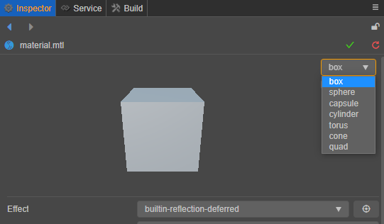

若修改了材质属性，面板右上角会出现  保存和  重置按钮。重置会将材质属性回退到上一次保存时的设置，而一旦点击保存后便无法再重置。

## 使用材质

一般情况下，3D 模型、2D 对象以及粒子系统都需要指定材质才可以正确渲染出物体表面的外观。

### 在 3D 模型中使用

通过 [网格/蒙皮网格/批量蒙皮网格渲染器组件](../module-map/mesh/) 上的 `Materials` 属性，我们可以指定当前 3D 模型所使用的材质。点击 `Materials` 属性框右侧的箭头图标按钮，可以看到当前项目中所有的材质资源，根据需要选择即可。或者也可以将所需的材质资源从 **资源管理器** 直接拖拽到 `Materials` 属性框中。

#### 导出模型资源中的材质

通常 [模型资源](../asset/model/mesh.md) 都是由第三方工具制作并导出，然后导入到 Creator 中使用的（支持 FBX 和 glTF 格式）。若模型资源文件中自带了材质资源，则导入后材质为 **只读** 状态，不可编辑。

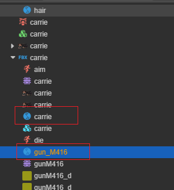

若要编辑模型资源自带的材质，我们需要先将其提取到模型资源外。 在 **资源管理器** 中选中模型资源，然后在 **属性检查器** 的 **材质** 分页中勾选 **提取材质**，并设置 **材质提取目录**，最后点击右上角的绿色打钩按钮，即可将模型资源的材质提取到指定目录。详情请参考 [模型资源 - Material 模块](../asset/model/mesh.md)。

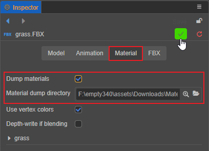

材质提取完成后，会自动和模型节点的网格渲染器组件中的 `Materials` 属性绑定。例如：

材质提取前：

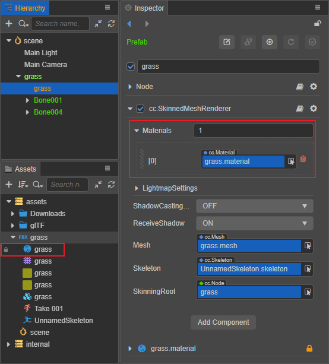

材质提取后：

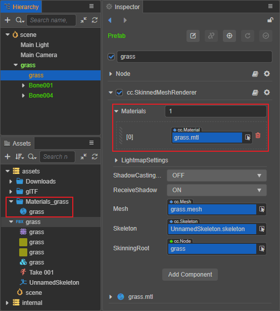

### 在 2D 以及 UI 渲染组件中使用

`UI` 和 `2D` 系统在默认情况下只支持一个单独的自定义材质。若留空则会使用引擎内置的标准材质。

若要进行自定义，在组件 **属性检查器上**，通过选择 `Custom Material` 的下拉框选择相应的材质。

### 在粒子系统中使用

粒子系统内通常有两个材质可选： 用于渲染粒子的 **粒子材质** 和用于渲染拖尾的的 **拖尾材质**，可以在 **属性查看器** 找到渲染器属性组下的 **粒子材质** 或 **拖尾材质** 修改即可。

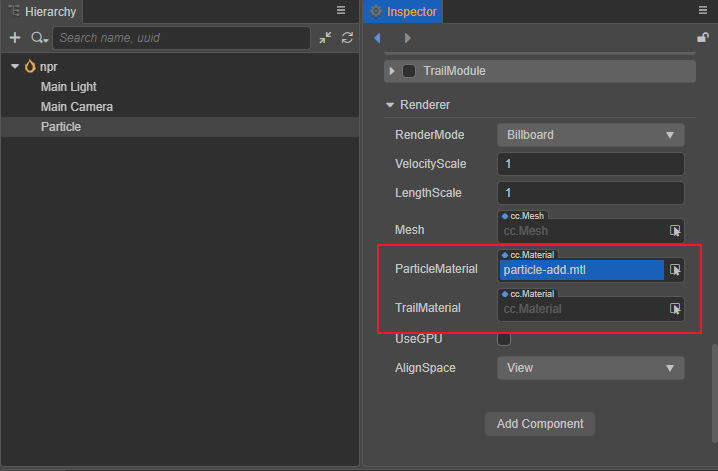

详情可参考：[粒子发射器](../particle-system/index.md)
