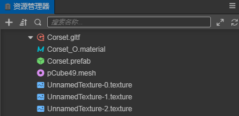
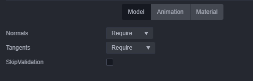
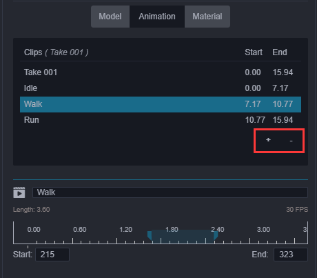

# 模型资源

目前，我们支持 **FBX** 和 **glTF** 两种格式的模型文件。关于如何从第三方工具导出这两种模型文件，请参考 [导入从 DCC 工具导出的模型](./dcc-export-mesh.md)。

## 模型导入

从外部导入编辑器中后，在 **资源管理器** 中可得到对应的模型资源文件，其目录结构如下：（以 glTF 文件为例，fbx 文件相同）

- 无动画的模型文件结构如下：

  

- 包含动画的模型文件结构如下：

  

  - `.material` — 材质文件
  - `.mesh` — 模型文件
  - `.texture` — 模型贴图文件
  - `.animation` — 模型动画文件
  - `.skeleton` — 模型骨骼文件
  - `.prefab` — 导入时自动生成的预制体文件

## 模型使用

将模型文件导入后，直接将模型文件的根节点从 **资源管理器** 拖拽到 **层级管理器** 中想要放置的节点下，即可完成节点创建，此时模型就成功在场景中创建了。 
或者也可以将模型文件的节点展开，选中模型文件节点下的 `.prefab` 文件，从 **资源管理器** 拖拽到 **层级管理器** 中同样能够完成创建。

## 模型资源属性面板说明

当在 **资源管理器** 中选中模型资源文件时（ `.fbx` 或 `.gltf`），在 **属性检查器** 中就可以直接设置模型资源的相关属性。

### model 模块

- `Normals` — 法线信息，包括 Optional、Exclude、Require、Recalculate 四种选项
- `Tangents` — 切空间信息，包括 Optional、Exclude、Require、Recalculate 四种选项
- `SkipValidation` — 是否跳过标准检测

### Animation 模块

上方的动画文件表格是当前模型下的所有动画资源信息，下方是当前选中动画的具体帧数信息的编辑区域，可以在此处更改动画名称或进行简单的动画裁剪。

- 点击图上红框内的 **+** 按钮可以添加动画文件，添加的新文件默认拷贝一份完整的 clip 数据，可以在下方的 `Start`、`End` 输入框中输入帧数来裁剪动画。(目前暂时不支持拖拽裁剪动画)

- 点击图上红框内的 **-** 按钮可以删除当前选中的动画文件

### Material 模块

- `DumpMaterial`：当对模型文件自带的材质不满意想要修改时，需开启此选项，将文件结构目录下的材质文件 dump 出模型资源中，此时就可以进行材质的调整修改了
- `Dumper Directory`：这里可以指定或者查看 dump 出来的目录位置
