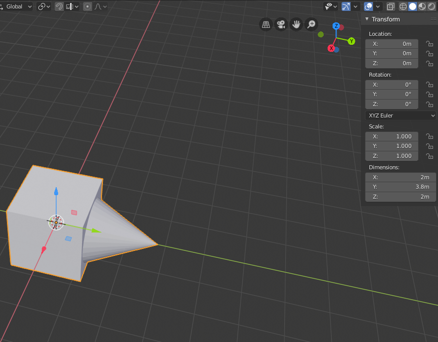
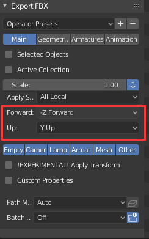
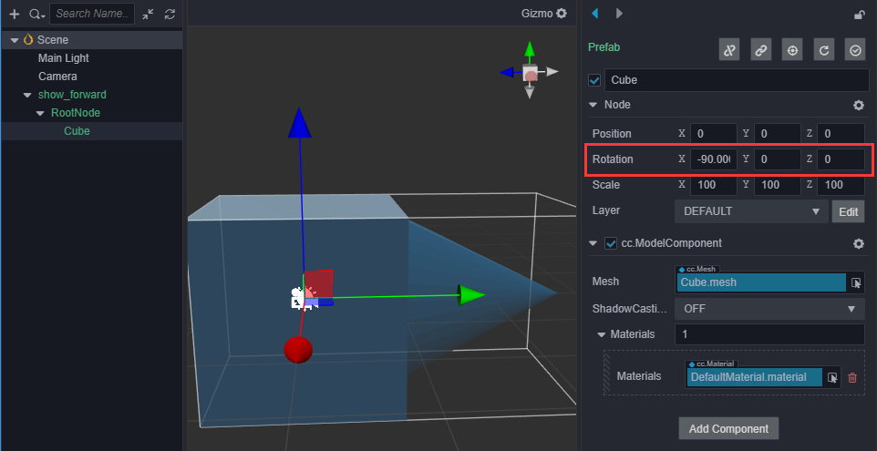
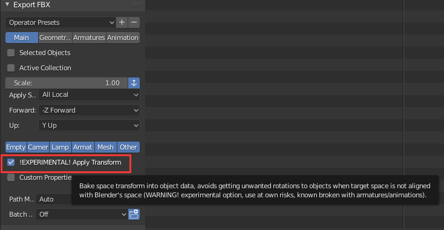
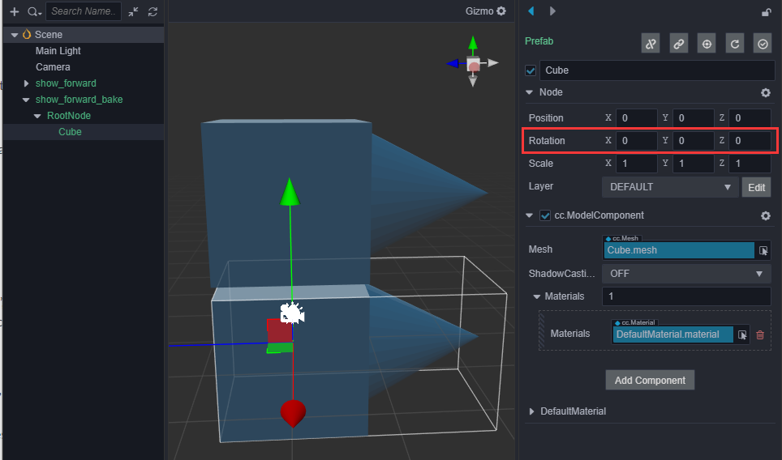
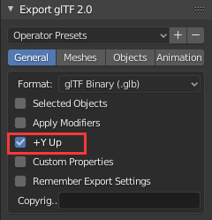
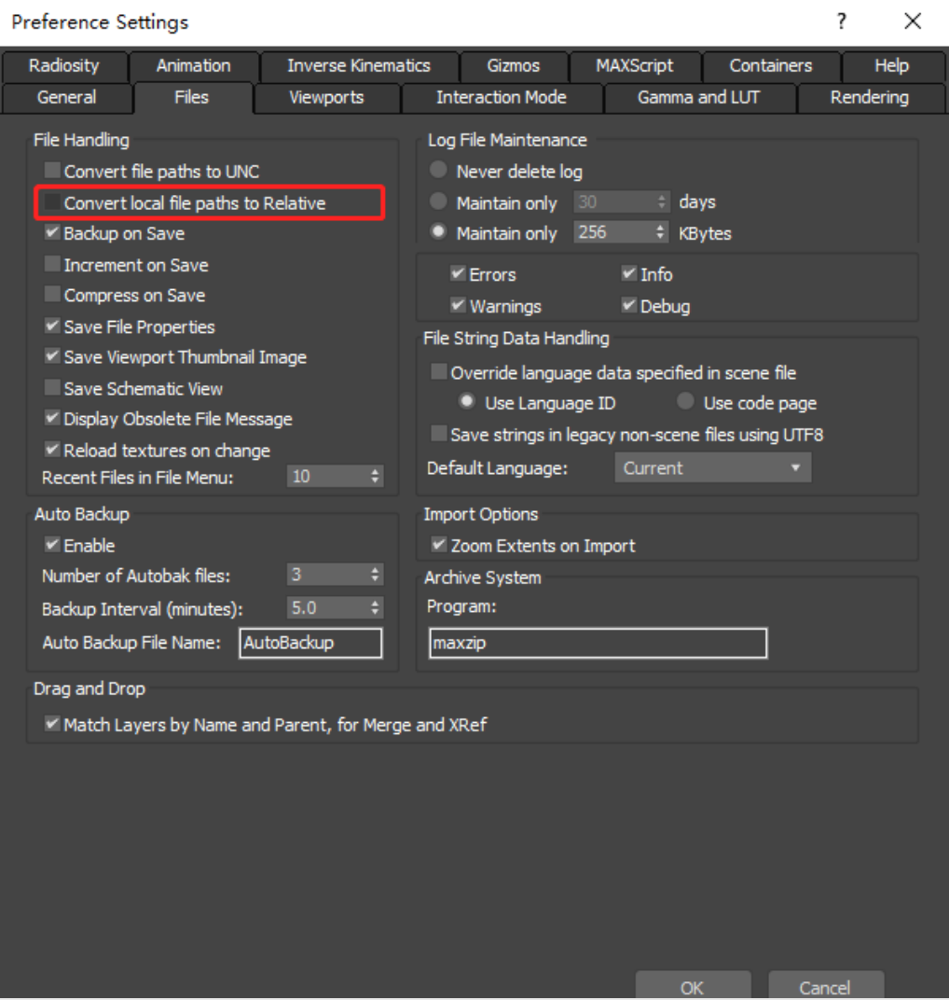

# 导入从 DCC 工具导出的模型

目前大多数数字内容制作（Digital Content Creation, DCC）工具（3ds Max、Maya、Blender）都能导出 **FBX** 和 **glTF** 这两种格式的模型文件，所以这些工具导出的内容都能在 Cocos Creator 中得到良好的展示。

## 导出 FBX

因为 DCC 工具的坐标系和游戏引擎的坐标系可能不一致，所以在导出模型时需要进行一些变换才能在引擎中得到想要的结果。例如：Blender 的坐标系为 X 轴向右，Y 轴向外，Z 轴向上，而 Cocos Creator 3.x 的坐标系为 X 轴向右，Y 轴向上，Z 轴向外，所以需要调整旋转才能使得轴向一致。

以下以 Blender 2.8 作为例子，介绍模型的导入流程，首先我们在 Blender 中创建一个模型。

在 [Blender 的 FBX 导出选项](https://docs.blender.org/manual/zh-hans/2.80/addons/io_scene_fbx.html) 中，我们选择 Up 为 Y Up，Forward 为 -Z Forward。

导入到 Cocos Creator 中，可以看到节点在 X 轴做了 -90 的旋转，以便将轴和 Creator 的对齐。

如果不想要这个旋转值，Blender 的 FBX 导出插件提供了一个实验性功能（Apply Transform），可以将旋转数据直接变换到模型的顶点数据中。

返回编辑器，在 **属性检查器** 中可以看到旋转数据没有了：

## 导出 glTF

[glTF 使用的也是右手坐标系](https://github.com/KhronosGroup/glTF/tree/master/specification/2.0#coordinate-system-and-units)，Blender 的 [导出 glTF 的选项](https://docs.blender.org/manual/zh-hans/2.80/addons/io_scene_gltf2.html) 比较简单，只要把 +Y Up 选项勾上就可以了，导出的数据中也没有旋转值。

## 朝向问题

游戏开发过程中可能会需要用到模型的朝向，例如想要一些物体面向玩家（使用了 LookAt 方法），这时就需要考虑模型的初始朝向，这里提供两种方法来调整模型的初始朝向。

1. Cocos Creator 3.x 是以 -Z 轴做为正前方的朝向，而在 Blender 中正前方朝向为 +Y 轴，所以在制作模型时需要以 Y 轴正方向做为物体的朝向，经过导出的变换后，在 Creator 中就会是以 -Z 轴做为正前方的朝向。
2. 如果不想在 DCC 工具中改变朝向，可以在场景中尝试为导入的模型增加一个父节点，然后旋转模型以使得模型的初始朝向为 -Z 轴，之后的各种旋转相关的操作都以父节点为操作对象。

## 美术制作规范说明

1. 合理制定模型资源下的子资源命名（例如：网格、材质），每修改一次子资源命名就会导致项目内关联该子资源的地方出现丢失。

2. 当模型有一部分需要透明，一部分不需要透明时，应该分两个材质导出。如果是一个材质导出容易出现模型穿透现象，需要手动调整材质。

3. 外部资源引用，导出的时候使用相对路径。否则，在多人合作下，会识别不到原资源路径，导致模型内置材质无法正确获取到贴图而呈现黄色。3ds Max 导出本地路径修改方式如下：

    
