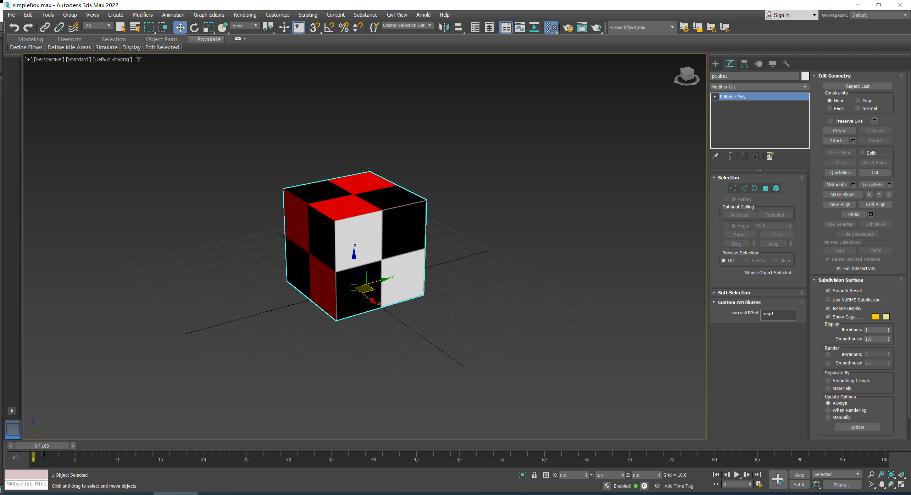
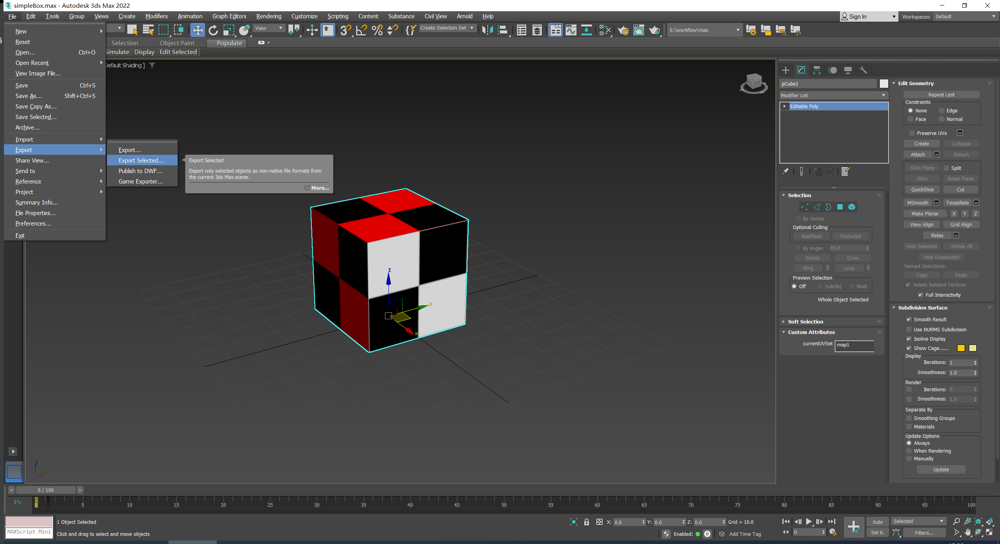
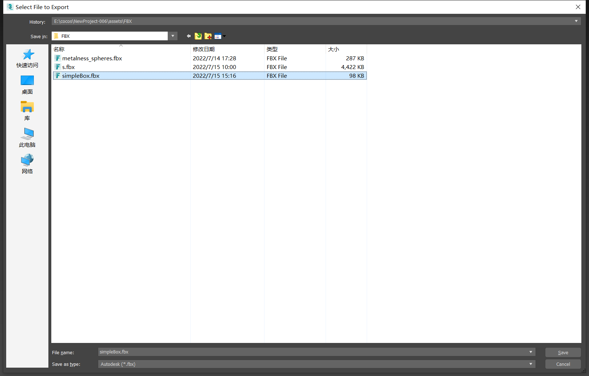
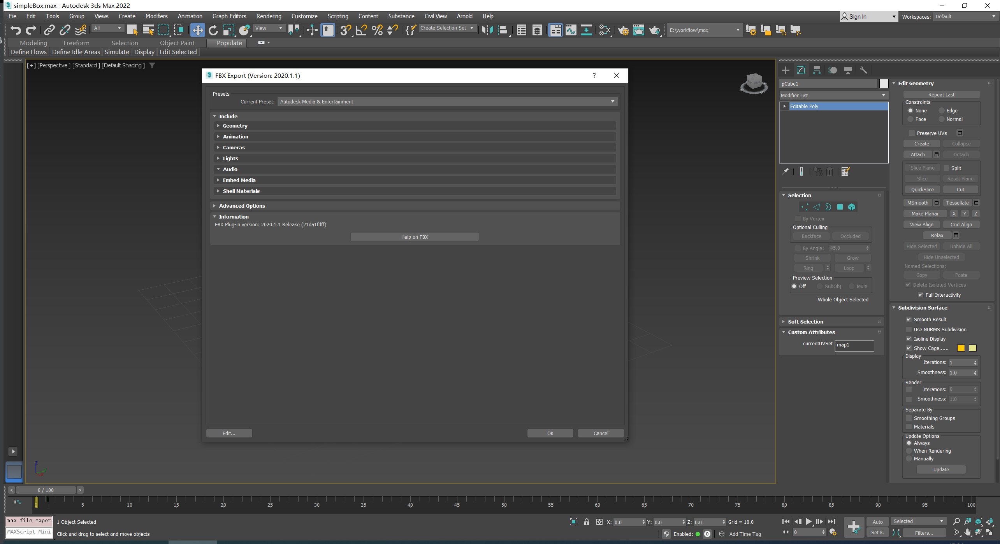
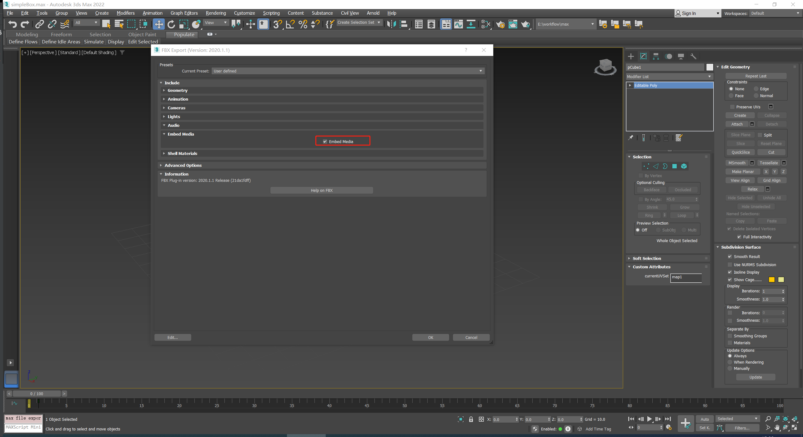
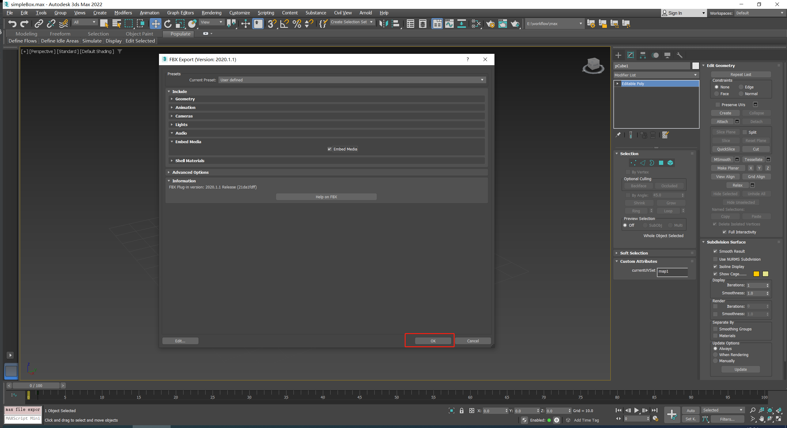
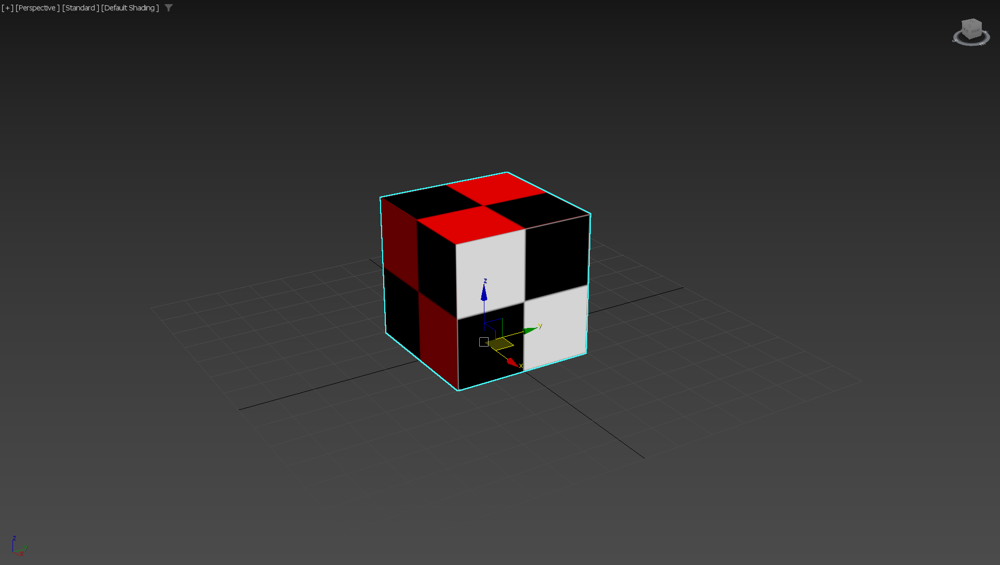

# 从 Max 中导出 FBX 模型资源

## 导出步骤
1. 在max选中要导出的模型

2. 选中主菜单 `File->Export->Export Selected` 展开导出选项：

3. 将`Save as type`设置为`*.fbx`， 点击`save`按钮

4. 将`Current Preset`设置为`Autodesk Media and Entertainment`

5. 开启`Embed Media`

6. 点击`OK`导出文件 

**备注** : 更多信息请参阅 [Max Fbx Files](https://help.autodesk.com/view/3DSMAX/2022/ENU/?guid=GUID-26E80277-1645-4C4E-A6B2-44399376490F)

# 导入 Cocos Creator
1. 将导出文件`simpleBox`放入 Cocos Creator 工程目录的`Asset`文件夹下。关于如何将 FBX 文件导入 Cocos Creator 请参阅 [模型资源](mesh.md)
2. 导入结果对比：

| 3ds Max Viewport                                    | Cocos Creator Scene Viewport                           |
|-----------------------------------------------------|--------------------------------------------------------|
|  |  |
