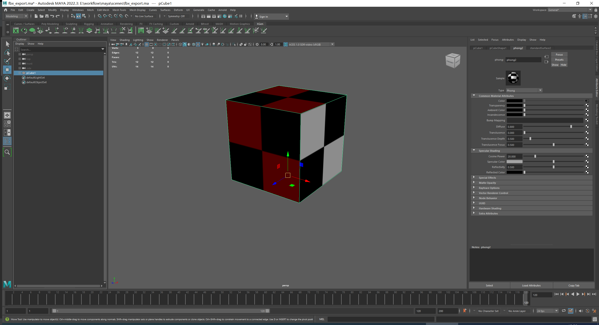
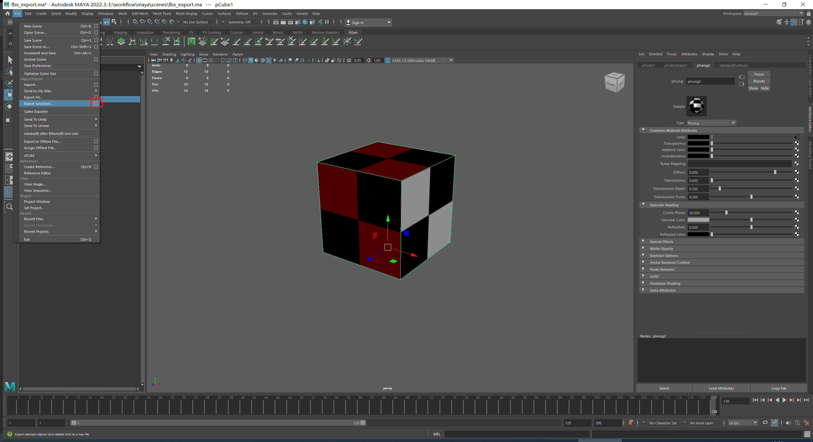
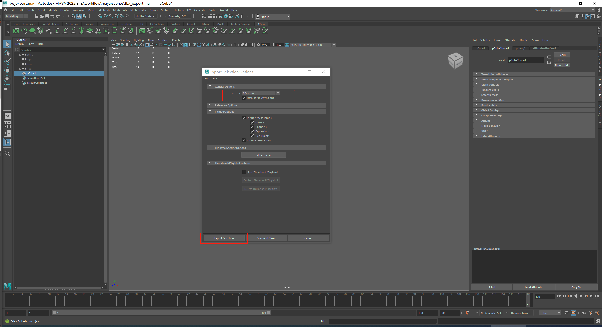
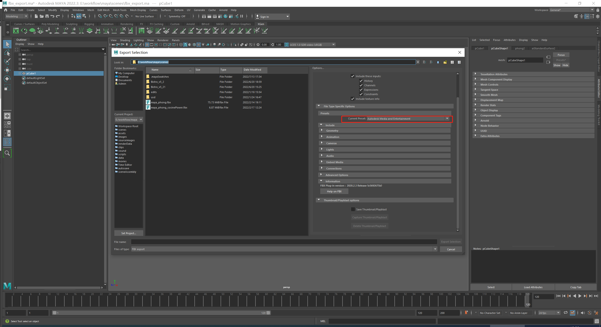
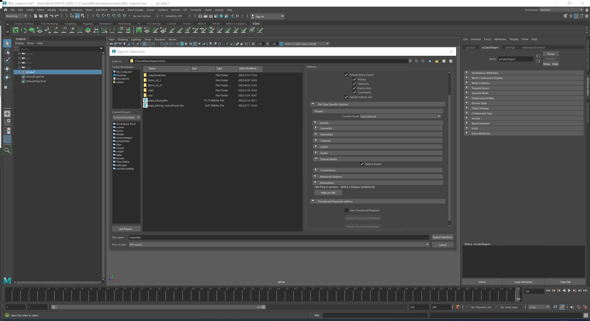
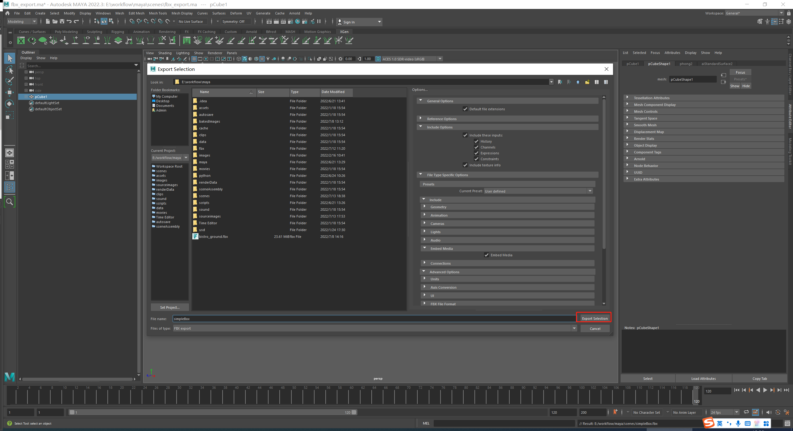
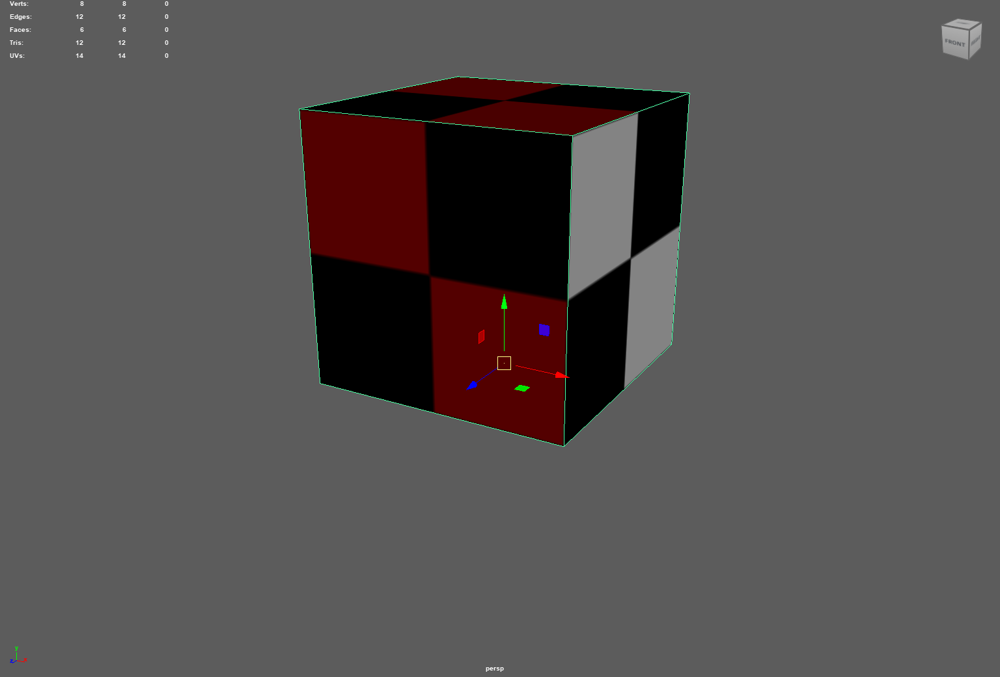
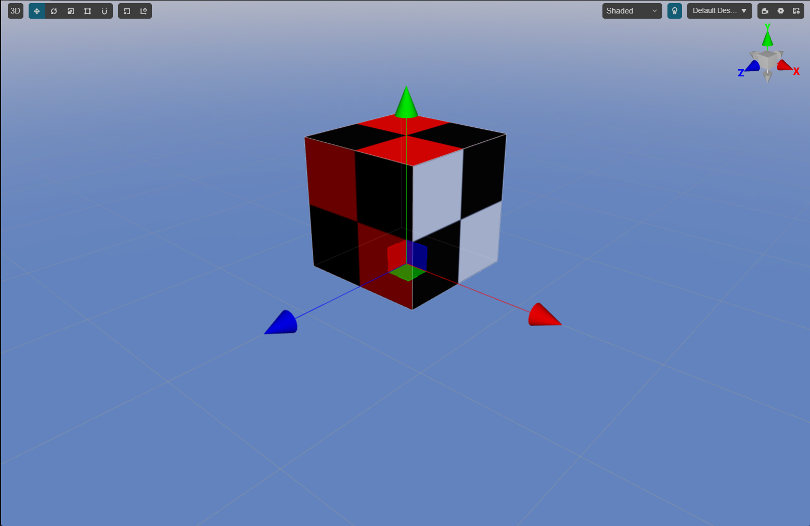

# 从 Maya 中导出 FBX 模型资源

## 导出步骤
1.  选中要导出的模型：

  

2. 选中主菜单 **File -> Export Selection Option** 展开导出选项：

  

3. 将 **File type** 设置为 **FBX export**， 点击 **export selection** 按钮：

  

4. 将 **Current Preset** 设置为 **Autodesk Media and Entertainment**：

  

5. 开启 **Embed Media**

  

6. 选择导出路径，命名为 **simpleBox**， 点击 **Export Selection** 导出文件 

  

**备注**：更多信息可参阅 [Maya FBX Plugin-in](https://help.autodesk.com/view/MAYAUL/2022/ENU/index.html?guid=GUID-BD85FA4C-4D40-457C-BE66-47BC08B82FC3)

## 导入 Cocos Creator

1. 将导出文件 simpleBox 放入 Cocos Creator 工程目录的`Asset`文件夹下。关于如何将 FBX 文件导入 Cocos Creator 请参阅 [模型资源](mesh.md)
2. 导入结果对比：

| Maya Viewport                                         | Cocos Creator Scene Viewport                           |
|-------------------------------------------------------|--------------------------------------------------------|
|  |  |
