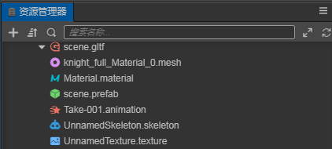
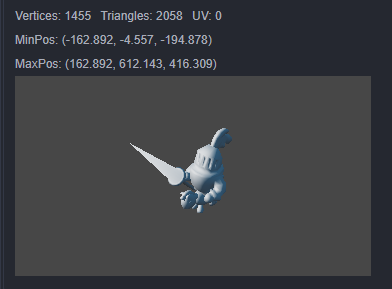
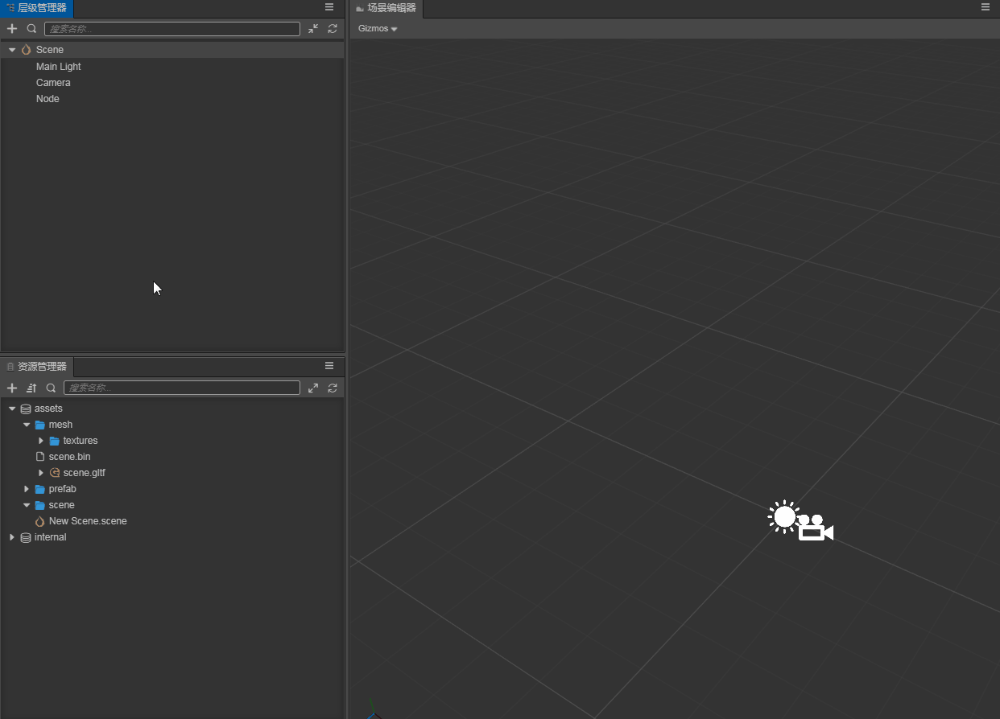
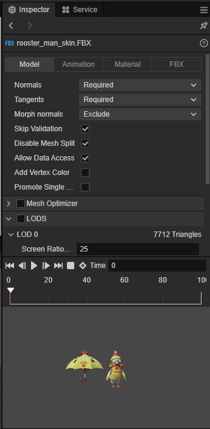
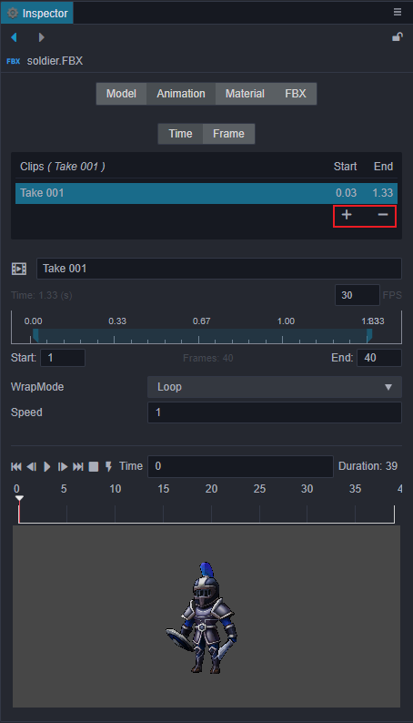
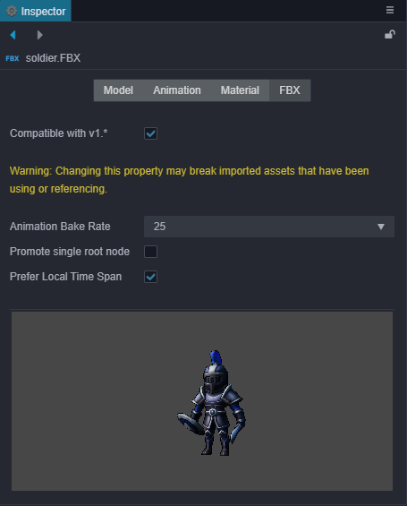

# 模型资源

目前，Creator 支持 **FBX** 和 **glTF** 两种格式的模型文件。

- FBX：支持 FBX 2020 及更早的文件格式。
- glTF：支持 glTF 2.0 及更早的文件格式，详情可参考 [glTF 模型](./glTF.md)。

关于如何从第三方工具导出这两种模型文件，请参考 [导入从 DCC 工具导出的模型](./dcc-export-mesh.md)。

## 模型导入

从外部导入编辑器中后，在 **资源管理器** 中可得到对应的模型资源文件，其目录结构如下：（以 glTF 文件为例，fbx 文件相同）

- 无动画的模型文件结构如下：

    

- 包含动画的模型文件结构如下：

    

    - `.material` — 材质文件
    - `.mesh` — 模型文件
    - `.texture` — 模型贴图文件
    - `.animation` — 模型动画文件
    - `.skeleton` — 模型骨骼文件
    - `.prefab` — 导入时自动生成的预制件

### Mesh 文件

Mesh 文件中存储了模型的顶点、索引、纹理坐标等数据。在 **层级管理器** 中选中 Mesh 文件后，在 **属性检查器** 便可以看到 Mesh 的一些信息以及它的预览效果。

| 属性 | 功能说明 |
| :-- | :-- |
| Vertices | 模型的顶点数 |
| Triangles | 模型的三角形数 |
| UV | 模型的纹理坐标索引 |
| MinPos | 模型的最小坐标值 |
| MaxPos | 模型的最大坐标值 |

## 模型使用

将模型文件导入后，直接将模型文件的根节点从 **资源管理器** 拖拽到 **层级管理器** 中想要放置的节点下，即可完成节点创建，此时模型就成功在场景中创建了。 
或者也可以将模型文件的节点展开，选中模型文件节点下的 `.prefab` 文件，从 **资源管理器** 拖拽到 **层级管理器** 中同样能够完成创建。

## 模型资源属性面板说明

当在 **资源管理器** 中选中模型资源文件时（ `.fbx` 或 `.gltf`），在 **属性检查器** 中就可以直接设置模型资源的相关属性。

### Model 模块

| 属性 | 说明 |
| :--- | :--- |
| 法线（Normals） | 导入法线信息，包括以下四种选项： 1. 可选（Optional）：只导入模型文件中包含的法线，适用于非常清楚自己模型数据的情况。 2. 排除（Exclude）：不导入法线。 3. 仅在必要时重新计算（Required）：导入模型文件中的法线，若模型文件中不包含法线则重新计算，适用于大部分情况。模型数据本身没问题的话还是推荐使用该项，没有额外的处理。 4. 重新计算（Recalculate）：无论模型文件中是否包含法线，都直接重新计算并导入。选择该项会增加计算量，但是可以消除模型原始数据法线没有归一化带来的后续问题。 |
| 切线（Tangents） | 导入切线信息，包括 Optional、Exclude、Require、Recalculate 四种选项，选项功能可参考 **法线** 的说明，二者相差不大。 |
| 形变法线（Morph normals） | 导入形变法线信息，包括： 可选（Optional）：只导入模型文件中包含的形变法线，适用于非常清楚自己模型数据的情况。 排除（Exclude）：不导入形变法线。 |
| 跳过验证（Skip Validation）| 是否跳过对模型文件的标准检测。 |
| 是否禁用 Mesh 拆分（Disable mesh split） | 为了解决实时骨骼动画系统下 uniform vector 数量限制问题，目前在资源导入期会根据骨骼数量做拆分，这会对其他系统也产生影响。如果确定不会使用实时计算模式（对应 SkeletalAnimation 组件的 useBakedAnimation 选项未勾选时），可以勾选此项以提升性能。但注意改变此选项会影响生成的 prefab 内容，需要对应更新场景中的引用。后续重构会移除此流程。 |
| Mesh Optimizer | 用于拆分模型。一般单个模型的骨骼数量是有限的，如果骨骼数量过多，便可以通过该项将其拆分成多个模型。|

### Animation 模块

上方的动画文件表格是当前模型下的所有动画资源信息，下方是当前选中动画的具体帧数信息的编辑区域，可以在此处更改动画名称或进行简单的动画裁剪。

- 点击图上红框内的 **+** 按钮可以添加动画文件，添加的新文件默认拷贝一份完整的 clip 数据，可以在下方的 `Start`、`End` 输入框中输入帧数来裁剪动画。(目前暂时不支持拖拽裁剪动画)

- 点击图上红框内的 **-** 按钮可以删除当前选中的动画文件

### Material 模块

上半部分的属性说明如下，下半部分则展示了当前模型中包含的材质。

| 属性  | 说明 |
| :--- | :--- |
| 提取材质     | 若想对模型文件自带的材质进行修改时，可开启该项，将文件结构目录下的材质文件提取出模型资源，便可以进行材质的调整修改了。 |
| 材质提取目录  | 用于指定或者查看提取出来的材质所在的目录。 |
| 使用顶点色   | 是否使用顶点色。 |
| 混合模式下的深度写入 | 当 Alpha 模式为 **Blend** 时开启深度写入。 |

### FBX 模块

| 属性  | 说明 |
| :--- | :--- |
| 与 1.x 版本兼容  | 若勾选该项，则在导入模型时会兼容 Cocos Creator 1.x 之前版本的导入方式。**注意**：启用该项可能会影响已经导入且被使用/引用的资源。 |
| 动画烘焙速率     | 指定动画烘焙速率，单位为 **帧/秒**，可选项包括 **自动**、**24**、**25**、**30** 和 **60**。 |
| 提升单一根节点   | 当开启该项，若 FBX 资源中包含的场景仅有一个根节点，则在将 FBX 场景转换为 Creator 的预制件时，会以该根节点作为预制件的根节点。否则将以 FBX 场景作为根节点。 |
| 优先使用文件时间范围 | 若勾选该项，则导入的 FBX 动画会优先使用 FBX 文件中记录的动画时间范围。 若不勾选该项，则不使用 FBX 的动画时间范围，将会粗略地计算动画时间范围。 有些 FBX 工具可能没有导出动画时间范围信息，那么也是粗略地计算动画时间范围。
