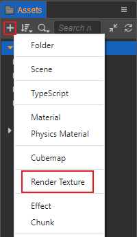
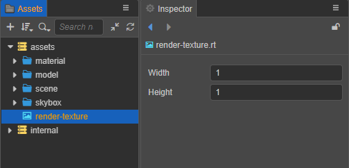
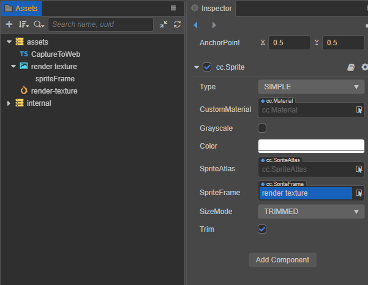
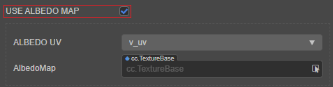

# 渲染纹理资源（Render Texture）

渲染纹理是一张在 GPU 上的纹理。通常我们会把它设置到相机的 **目标纹理** 上，使相机照射的内容通过离屏的 `frambuffer` 绘制到该纹理上。一般可用于制作汽车后视镜，动态阴影等功能。

## 创建渲染纹理资源

在 **资源管理器** 中点击左上方的 **+** 按钮，然后选择 **渲染纹理**，即可创建渲染纹理资源：



然后在 **属性检查器** 中便可以设置渲染纹理资源的相关属性：



| 属性 | 说明 |
| :--- | :--- |
| **Width** | 设置渲染纹理的宽 |
| **Height** | 设置渲染纹理的高 |
| **Anisotropy** | 各项异性值 |
| **Min Filter** | 缩小过滤算法 |
| **Mag Filter** | 放大过滤算法 |
| **Mip Filter** | 多级纹理过滤算法 |
| **Wrap Mode S** | S（U）方向纹理寻址模式 |
| **Wrap Mode T** | T（V）方向纹理寻址模式 |

## 在编辑器使用

在相机组件中，给相机的 **TargetTexture** 属性赋予 RenderTexture 可以将相机照射的结果绘制到 RenderTexture 上。


### 在 2D / UI 中使用

RenderTexture 可以像普通贴图一样使用。以 Sprite 为例，从 **资源管理器** 拖拽到 **SpriteFrame** 属性即可。



### 设置 RenderTexture 为材质贴图

将 RenderTexture 设置为材质贴图包括以下两个步骤：

1. 在 effect 中处理 uv。判断 `SAMPLE_FROM_RT`，并调用 `CC_HANDLE_RT_SAMPLE_FLIP` 函数：

    ```
    #if USE_TEXTURE
        v_uv = a_texCoord * tilingOffset.xy + tilingOffset.zw;
        #if SAMPLE_FROM_RT
            CC_HANDLE_RT_SAMPLE_FLIP(v_uv);
        #endif
    #endif
    ```

2. 在 **层级管理器** 中选中对应的材质，然后在 **属性检查器** 中勾选 `SAMPLE FROM RT`

    

## 程序化使用

使用 RenderTexture 有以下两种方法：

- **方法一**：把 3D 相机照射的内容绘制到 UI 的精灵帧上

    ```typescript
    @ccclass('CaptureToWeb')
    export class CaptureToWeb extends Component {
        @property(Sprite)
        sprite: Sprite = null;
        @property(Camera)
        camera: Camera = null;

        protected _renderTex: RenderTexture = null;

        start() {
            const sp = new SpriteFrame();
            const renderTex = this._renderTex = new RenderTexture();
            renderTex.reset({
                width: 256,
                height: 256,
            });
            this.camera.targetTexture = renderTex;
            sp.texture = renderTex;
            this.sprite.spriteFrame = sp;
        }
    }
    ```

- **方法二**：把 3D 相机照射的内容绘制到 3D 模型上

    ```typescript
    @ccclass("RenderCameraToModel")
    @requireComponent(Camera)
    export class RenderCameraToModel extends Component {
        @property(MeshRenderer)
        model: MeshRenderer = null;

        start() {            
            const renderTex = new RenderTexture();
            renderTex.reset({
                width: 256,
                height: 256,
            });
            const cameraComp = this.getComponent(Camera);
            cameraComp.targetTexture = renderTex;
            const pass = this.model.material.passes[0];
            // 设置 'SAMPLE_FROM_RT' 宏为 'true' 的目的是为了使 RenderTexture 在各个平台能正确显示
            const defines = { SAMPLE_FROM_RT: true, ...pass.defines };
            const renderMat = new Material();
            renderMat.initialize({
                effectAsset: this.model.material.effectAsset,
                defines,
            });
            this.model.setMaterial(renderMat, 0);
            renderMat.setProperty('mainTexture', renderTex, 0);
        }
    }
    ```

    如果要正确的显示绘制结果，请确保着色器拥有 `mainTexture` 属性并已在材质中启用。如果使用是 builtin-standard 着色器，请确保 **USE ALBEDO MAP** 选项被勾选：

    

更多使用方法可参考范例 **RenderTexture**（[GitHub](https://github.com/cocos-creator/test-cases-3d/tree/v3.4/assets/cases/rendertexture) | [Gitee](https://gitee.com/mirrors_cocos-creator/test-cases-3d/tree/v3.4/assets/cases/rendertexture)）。
