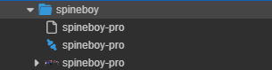
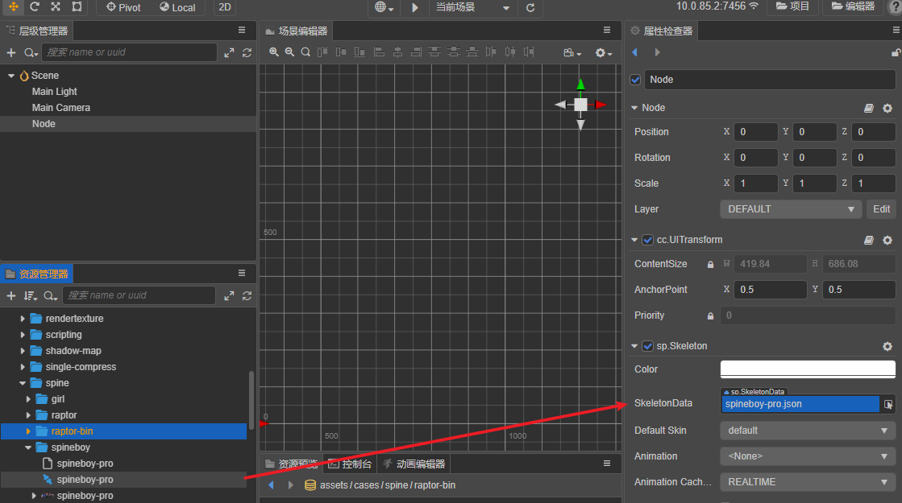
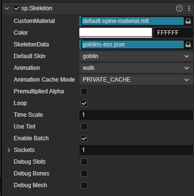
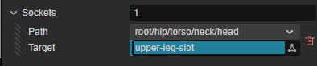
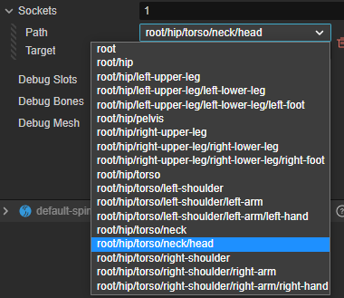
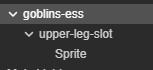
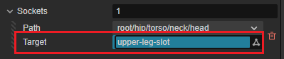
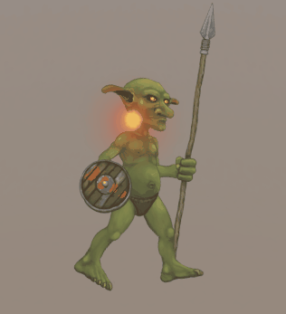

# 骨骼动画资源（Spine）

Creator 中的骨骼动画资源是由 [Spine 编辑器](http://zh.esotericsoftware.com/) 导出的，目前支持 [JSON](http://zh.esotericsoftware.com/spine-export/#JSON) 和 [二进制](http://zh.esotericsoftware.com/spine-export/#%E4%BA%8C%E8%BF%9B%E5%88%B6) 两种数据格式。

各 Creator 版本对应支持的 Spine 版本如下所示：

| Creator 版本  | Spine 版本 |
| :----------  | :-------- |
| v3.0 及以上   | v3.8（原生平台不支持特定版本 v3.8.75）|
| v2.3 及以上   | v3.8 |
| v2.2         | v3.7 |
| v2.0.8～v2.1 | v3.6 |
| v2.0.7 及以下 | v2.5 |

## 导入骨骼动画资源

骨骼动画所需资源有：

- `.json/.skel` 骨骼数据
- `.png` 图集纹理
- `.txt/.atlas` 图集数据

  

> **注意**：导出的资源名称需要 `.json/.skel` 和 `.text/.atlas` 保持同名。

## 创建骨骼动画

从 **资源管理器** 中将骨骼动画资源拖动到 **属性检查器** Spine 组件的 SkeletonData 属性中：



## 属性



| 属性 | 说明 |
| :--- | :--- |
| **Custom Material** | 自定义材质，保持为空时引擎会默认使用 default-spine-material.mtl |
| **Color** | Spine 动画的颜色 |
| **SkeletalData** | 骨骼动画的动画问。拖入 Spine 动画的 .json 或者 .skeleton 文件 |
| **Default Skin** | 默认的皮肤，可以通过下拉框选择不同的皮肤 |
| **Animation** | 当前播放的动画 |
| **Animation Cache Mode**| 动画缓存的类型，请参考下文缓存类型部分 |
| **Premultiplied Alpha** | 预乘 Alpha。 如果出现不透明色块，请取消该选项 |
| **Loop** | 是否循环 |
| **Time Scale** | 时间缩放因子 |
| **Use Tint**  | 是否启动颜色效果 |
| **Enable Batch** | 是否合批 |
| **Sockets** | 挂点，请参考下方挂点系统 |
| **Debug Slots** | 调试挂点 |
| **Debug Bones** | 调试骨骼 |
| **Debug Mesh** | 调试网格 |

## 播放动画

播放动画除了可以在 **属性检查器** 内通过下拉框来选择，也可以调用 `setAnimation` 方法来播放动画，代码示例如下：

```ts
this.skeleton.setAnimation(0, 'walk', false);                    
```

## 从服务器远程加载 Spine

### 加载文本格式的 Spine 资源

```ts
let comp = this.getComponent('sp.Skeleton') as sp.Skeleton;

let image = "http://localhost/download/spineres/1/1.png";
let ske = "http://localhost/download/spineres/1/1.json";
let atlas = "http://localhost/download/spineres/1/1.atlas";
assetManager.loadAny([{ url: atlas, ext: '.txt' }, { url: ske, ext: '.txt' }], (error, assets) => {
    assetManager.loadRemote(image, (error, texture: Texture2D) => {
        let asset = new sp.SkeletonData();
        asset.skeletonJson = assets[1];
        asset.atlasText = assets[0];
        asset.textures = [texture];
        asset.textureNames = ['1.png'];
        skeleton.skeletonData = asset;
    });
});
```

### 加载二进制格式的 Spine 资源

```ts
let comp = this.getComponent('sp.Skeleton') as sp.Skeleton;

let image = "http://localhost/download/spineres/1/1.png";
let ske = "http://localhost/download/spineres/1/1.skel";
let atlas = "http://localhost/download/spineres/1/1.atlas";
assetManager.loadAny([{ url: atlas, ext: '.txt' }, { url: ske, ext: '.bin' }], (error, assets) => {
    assetManager.loadRemote(image, (error, texture: Texture2D) => {
        let asset = new sp.SkeletonData();
        asset._nativeAsset = assets[1];
        asset.atlasText = assets[0];
        asset.textures = [texture];
        asset.textureNames = ['1.png'];
        asset._uuid = ske; // 可以传入任意字符串，但不能为空
        asset._nativeURL = ske; // 传入一个二进制路径用作 initSkeleton 时的 filePath 参数使用
        comp.skeletonData = asset;
        let ani = comp.setAnimation(0, 'walk', true);
    });
});
```

## 缓存类型

目前的 sp.Skeleton 组件支持三种不同的缓存类型。

- REALTIME 实时模式，此模式下动画数据不会缓存
- SHARED_CACHE 共享缓存模式，此模式下，使用相同的骨骼数据的动画组件会使用共享的动画数据。
- PRIVATE_CACHE 私有缓存，此模式下，动画数据会缓存至该组件内部。

对于不同组件，但采用同样的动画数据，此时可以使用 SHARED_CACHE 来提高性能。

## 挂点系统

在 **Sockets** 属性后的输入框内，输入大于 0 的整数可以增加挂点，挂点可以实现一些简单的换肤功能，比如给角色增加配饰等。



通过下拉框选择要挂载的骨骼节点，骨骼名称可以通过 spine 编辑器查看。



在 spine 组件的节点下创建一个新的节点：



并将这个节点赋值给 Sockets 的 Target 属性：



此时运行可以观察到作为演示节点的 Sprite 随着骨骼运行：



> 资源来自 Spine 官网
