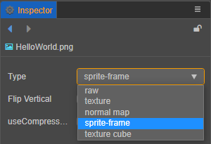

# 精灵帧资源（SpriteFrame）

Cocos Creator 的 SpriteFrame 是 UI 渲染基础图形的容器。其本身管理图像的裁剪和九宫格信息，默认持有一个与其同级的 Texture2D 资源引用。

## 导入精灵帧资源

使用默认的 [资源导入](asset-workflow.md) 方式将图像资源导入到项目中，然后在 **属性检查器** 中将图像资源的类型设置为 **sprite-frame**：



Creator 便会自动在它下面创建一个如下所示的 spriteFrame 资源：


图像资源在 **资源管理器** 中会以自身图片的缩略图作为图标。在 **资源管理器** 中选中图像子资源后，**属性检查器** 下方会显示该图片的缩略图。

spriteFrame 的属性如下：

| 属性 | 功能说明 |
| :--- | :--- |
| Packable    | 是否参与动态合图      |
| Rotated  | 只读属性，不可更改。用于查看 Texture Packer 资源中的子资源是否被旋转 |
| Offset X、Y | 只读属性，不可更改。用于查看 Texture Packer 资源中矩形框的偏移量 |
| Trim Type | 裁剪类型，包括：<br>1. Auto — 自动裁剪（默认），详情请参考 [图像资源的自动剪裁](../ui-system/components/engine/trim.md)<br>2. Custom — 自定义裁剪<br>3. None — 无裁剪，使用原图 |
| Trim Threshold | 透明度阈值，默认为 1，取值范围为 0~1，会将透明度在设定值以下的像素裁减掉。当 Trim Type 设置为 **Auto** 时生效 |
| Trim X、Y、Width、Height | 设置裁剪矩形框，当 Trim Type 设置为 **Custom** 时生效 |
| Border Top、Bottom、Left、Right | 设置九宫格图边距，可点击下方的 **编辑** 按钮进行可视化编辑  |

## 使用 SpriteFrame

### 容器内包含对象是贴图的使用方式

在编辑器中，拖拽 SpriteFrame 资源到 **Sprite** 组件的 `Sprite Frame` 属性栏中，来切换 Sprite 显示的图像。<br>
在运行时，以上图中的 content 图片为例，整个资源分为三部分：
- `content`（图像源资源 ImageAsset）
- `content` 的子资源 `spriteFrame`（精灵帧资源 SpriteFrame）
- `content` 的子资源 `texture`（贴图资源 Texture2D）。

在游戏包内（也就是已经放在 resources 目录下）的资源可以通过：

方法一（加载 SpriteFrame）：

```typescript
const url = 'test_assets/test_atlas/content/spriteFrame';
resources.load(url, SpriteFrame, (err: any, spriteFrame) => {
  const sprite = this.getComponent(Sprite);
  sprite.spriteFrame = spriteFrame;
});
```

在服务器上的资源只能加载到图像源 ImageAsset，具体方法请参考 [动态加载资源](./dynamic-load-resources.md)。

我们提供了 `createWithImage` 方法来帮助用户快捷的将 ImageAsset 或者原始图像资源 ImageSource 包装为 SpriteFrame：

方法二（加载 ImageAsset）：

```typescript
const self = this;
const url = 'test_assets/test_atlas/content';
resources.load(url, ImageAsset, (err: any, imageAsset) => {
  const sprite = this.getComponent(Sprite);
  sprite.spriteFrame = SpriteFrame.createWithImage(imageAsset);
});
```

或者用户也可以手动填充信息，如下：

```typescript
const self = this;
const url = 'test_assets/test_atlas/content';
resources.load(url, ImageAsset, (err: any, imageAsset) => {
  const sprite = this.getComponent(Sprite);
  const spriteFrame = new SpriteFrame();
  const tex = new Texture2D();
  tex.image = imageAsset;
  spriteFrame.texture = tex;
  sprite.spriteFrame = spriteFrame;
});
```

方法三（canvas 绘制内容 UI 上显示）（加载 ImageSource）：

```typescript
const sprite = this.getComponent(Sprite);
sprite.spriteFrame = SpriteFrame.createWithImage(canvas);
```

或者用户也可以手动填充信息，如下：

```typescript
const sprite = this.getComponent(Sprite);
const img = new ImageAsset(canvas);
const tex = new Texture2D();
tex.image = img;
const sp = new SpriteFrame();
sp.texture = tex;
sprite.spriteFrame = sp;
```

### 容器内包含对象是 RenderTexture 的使用方式

RenderTexture 是一个渲染纹理，它可以将摄像机上的内容直接渲染到一张纹理上而不是屏幕上。SpriteFrame 通过管理 RenderTexture 可以轻松的将 3D 相机内容显示在 UI 上。使用方法如下：

```typescript
const cameraComp = this.getComponent(Camera);
const renderTexture = new RenderTexture();
const size = view.getVisibleSize();
renderTexture.reset({
   width: size.width,
   height: size.height,
   colorFormat: RenderTexture.PixelFormat.RGBA8888,
   depthStencilFormat: RenderTexture.DepthStencilFormat.DEPTH_24_STENCIL_8
});

cameraComp.targetTexture = renderTexture;
const spriteFrame = new SpriteFrame();
spriteFrame.texture = renderTexture;
const sprite = this.getComponent(Sprite);
sprite.spriteFrame = spriteFrame;
```

API 接口文档：[SpriteFrame 资源类型](__APIDOC__/zh/#/docs/3.4/zh/asset/Class/SpriteFrame)。
