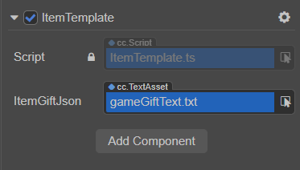

# 文本资源

Creator 支持使用文本文件，常见的文本格式如：`.txt`、`.plist`、`.xml`、`.json`、`.yaml`、`.ini`、`.csv`、`.md`。通过 [资源导入](./asset-workflow.md#%E5%AF%BC%E5%85%A5%E8%B5%84%E6%BA%90) 的方式将其导入到编辑器，所有的文本文件都会导入为 `cc.TextAsset` 格式的资源。

## 使用方式

开发者可通过 **编辑器挂载** 和 **代码中动态加载** 两种方式获取文本数据。

### 通过编辑器

首先在 **资源管理器** 中新建一个 TypeScript，脚本内容示例如下：

```ts
import { _decorator, Component, TextAsset } from 'cc';
const { ccclass, property } = _decorator;

@ccclass('ItemTemplate')
export class ItemTemplate extends Component {

    // 声明属性 ‘itemGiftText‘ 的类型为 TextAsset
    @property(TextAsset)
    itemGiftText: TextAsset = null!;

    start () {

        const data: string = this.itemGiftText.text!;

    }
}
```

保存脚本内容后回到编辑器，将脚本挂载到相应的节点上，然后将 **资源管理器** 中的文本资源拖拽到脚本组件相应的属性框中。例如下图：



### 通过代码动态加载

开发者也可以直接通过代码 [动态加载](./dynamic-load-resources.md#%E5%8A%A8%E6%80%81%E5%8A%A0%E8%BD%BD-resources) 来获取文本数据，代码示例如下：

```ts
import { _decorator, Component, resources, error, TextAsset } from 'cc';
const { ccclass, property } = _decorator;

@ccclass('ItemTemplate')
export class ItemTemplate extends Component {

    start () {

        resources.load('itemGiftText', (err: any, res: TextAsset) => {
            if (err) {
                error(err.message || err);
                return;
            }

            // 获取到文本数据
            const textData = res.text;
        })

    }
}
```
