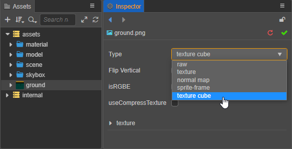
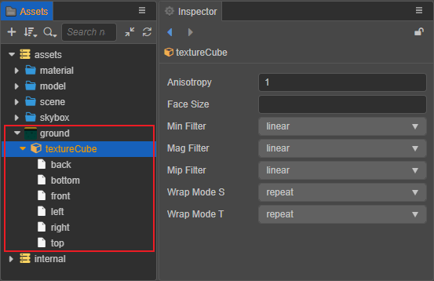

# 立方体贴图

TextureCube 为立方体纹理，常用于设置场景的 [天空盒](../concepts/scene/skybox.md)。立方体贴图可以通过设置全景图 ImageAsset 为 TextureCube 类型获得，也可以在 Creator 中制作生成。

## 设置为立方体贴图

在将 ImageAsset [导入](asset-workflow.md) 到 Creator 后，即可在 **属性检查器** 面板将其设置为 **texture cube** 类型，设置完成后请点击右上角的绿色打钩按钮，以保存修改。

设置完成后在 **资源管理器** 面板可以看到原先的图像资源下方生成了一个 **textureCube** 子资源，以及组成 TextureCube 的六张 texture：

## 制作立方体贴图

在 Creator 中通过制作 CubeMap 获得的 TextureCube 如下图：

关于 TextureCube 具体的使用与制作 CubeMap 的方式，请参考 [天空盒 — 设置 CubeMap](../concepts/scene/skybox.md)。
