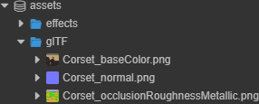
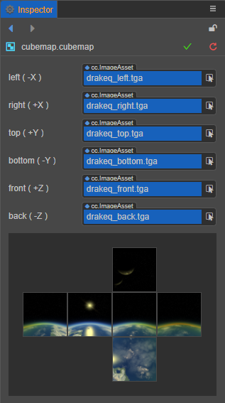

# 纹理贴图资源

纹理贴图资源是一种用于程序采样的资源，如模型上的贴图、精灵上的 UI。当程序渲染 UI 或者模型时，会对相应的纹理进行采样，然后填充在模型网格上，再加上光照等等一系列处理便渲染出了整个场景。

纹理资源可由 ImageAsset 转化而成，一些通用的图像交换格式如 png、jpeg 等等都可为 ImageAsset。

## Texture2D

Texture2D 是纹理资源的一种，通常用于 3D 模型的渲染，如模型材质中的反射贴图、环境光遮罩贴图等等。在 Cocos Creator 3.0 中的 Texture2D：

**注：texture 类型即为 Texture2D 资源**。

### 调整 Texture2D 的属性

当导入一张 ImageAsset 时，默认会将其设置为 Texture2D 的类型，这时会在原资源上会生成一个或多个子资源，点击原资源前的箭头便可以看到所有的子资源，如下动图所示：

选中生成的 Texture2D 子资源后可以看到以下面板：

#### 子资源 Texture2D 的属性面板

以下介绍了面板的所有属性：

属性 | 解释
---|---
**anisotropy** | 各项异性值
**minFilter** | 缩小过滤算法
**magFilter** | 放大过滤算法
**mipFilter** | 多级纹理过滤算法
**wrapS** | S（U）方向纹理寻址模式
**wrapT** | T（V）方向纹理寻址模式

**注意：由于默认的 wrap mode 在透明边缘图像的渲染可能会出现黑边，所以在将图像资源类型设置为 sprite-frame 时，我们将会把 texture 的 wrapS 和 wrapT 修改为 clamp-to-edge，如有特殊需要，用户可以自行修改。**

### 使用 Texture2D

Texture2D 是使用范围非常广泛的资源，在属性面板上任何标记为 Texture2D 类型的属性，都可以拖入 Texture2D 类型的资源。

使用场景主要为编辑器环境与动态获取使用

- 在编辑器中，只需要将资源拖入即可；
- 动态使用时，需要先获取 ImageAsset 资源，然后根据获取到 ImageAsset 实例化出 Texture2D 资源；

## TextureCube

TextureCube 为立方体纹理，可用于设置场景的 [天空盒](../concepts/scene/skybox.md)，可以通过设置全景图 ImageAsset 为 TextureCube 类型获得，也可以通过制作 CubeMap 资源获得，在场景的天空盒章节有详细的使用和制作方式。

在 Cocos Creator 中通过全景图获得的 TextureCube：

在 Cocos Creator 中通过制作 CubeMap 获得的 TextureCube：

更多关于 TextureCube 的使用与制作 CubeMap 的方式，请参考 [天空盒](../concepts/scene/skybox.md)。
