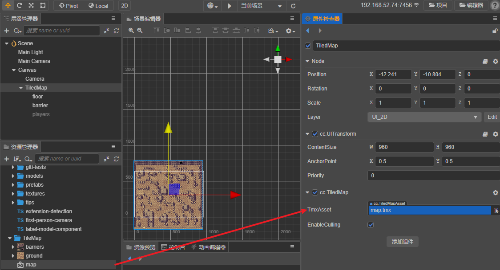

# 瓦片图资源（TiledMap）

瓦片图资源是由 [Tiled 编辑器](https://www.mapeditor.org/) 所导出的数据格式（Cocos Creator 3.0 支持 Tiled v1.6.0）。

## 导入地图资源

地图所需资源有：

- `.tmx` 地图数据
- `.png` 图集纹理
- `.tsx` tileset 数据配置文件（部分 tmx 文件需要）

    

## 创建瓦片图资源

从 **资源管理器** 里将地图资源拖动到已创建 TiledMap 组件的 Tmx File 属性中：

## 在项目中的存放

为了提高资源管理效率，建议将导入的 `tmx`、`tsx` 和 `png` 文件存放在单独的目录下，不要和其他资源混在一起。需要注意的是要把 `tmx` 文件和 `tsx` 文件放在同一目录管理，否则可能会导致资源无法被正确加载。
