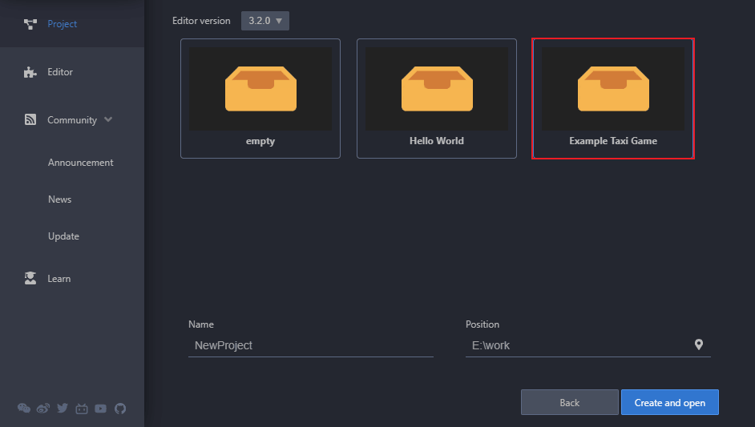

# 音频播放示例

由于 Cocos Creator 3.x 废弃了 v2.x `cc.audioEngine` 系列的 API，统一使用 AudioSource 控制音频播放，因此我们可以将 [AudioSource 组件](./audiosource.md) 声明为常驻根节点，封装一个管理器进行使用。如下所示：

```typescript
import { assert, AudioSource, Component, game } from 'cc';
const { ccclass, property } = _decorator;
@ccclass('GameRoot')
export class GameRoot extends Component {
    
    @property(AudioSource) 
    _audioSource: AudioSource = null!;

    onLoad () {
        const audioSource = this.node.getComponent(AudioSource)!;
        assert(audioSource);
        this._audioSource = audioSource;
        // 声明常驻根节点，该节点不会在场景切换中被销毁。目标节点必须是根节点，否则无效。
        game.addPersistRootNode(this.node);

        // 将节点封装到管理器中
        audioManager.instance.init(this._audioSource);
    }
}
```

当需要对音乐音效的进行播放、音量控制等操作时，如下所示：

```typescript
import { AudioClip, AudioSource, assert, warn, clamp01, resources } from "cc";
export class audioManager {

    private static _instance: audioManager;
    private static _audioSource?: AudioSource;

    static get instance () {
        if (this._instance) {
            return this._instance;
        }

        this._instance = new audioManager();
        return this._instance;
    }

    /**管理器初始化*/
    init (audioSource: AudioSource) {
        audioManager._audioSource = audioSource;
    }

      /**
     * 播放音乐
     * @param {Boolean} loop 是否循环播放
     */
    playMusic (loop: boolean) {
        const audioSource = audioManager._audioSource!;
        assert(audioSource, 'AudioManager not inited!');

        audioSource.loop = loop;
        if (!audioSource.playing) {
            audioSource.play();
        }
    }

     /**
     * 播放音效
     * @param {String} name 音效名称
     * @param {Number} volumeScale 播放音量倍数
     */
    playSound (name:string,volumeScale:number = 1 ) {
        const audioSource = audioManager._audioSource!;
        assert(audioSource, 'AudioManager not inited!');

        // 音效一般是多个的，不会只有一个
        let path = 'gamePackage/audio/sound/';

        resources.load(path + name, AudioClip, (err, clip) => {
            if (err) {
                warn('load audioClip failed: ', err);
                return;
            }
            
            // 注意：第二个参数 “volumeScale” 是指播放音量的倍数，最终播放的音量为 “audioSource.volume * volumeScale”
            audioSource.playOneShot(clip, volumeScale);
        });

    }
    // 设置音乐音量
    setMusicVolume (flag: number) {
        const audioSource = audioManager._audioSource!;
        assert(audioSource, 'AudioManager not inited!');

        flag = clamp01(flag);
        audioSource.volume = flag;
    }

}
```

特别需要注意的是常驻节点在切换场景时会 **暂停音乐**，需要在 `onEnable` 中继续播放操作，代码示例如下：

```typescript
import {  _decorator,Component} from 'cc';
const { ccclass, property } = _decorator;
@ccclass('GameRoot')
export class GameRoot extends Component {

    onEnable () {
        audioManager.instance.playMusic(true);
    }
}

```

> **注意**：该问题将在未来版本中解决，请关注版本公告。

Creator 在范例项目 **快上车**（[GitHub](https://github.com/cocos-creator/tutorial-taxi-game) | [Gitee](https://gitee.com/mirrors_cocos-creator/tutorial-taxi-game)）中提供了完整的封装好的音效播放管理器的使用示例。开发者可打开 Dashboard 的 **项目** 页面，点击右下角的 **新建** 按钮，进入新建项目页面，即可看到 **Example Taxi Game** 范例项目，根据需要填写项目名称和项目位置后即可创建并打开快上车范例：



也可以在 **快上车 3D**（[GitHub](https://github.com/cocos-creator/tutorial-taxi-game) | [Gitee](https://gitee.com/mirrors_cocos-creator/tutorial-taxi-game)）中进行查看。
