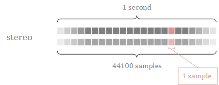
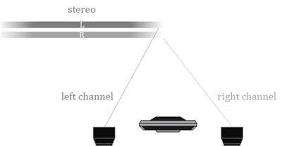

# 音频文件

在游戏中开发者经常遇到各种各样音频文件类型。这些音频格式是通过不同的数据编码和数据格式产生的各个类型的音频文件。开发者可以根据项目情况和声音的长短采用不同的格式进行使用。

## 基础概念

声卡对声音的处理质量可以用三个基本参数来衡量，即采样频率、采样位数和声道数。

音频的数据量（字节/秒）= 采样频率（Hz）×（采样位数（bit）/8）× 声道数

因此音频文件的大小与这几个参数息息相关。

### 采样频率

**采样频率** 是指单位时间内的采样次数。采样频率越大，采样点之间的间隔就越小，数字化后得到的声音就越逼真，但相应的数据量就越大。

这是一个立体声道采样频率为 44.1 kHz 时一秒的图样：

### 采样位数

**采样位数** 是记录每次采样值数值大小的位数。采样位数通常有8 bits 或16 bits 两种，采样位数越大，所能记录声音的变化度就越细腻，相应的数据量就越大。

### 声道

当人听到声音时，能对声源进行定位，那么通过在不同的位置设置声源，就可以造就出更好的听觉感受，如果配合影像进行音频位置的调整，则会得到更好的视听效果。

常见的声道有：
- 单声道 mono:单声道是比较原始的声音复制形式，早期的声卡采用的比较普遍。单声道的声音只能使用一个扬声器发声，有的也处理成两个扬声器输出同一个声道的声音。
- 立体声 Stereo：声音在录制过程中被分配到两个独立的声道，从而达到了很好的声音定位效果。
- 2.1声道：在立体声道基础上加入一个低音声道。
- 四声道：四声道环绕规定了前左、前右，后左、后右四个发声点，听众则被包围在这中间。
- 5.1声道：包含一个正面声道、左前方声道、右前方声道、左环绕声道、右环绕声道、一个低音声道，最早应用于早期的电影院。
- 7.1声道：在 5.1 声道的基础上，把左右的环绕声道拆分为左右环绕声道以及左右后置声道，主要应用于 BD 以及现代的电影院。

下图是一个双声道的音频系统：

### 比特率

每秒的传输速率(位速, 也叫比特率)。如705.6 kbps 或 705600 bps, 其中的 b 是 bit, ps 是每秒(per second)的意思，表示每秒705600 bit 的容量。

比特率 = 采样率 x 采样位深 x 通道数/8

### 简单示例

计算对于5分钟双声道、16位采样位数、44.1kHz采样频率声音的不压缩数据量是多少？

根据公式：数据量 =（采样频率 × 采样位数 × 声道数 × 时间）/8
数据量(MB) = [44.1×1000×16×2×（5×60）] /（8×1024×1024）= 50.47 MB
>**注意：** 数据量单位换算：1 MB =1024×1024=1048576 B

## 支持的声音资源的格式

目前在 Cocos Creator 引擎的音频系统已经能够支持 web 原生支持的格式：

|格式            | 扩展名                    |
|:--            | :--                     |
|Ogg Vorbis           | .ogg      |
|MPEG layer 3           | .mp3              |
|Microsoft Wave    | .wav |
|MPEG-4 Part 14         | .mp4   |
|MPEG-4         | .m4a   |

关于声音资源，更多内容可参考 [声音资源](../asset/audio.md)。

开发者可以根据实际的项目需求，使用相对应的音频格式文件。使用方式也很简单，将文件拖入项目中即可。Cocos Creator 会将音频文件导入成 AudioClip 资源。
