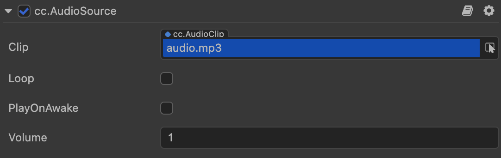
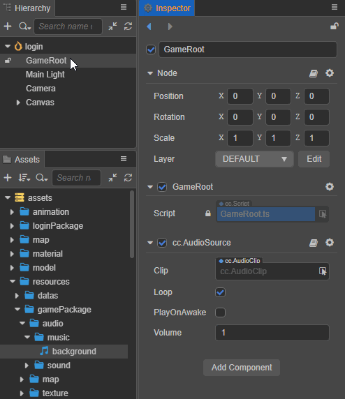

# AudioSource 组件参考

AudioSource 组件用于控制音乐和音效的播放。



在 **层级管理器** 中选中节点，然后点击 **属性检查器** 下方的 **添加组件** 按钮，选择 **Audio -> AudioSource** 即可添加 AudioSource 组件到节点上。

## AudioSource 属性

|属性            | 说明                    |
|:--            | :--                     |
|Clip           | 添加的用于播放的 [音频资源](../asset/audio.md)，默认为空，点击后面的箭头按钮即可选择      |
|Loop           | 是否循环播放              |
|PlayOnAwake    | 是否在游戏运行（组件激活）时自动播放音频 |
|Volume         | 音量大小，范围在 0~1 之间   |

## 音频播放

Cocos Creator 3.x 使用 AudioSource 控制音频的播放。AudioSource 是组件，可以添加到场景中，由 **编辑器** 设置，也可以在 **脚本** 中进行调用。

另外，Creator 根据音频的长短将其分为较长的 **音乐** 和短的 **音效** 两种：

- 若通过编辑器控制音频播放，则播放音乐和音效没有区别，但推荐使用长音乐。详情可参考下文 **通过编辑器播放** 部分的内容。
- 若通过脚本控制音频播放，则 AudioSource 组件额外提供了 `playOneShot` 接口用于播放短音效，详情请参考下文 **音效播放** 部分的内容。

> **注意**：Cocos Creator 3.x 移除了 v2.x 中的 `audioEngine` API，统一使用 AudioSource 组件播放音频。

### 通过编辑器

1. 在节点上添加 AudioSource 组件。
2. 将所需的音频资源从 **资源管理器** 拖拽到 AudioSource 组件的 Clip 属性框中，如下所示：

    

3. 根据需要对 AudioSource 组件的其他属性进行设置即可。

### 通过脚本

如果要更灵活地控制 AudioSource 播放音频，可以将自定义脚本添加到 **AudioSource 组件** 所在的节点，然后调用相应的 API 来控制音频播放。

1. 在节点上添加 AudioSource 组件并指定音频资源。
2. 在 **资源管理器** 中 [创建脚本](../scripting/setup.md) 并命名（例如 `AudioController`），然后双击打开脚本进行编写，内容如下：

    ```typescript
    import { _decorator, Component, Node, AudioSource, assert } from 'cc';
    const { ccclass, property } = _decorator;

    @ccclass("AudioController")
    export class AudioController extends Component { 
    
        @property(AudioSource)
        public _audioSource: AudioSource = null!;

        onLoad () {
            // 获取 AudioSource 组件
            const audioSource = this.node.getComponent(AudioSource)!;
            // 检查是否含有 AudioSource，如果没有，则输出错误消息
            assert(audioSource);
            // 将组件赋到全局变量 _audioSource 中
            this._audioSource = audioSource;
        }

        play () {
            // 播放音乐
            this._audioSource.play();
        }

        pause () {
            // 暂停音乐
            this._audioSource.pause();
        }
    }
    ```

3. 在 **层级管理器** 选中节点，然后将 **资源管理器** 中的脚本拖拽到 **属性检查器** 即可添加脚本组件到节点。如下所示：

    

#### 音效播放

相较于长的音乐播放，音效播放具有以下特点：

- 播放时间短
- 同时播放的数量多

**AudioSource** 组件提供了 `playOneShot` 接口来播放音效。具体代码实现如下：

```typescript
// AudioController.ts
import { AudioClip, AudioSource, Component, _decorator } from 'cc';
const { ccclass, property } = _decorator;

@ccclass("AudioController")
export class AudioController extends Component {     

    @property(AudioClip)
    public clip: AudioClip = null!;   

    @property(AudioSource)
    public audioSource: AudioSource = null!;

    playOneShot () {
        this.audioSource.playOneShot(this.clip, 1);
    }
}
```

> **注意**：`playOneShot` 是一次性播放操作，播放后的音效无法暂停或停止播放，也无法监听播放结束的事件回调。

更多音频相关的脚本接口请参考 [AudioSource API](__APIDOC__/zh/classes/component_audio.audiosource.html)。

更多对音频的播放控制，可以参考文档 [AudioSource 播放示例](./audioExample.md)。

### Web 平台的播放限制

目前 Web 平台的音频播放需要遵守最新的 [Audio Play Police](https://www.chromium.org/audio-video/autoplay)，即使 **AudioSource** 组件设置了 `playOnAwake`，也需要在触摸事件中手动播放音频，如下所示：

```typescript
// AudioController.ts
import { _decorator, Component, Node, AudioSource, find } from 'cc';
const { ccclass, property } = _decorator;

@ccclass("AudioController")
export class AudioController extends Component {      

    @property(AudioSource)
    public audioSource: AudioSource = null!;

    start () {
        let btnNode = find('BUTTON_NODE_NAME');
        btnNode!.on(Node.EventType.TOUCH_START, this.playAudio, this);
    }
    
    playAudio () {
        this.audioSource.play();
    }
}
```
