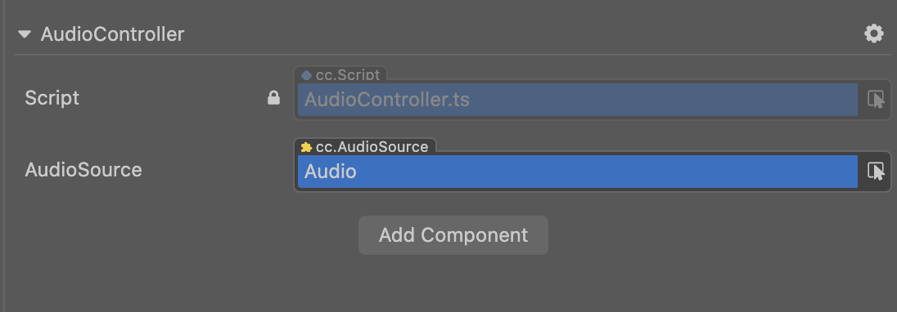

# 声音系统总览

声音系统的接口主要面向两类需求，一类是长度较长，循环持续播放的 “音乐”，一类是长度较短，一次性播放的 “音效”。所有声音资源都会在编辑器内导入成 AudioClip 资源。

## 音乐播放

1. 在 **层级管理器** 上创建一个空节点
2. 选中空节点，在 **属性检查器** 最下方点击 **添加组件 -> Components -> AudioSource** 来添加 AudioSource 组件
3. 将 **资源管理器** 中所需的声音资源拖拽到 AudioSource 组件的 Clip 中，如下所示:

    

4. 根据需要对 AudioSource 组件的其他参数项进行设置即可，参数详情可参考 [AudioSource 组件参考](./audiosource.md)。

如果只需要在游戏加载完成后自动播放声音，那么勾选 AudioSource 组件的 **PlayOnAwake** 即可。如果要更灵活的控制 AudioSource 的播放，可以在自定义脚本中获取 **AudioSource 组件**，然后调用相应的 API，如下所示：

```typescript
// AudioController.ts
@ccclass("AudioController")
export class AudioController extends Component { 
    
    @property(AudioSource)
    public audioSource: AudioSource = null!;

    play () {
        this.audioSource.play();
    }

    pause () {
        this.audioSource.pause();
    }
}
```

然后在编辑器的 **属性检查器** 中添加对应的用户脚本组件。选择相对应的节点，在 **属性检查器** 最下方点击 **添加组件 -> 自定义脚本 -> 用户脚本**，即可添加脚本组件。然后将带有 AudioSource 组件的节点拖拽到脚本组件中的 **Audio Source** 上，如下所示：



## 音效播放

相较于长的音乐播放，音效播放具有以下特点：
- 播放时间短
- 同时播放的数量多

针对这样的播放需求，AudioSource 组件提供了 `playOneShot` 接口来播放音效。具体代码实现如下：

```typescript
// AudioController.ts
@ccclass("AudioController")
export class AudioController extends Component {     

    @property(AudioClip)
    public clip: AudioClip = null!;   

    @property(AudioSource)
    public audioSource: AudioSource = null!;

    playOneShot () {
        this.audioSource.playOneShot(this.clip, 1);
    }
}
```

> **注意**：`playOneShot` 是一次性播放操作，播放后的声音没法暂停或停止播放，也没法监听播放结束的事件回调。

## Web 平台的播放限制

目前 Web 平台的声音播放需要遵守最新的 [Audio Playback Policy](https://www.chromium.org/audio-video/autoplay)，即使 AudioSource 组件设置了 `playOnAwake` 也会在第一次接收到用户输入时才开始播放。范例如下：

```typescript
// AudioController.ts
@ccclass("AudioController")
export class AudioController extends Component {      

    @property(AudioSource)
    public audioSource: AudioSource = null!;

    start () {
        let btnNode = find('BUTTON_NODE_NAME');
        btnNode!.on(Node.EventType.TOUCH_START, this.playAudio, this);
    }
    
    playAudio () {
        this.audioSource.play();
    }
}
```

## 相关链接

[Audio 资源](../asset/audio.md)  
[AudioSource 组件参考](./audiosource.md)