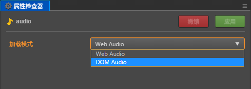

# 音频播放

音频的加载方式请参考：[声音资源](../asset-workflow/audio-asset.md)

## 使用 AudioSource 组件播放

1. 在 **层级管理器** 上创建一个空节点
2. 选中空节点，在 **属性检查器** 最下方点击 **添加组件 -> 其他组件 -> AudioSource** 来添加 AudioSource 组件
3. 将 **资源管理器** 中所需的音频资源拖拽到 AudioSource 组件的 Clip 中，如下所示:

    

然后根据需要对 AudioSource 组件的其他参数项进行设置即可，参数详情可参考 [AudioSource 组件参考](../components/audiosource.md)。

- **通过脚本控制 AudioSource 组件**

    如果只需要在游戏加载完成后自动播放音频，那么勾选 AudioSource 组件的 **Play On Load** 即可。如果要更灵活的控制 AudioSource 的播放，可以在自定义脚本中获取 **AudioSource 组件**，然后调用相应的 API，如下所示：

    ```js
    // AudioSourceControl.js
    cc.Class({
        extends: cc.Component,

        properties: {
            audioSource: {
                type: cc.AudioSource,
                default: null
            },
        },

        play: function () {
            this.audioSource.play();
        },

        pause: function () {
            this.audioSource.pause();
        },
    });
    ```

    然后在编辑器的 **属性检查器** 中添加对应的用户脚本组件。选择相对应的节点，在 **属性检查器** 最下方点击 **添加组件 -> 用户脚本组件 -> 用户脚本**，即可添加脚本组件。然后将带有 AudioSource 组件的节点拖拽到脚本组件中的 **Audio Source** 上，如下所示：

    

## 使用 AudioEngine 播放

AudioEngine 与 AudioSource 都能播放音频，它们的区别在于 AudioSource 是组件，可以添加到场景中，由编辑器设置。而 AudioEngine 是引擎提供的纯 API，只能在脚本中进行调用。如下所示：

1. 在脚本的 properties 中定义一个 AudioClip 资源对象
2. 直接使用 `cc.audioEngine.play(audio, loop, volume);` 播放，如下所示：

    ```js
    // AudioEngine.js
    cc.Class({
        extends: cc.Component,

        properties: {
            audio: {
                default: null,
                type: cc.AudioClip
            }
        },

        onLoad: function () {
            this.current = cc.audioEngine.play(this.audio, false, 1);
        },

        onDestroy: function () {
            cc.audioEngine.stop(this.current);
        }
    });
    ```

目前建议使用 [audioEngine.play](../../../api/zh/classes/audioEngine.html#play) 接口来统一播放音频。或者也可以使用 [audioEngine.playEffect](../../../api/zh/classes/audioEngine.html#playeffect) 和 [audioEngine.playMusic](../../../api/zh/classes/audioEngine.html#playmusic) 这两个接口，前者主要是用于播放音效，后者主要是用于播放背景音乐。具体可查看 API 文档。

AudioEngine 播放的时候，需要注意这里传入的是一个完整的 AudioClip 对象（而不是 url）。所以不建议在 play 接口内直接填写音频的 url 地址，而是希望用户在脚本的 properties 中先定义一个 AudioClip，然后在编辑器的 **属性检查器** 中添加对应的用户脚本组件，将音频资源拖拽到脚本组件的 audio-clip 上。如下所示：


**注意**：如果音频播放相关的设置都完成后，在部分浏览器上预览或者运行时仍听不到声音，那可能是由于浏览器兼容性导致的问题。例如：Chrome 禁用了 WebAudio 的自动播放，而音频默认是使用 Web Audio 的方式加载并播放的，此时用户就需要在 **资源管理器** 中选中音频资源，然后在 **属性检查器** 中将音频的加载模式修改为 DOM Audio 才能在浏览器上正常播放。详情可参考 [声音资源](../asset-workflow/audio-asset.md) 和 [兼容性说明](compatibility.md)。


