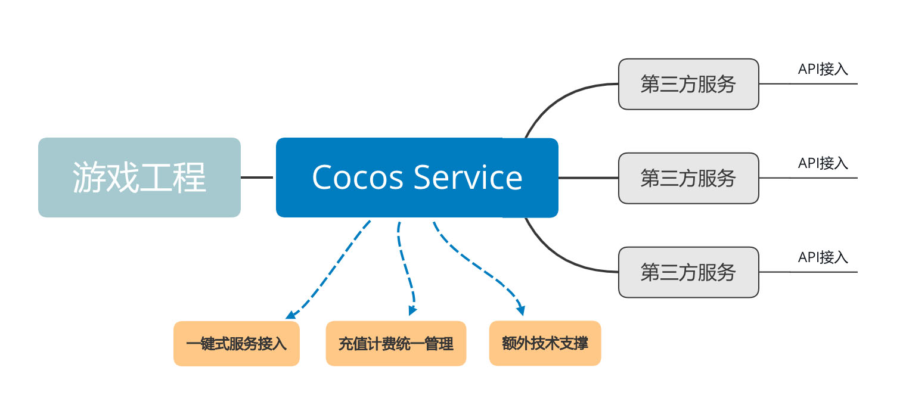

# 关于 Cocos Service
## 产品概述
Cocos 是一款优秀的开源移动游戏引擎，在全球范围内拥有数量庞大的用户。

如果说我们的目标仅仅停留在不断打造引擎本身，是远远不够的。Cocos 的目标是更好的服务广大游戏开发者，为游戏开发者提供全套的游戏开发解决方案，包括游戏研发中、上线时、上线后游戏变现等过程中所涉及到的一系列的技术和服务。Cocos 力求让游戏开发者的工作变得更加简单而高效。

Cocos Service 的主要目的有两个，一是尽最大的可能提高从用户端到达各个服务的便利性，以及易用性。我们整合了部分接入流程，带给用户一键式的接入体验；二是为第三方服务接入 Cocos Service 提供规范和依据，以及提供相应的技术支撑。

## 产品优势

开发者使用第三方服务时，每接入一家服务，一般需要按以下步骤进行接入：
- 注册开通账号
- 充值和购买服务
- 下载集成SDK
- 技术支持对接
- API接入

Cocos Service 对一些通用步骤进行了整合，提供了一键式接入的方式，用户仅需要处理服务的 API 接入部分。通过 Cocos Service 接入的优势有：
- Cocos Service 提前调研市场，审查公司资质，精选行业内高口碑高质量的产品选择接入。
- 服务上线前，Cocos Service 已经完成了服务的整合接入和调试测试等工作，降低了用户自行接入第三方服务时可能遇到的风险。
- 统一使用 Cocos 账号进行 SSO 单点登录，一个 Cocos 账号畅通所有服务，无需在每家服务商分别注册和登录账号。
- 用户统一在 Cocos 开发者账户中心进行充值和计费，减少了在多个后台管理账号和计费情况的工作量。
- 服务商的 SDK 被整合到 Cocos Creator 插件，服务开通的同时自动集成到游戏工程中，免去用户自行接入原生 SDK 时带来的困境。
- Cocos Service 提供额外的技术支撑，可以处理一些对接过程中，服务商难以解决的问题。
- 依托广大开发者群体，我们可以通过发放代金券和折扣券，带给开发者更多的实惠。

## 支持服务
- [**Cocos 数据统计**](https://n-analytics.cocos.com/docs/) ：精准了解游戏的新增、活跃、留存、付费等数据。
- [**Matchvs 游戏云**](https://www.matchvs.com/) ：专业成熟的移动游戏联网与服务端解决方案。
- [**Agora Voice**](https://www.agora.io/cn/) ：游戏内置实时音频 SDK。

更多第三方服务还在不断接入中，商务合作请联系 **zhifeng.hu@cocos.com**

