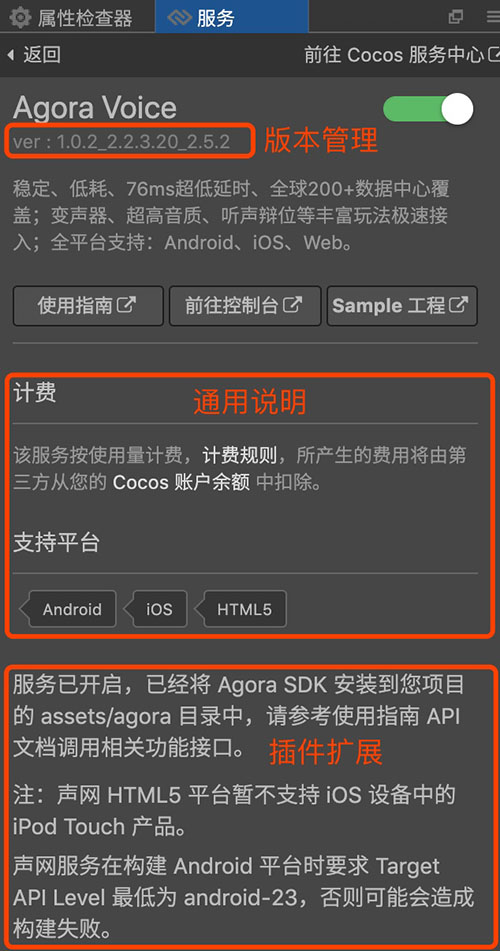
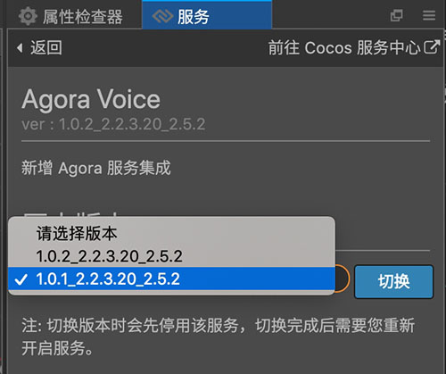

# 服务面板说明
- 服务面板分为三部分，**主面板**，**通用说明** 和 **插件扩展**。以声网 Agora Voice 为例：

    
    
###主面板：
- 使用指南：提供对应服务的文档。
- 前往控制台：跳转到对应服务的控制后台。
- Sample 工程：提供对应服务的 Cocos Creator Sample 工程下载。
- 版本管理：**点击版本号**，可以打开版本管理面板，查看该版本说明，和 **选择切换到其他历史版本**。

    

###通用说明：
- 计费说明
- 支持平台

###插件扩展：
- 开通服务时，服务面板会下载对应服务的插件，并将插件扩展的内容显示在面板上,各服务会根据自身需要进行设计。该部分可能有额外说明，参数配置面板等情况。

---

继续前往 [服务功能接入](service-integration.md)。

