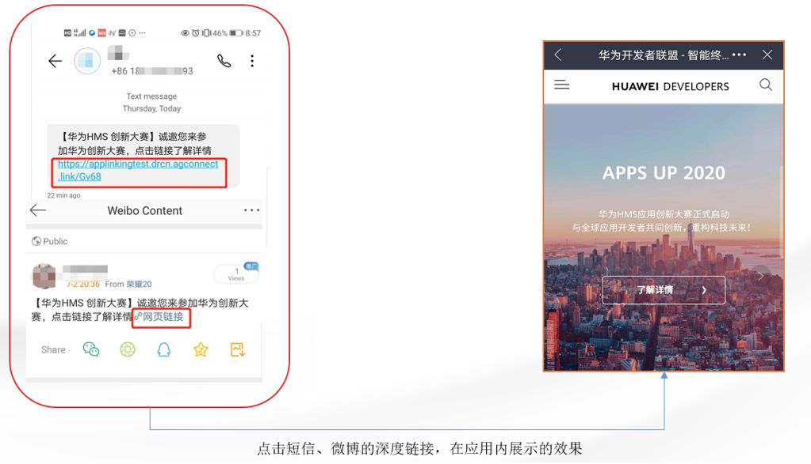
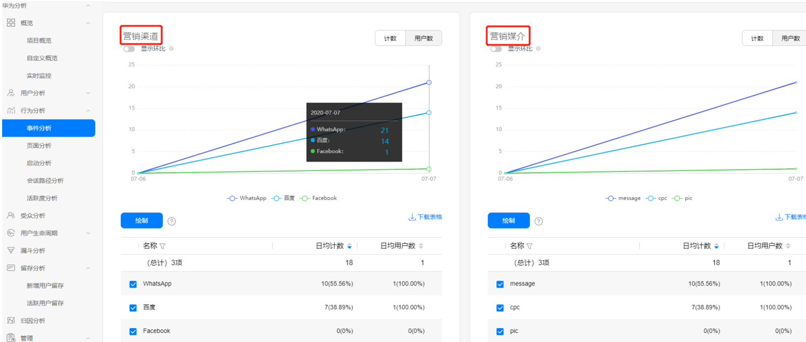
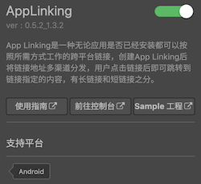
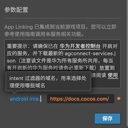
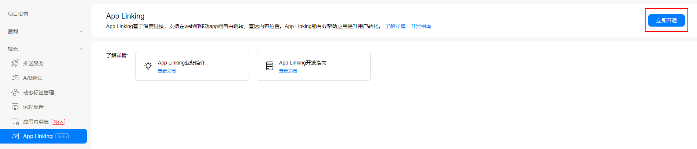
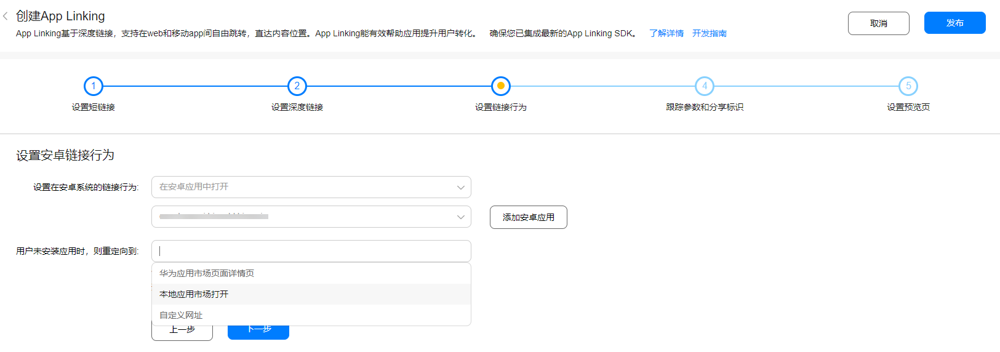
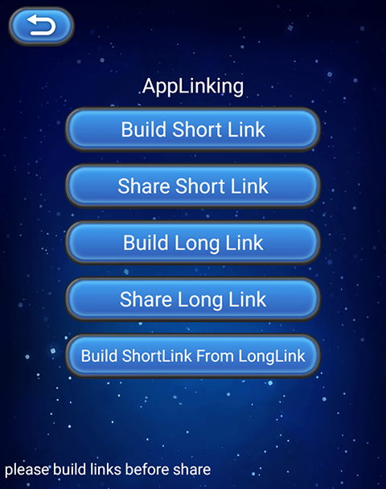

> **注意**：此版本文档已归档不再维护，请移步至 [最新版本](https://service.cocos.com/document/zh/agc-applinking.html)。

# App Linking（AppGallery Connect）快速入门

华为 AppGallery Connect（简称 AGC）[App Linking](https://developer.huawei.com/consumer/cn/doc/development/AppGallery-connect-Guides/agc-applinking-introduction) 是一种无论应用是否已经安装都可以按照所需方式工作的跨平台链接，创建 App Linking 后将链接地址多渠道分发，用户点击链接后即可跳转到链接指定的内容，有长链接和短链接之分。为了区分用户来源的渠道，在创建 App Linking 时可针对不同渠道设置不同的跟踪参数用于流量跟踪，将链接地址多平台多渠道分发投放，根据数据点击来查看哪个营销平台或广告系列最为适合。

### 应用场景

#### 唤醒沉默用户/提高某个页面访问量

结合运营 -> 活动管理 -> 用户召回功能，策划用户唤醒活动并以此为内容创建链接，通过社交、邮件、短信或 push 等方式，将此链接发送给用户。用户因活动内容吸引点击链接时，可拉起 APP 并直达此内容页面，引导用户完成转发或付费等，促活的同时增加了此页面的访问量。



#### 将移动网页用户转化成原生应用用户

在不使用 App Linking 链接的情况下，当移动网页用户通过分享打开链接时，必须先安装应用，再导航回其原先位置打开链接内容。但使用 App Linking 链接，用户就可在安装应用后，直接打开应用内对应的页面，提高应用安装率及用户体验。


#### 用于日常营销场景，跟踪用户来源，查看营销平台的有效性

用公司日常促销活动创建 App Linking，在多个渠道进行投放，通过设置参数跟踪各个渠道的点击浏览数据，来查看哪些渠道的引流效果好，以测试这个渠道的用户是否贴近应用的用户画像。



#### 鼓励用户分享

与 [云函数](https://developer.huawei.com/consumer/cn/doc/development/AppGallery-connect-Guides/agc-cloudfunction-introduction)、[云数据库](https://developer.huawei.com/consumer/cn/doc/development/AppGallery-connect-Guides/agc-clouddb-introduction) 结合使用，制定激励政策，创建 App Linking 链接，鼓励用户分享链接，邀请自己的朋友下载应用，给予分享者一定的激励，从而促进用户快速增长。

### 主要功能

| 功能 | 说明 |
| :--- | :--- |
| 延迟深度链接支持 | 即使用户还未安装该应用，也可以先跳转到应用市场，在安装该应用后，即可从他们原先所在的位置继续，而不用重新导航回到原先的位置。 |
| 支持社交卡片的适配 | 通过分享标识可以将 App Linking 呈现为卡片，实现更加丰富的呈现效果。 |
| 数据统计 | 记录链接里所有相关事件数据，比如点击次数、首次打开次数、重复打开次数等，便于数据分析。 |

### 创建链接

创建 App Linking 链接有以下三种方式：

1. 在 AGC 管理台中创建。

2. 在应用客户端创建。

3. 手动构造 App Linking 链接。

创建出来的链接包括 **长链接** 和 **短链接** 两种。其中前两种创建方式可创建长链接/短链接，而第三种方式只能创建出长链接。

#### 长链接

长链接是指包含 App Linking 所有链接信息的地址，一个典型的 App Linking 长链接地址的格式如下：

**链接前缀 + [深度链接地址] + [Android 应用参数] + [预览类型] + [社交分享标记参数] + [广告跟踪参数] + [站点编号]**

- 链接前缀：指 App Linking 链接地址中包含的网址，格式为 `https://域名`，可以使用 AGC 提供的免费域名地址。
- 深度链接地址：深度链接地址是开发者自行设置，需要用户跳转到的应用内部的地址。当用户点击链接跳转到该应用后，开发者如果需要让用户进入应用的某个具体页面，可以将深度链接地址配置为应用内部的具体页面地址。
- Android 应用参数：定义应用包名、未安装应用时需要打开的链接地址等信息。
- 预览类型：App Linking 在浏览器中打开时展示的预览页类型。
- 社交分享标记参数：定义 App Linking 在社交工具中展示的信息。当前支持的社交网站和应用包括 Facebook、Messenger、Twitter 和 WhatsApp。
- 广告跟踪参数：在链接中增加跟踪参数，可用于广告和流量跟踪。
- 站点编号：用于标记向应用提供 App Linking 服务的站点信息，站点编号根据应用设置的数据存储位置确定。

具体的参数说明可参考文档 [手动构造 App Linking](https://developer.huawei.com/consumer/cn/doc/development/AppGallery-connect-Guides/agc-applinking-createlinks-defined)。

#### 短链接

短链接地址是指为了防止链接地址过长不利于分享，将长链接地址包含的信息缩短成随机字符串后缀。短链接地址格式如下：

**链接前缀 + 随机字符串后缀**

- 链接前缀：与长链接的一致。
- 随机字符串后缀，包括 **LONG** 和 **SHORT** 两种：
  - **LONG** 固定 17 位字符。
  - **SHORT** 以 4 位字符开始，当 4 位字符的随机字符串使用完后自动增加 1 位，依次累加。

### 打开链接

链接创建完成后可设置在 **浏览器** 或 **应用** 中打开。

- 如果设置的是在浏览器中打开，那么无论用户是在 **移动端** 还是 **PC 端** 都可以通过浏览器打开链接查看内容。

- 如果设置的是在应用中打开：
  - 若尚未安装应用，则会跳转到应用市场（或自定义网址）提示用户安装应用然后展示内容。
  - 若已安装应用，则会直接打开应用原生的页面来展示内容。

### 版本更新说明

- 当前版本：0.6.0_1.4.2.301

    - 升级 SDK 版本到 1.4.2.301。
    - 服务面板添加 **intent link type** 选项。
    - 服务面板添加 **剪切板设置** 选项。

- v0.5.9_1.4.1.300

    - 增加对 App Linking 信息接收方式的支持。

- v0.5.7_1.4.1.300

    - 修复部分 bug。

- v0.5.4_1.3.2

    - 集成华为 AGC App Linking 服务。

## 一键接入 App Linking

### 开通服务

- 使用 Cocos Creator 打开需要接入 App Linking 服务的项目工程。

- 由于 App Linking 事件进行数据统计时，使用了华为分析服务功能，所以在集成 App Linking 服务前，请先开通 [分析服务（HMS Core）](./hms-analytics.md#%E5%BC%80%E9%80%9A%E6%9C%8D%E5%8A%A1)。

- 点击菜单栏的 **面板 -> 服务**，打开 **服务** 面板，选择 **App Linking**，进入服务详情页。然后点击右上方的 **启用** 按钮即可开通服务。详情可参考 [服务面板操作指南](./user-guide.md)。

  

- 在 App Linking 服务面板的 **参数配置** 中填写 **android intent filter**，需要填入 App Linking **转换前** 的网站地址，然后设置 **intent link type** 选项。构建时插件会将所需的配置添加到 `AndroidManifest.xml` 文件中。具体内容可参考 [添加 Intent 过滤器](https://developer.huawei.com/consumer/cn/doc/development/AppGallery-connect-Guides/agc-applinking-receivelinks#h1-1579335100846)。

    - 当前支持使用 **AppLink** 或 **DeepLink** 来接收信息，一般建议使用 **AppLink**。
    - 若选择 **AppLink**，网址前缀必须为 `http://` 或者 `https://`。
    - 若选择 **DeepLink**，可以使用任意网址前缀，例如 `abc://`。

- App Linking SDK 会在首次启动时，读取剪切板内容获取链接信息，以前往应用内指定的内容。可再通过 **剪切板设置** 选项，设置应用每次启动时是否读取剪切板。
    
    - **Default**：仅在应用首次启动时读取剪切板。
    - **Available**：应用每次启动时，都会读取剪切板。
    - **Unavailable**：不读取剪切板。

  

- 开发者需要在 AGC 提供的免费域名（例如 `drcn.agconnect.link`）前设置一个前缀字符串，作为开发者域名地址的唯一标识。详情请参考 [添加链接前缀](https://developer.huawei.com/consumer/cn/doc/development/AppGallery-connect-Guides/agc-applinking-createlinks-byagc#h1-1579332231584)。
  
- 登录 AppGallery Connect，点击 **我的项目**，在项目的应用列表中选择需要启动 App Linking 服务的应用，然后点击 **增长 -> App Linking**，若首次使用请点击页面右上方的 **立即开通** 按钮来开通服务。

  

### 配置华为参数文件

大部分的华为相关项目都需要用到 `agconnect-services.json` 配置文件。若有新开通服务等操作，请及时更新该文件。

- 登录 [AppGallery Connect](https://developer.huawei.com/consumer/cn/service/josp/agc/index.html) 后台，在 **项目列表 -> 应用列表** 中找到对应的应用。

- 在 **项目设置** 页面的 **应用** 区域，点击 `agconnect-services.json` 下载配置文件。`agconnect-services.json` 文件在下载或者更新完成后，**必须手动拷贝** 到工程目录的 `settings` 目录下。

  

**注意**：

- Cocos Creator v2.4.3 及以上版本，若 [发布到 HUAWEI AppGallery Connect](../publish/publish-huawei-agc.md)，开发者可直接在 **构建发布** 面板中选取下载或更新后的配置文件，不需要手动拷贝。

  

### 验证服务是否接入成功

- 完成 **App Linking** 接入步骤后，我们便可以通过在脚本中添加简单的代码，来验证接入是否成功。

  ```js
  huawei.agc.applinking.appLinkingService.on(huawei.agc.applinking.AGC_APP_LINKING_EVENT_LISTENER_NAME.RECEIVE_LINK_CALLBACK, (data) => {
      console.log("getData, data.code =", data.code);
      if (data.code === 1) {
          this.console.log('receive deepLink:', data.getDeepLink());
      }
  }, this);
  ```

- [发布到 Android 平台](../publish/publish-native.md)。请确保 **构建发布** 面板中的包名与华为后台设置的包名一致。

- 参考 [在 AGC 界面创建 App Linking](https://developer.huawei.com/consumer/cn/doc/development/AppGallery-connect-Guides/agc-applinking-createlinks-byagc) 文档，创建一个 App Linking，在 **设置安卓链接行为** 时，请选择 **在安卓应用中打开**，并在下方设置框中选择当前应用（若还未创建应用可点击后面的 **添加安卓应用** 按钮创建）。

  

- 获取该 App Linking 的地址，在测试设备的浏览器中打开该地址，可以看到 App Linking 提供的界面（如下所示），点击 **打开**，跳转到 App。

  

- 跳转到 App 后，能在 **LogCat** 中打印出 deepLink 地址，即为接入成功。

## Sample 工程

开发者可以通过 Sample 工程快速体验 App Linking。

- 点击 App Linking 面板中的 **Sample 工程** 按钮，Clone 或下载 HUAWEI Sample 工程，并在 Cocos Creator 中打开。

- 参照上文开通 App Linking 服务并配置华为参数文件后，可通过 Creator 编辑器菜单栏的 **项目 -> 构建发布** 打开 **构建发布** 面板来构建编译工程。Creator v2.4.1 及以上版本，可 [发布到 HUAWEI AppGallery Connect](../publish/publish-huawei-agc.md)。Creator v2.4.1 以下的版本可 [发布到 Android 平台](../publish/publish-native.md)。

- Sample 工程运行到手机后，点击首页的 **AppLinking** 按钮，即可进入功能界面进行测试。

  

## 开发指南

本文主要介绍 [在应用客户端创建 App Linking](https://developer.huawei.com/consumer/cn/doc/development/AppGallery-connect-Guides/agc-applinking-createlinks-bysdk) 方式，其他创建 App Linking 方式，请参考 [在 AGC 界面创建 App Linking](https://developer.huawei.com/consumer/cn/doc/development/AppGallery-connect-Guides/agc-applinking-createlinks-byagc) 和 [手动构造 App Linking](https://developer.huawei.com/consumer/cn/doc/development/AppGallery-connect-Guides/agc-applinking-createlinks-defined) 文档。

### 在应用客户端创建 App Linking

如果开发者希望在应用程序中以动态方式创建链接以便用户之间相互分享，可以在应用客户端中使用 App Linking SDK 提供的 API 来创建 App Linking 的长链接或短链接。

#### 创建长链接或短链接

- Builder 对象使用 [setBuilder](https://service.cocos.com/document/api/classes/huawei.agc.applinking.applinking.html#setbuilder) 方法设置，方法中包含 App Linking 相关参数的 `Builder` 实例，该实例使用 [huawei.AGC.AppLinking.Builder](https://service.cocos.com/document/api/classes/huawei.agc.applinking.builder.html) 构建。

  ```js
  let linkInfo = new huawei.agc.applinking.AppLinking();
  let linkBuilder = new huawei.agc.applinking.Builder();
  linkBuilder.setUriPrefix("https://yourapp.drcn.agconnect.link");
  linkBuilder.setDeepLink("https://docs.cocos.com/creator/manual/en/");
  linkInfo.setBuilder(linkBuilder);
  ```

- 安卓应用参数信息使用 [setAndroidLinkInfo](https://service.cocos.com/document/api/classes/huawei.agc.applinking.applinking.html#setandroidlinkinfo) 方法设置，方法中包含安卓参数信息的 `AndroidLinkInfo` 实例，该实例使用 [huawei.AGC.AppLinking.AndroidLinkInfo](https://service.cocos.com/document/api/classes/huawei.agc.applinking.androidlinkinfo.html) 构建。

  ```js
  let linkInfo = new huawei.agc.applinking.AppLinking();
  let androidLinkInfo = new huawei.AGC.AppLinking.AndroidLinkInfo();
  androidLinkInfo.setFallbackUrl("https://yourapp.drhw.agconnect.com/applink");
  androidLinkInfo.setMinimumVersion(1);
  linkInfo.setAndroidLinkInfo(androidLinkInfo);
  ```

- 社交分享标记参数使用 [setSocialCardInfo](https://service.cocos.com/document/api/classes/huawei.agc.applinking.applinking.html#setsocialcardinfo) 设置，方法中包含社交分享参数信息的 `SocialCardInfo` 实例，该实例使用 [huawei.AGC.AppLinking.SocialCardInfo](https://service.cocos.com/document/api/classes/huawei.agc.applinking.socialcardinfo.html) 构建。

  ```js
  let linkInfo = new huawei.agc.applinking.AppLinking();
  let socialBuilder = new huawei.agc.applinking.SocialCardInfo();
  socialBuilder.setDescription('this is a test case');
  socialBuilder.setImageUrl('http://url1.com/pic1.jpg');
  socialBuilder.setTitle('AppLinking Test');
  linkInfo.setSocialCardInfo(socialBuilder);
  ```

- 活动参数使用 [setCampaignInfo](https://service.cocos.com/document/api/classes/huawei.agc.applinking.applinking.html#setcampaigninfo) 设置，方法中包含活动参数信息的 `CampaignInfo` 实例，该实例使用 [huawei.agc.applinking.CampaignInfo](https://service.cocos.com/document/api/classes/huawei.agc.applinking.campaigninfo.html) 构建。

  ```js
  let linkInfo = new huawei.agc.applinking.AppLinking();
  let campaignInfo = new huawei.agc.applinking.CampaignInfo();
  campaignInfo.setMedium('test-medium');
  campaignInfo.setSource('test-source');
  campaignInfo.setName('test-name');
  linkInfo.setCampaignInfo(campaignInfo);
  ```

#### 创建长链接

`buildLongLink(linkInfo: AppLinking): string`

调用 `buildLongLink` 同步方法生成长链接。

```js
let getLinkInfo = new huawei.agc.applinking.AppLinking();
...
let longLink = huawei.agc.applinking.appLinkingService.buildLongLink(genLinkInfo);
```

#### 创建短链接

`buildShortLink(linkInfo: AppLinking): void`

调用 `buildShortLink` 方法生成短链接。

```js
huawei.agc.applinking.appLinkingService.once(huawei.agc.applinking.AGC_APP_LINKING_EVENT_LISTENER_NAME.BUILD_SHORT_LINK, (data) => {
    if (data.code === 1) {
        console.log('build short link success:', data.data);
    }
}, this);

let linkInfo = new huawei.agc.applinking.AppLinking();
...
huawei.agc.applinking.appLinkingService.buildShortLink(linkInfo);
```

#### 将长链接修改为短链接

`buildShortLinkFromLongLink(longLink: string): void`

如果应用已经生成了一个长链接，需要将长链接转化为短链接，可以调用 `buildShortLinkFromLongLink` 方法。

```js
huawei.agc.applinking.appLinkingService.once(huawei.agc.applinking.AGC_APP_LINKING_EVENT_LISTENER_NAME.BUILD_SHORT_LINK_FROM_LONG_LINK, (data) => {
    if (data.code === 1) {
        console.log('build short link from long link success:', data.data);
    }
}, this);

huawei.agc.applinking.appLinkingService.buildShortLinkFromLongLink(longLink);
```

### 在应用中接收 App Linking

`getAppLinking(): void`

查看指定的链接地址是否有待接收的数据，在回调中解析出 App Linking 传递的信息，如 DeepLink 地址。

```js
huawei.agc.applinking.appLinkingService.on(huawei.agc.applinking.AGC_APP_LINKING_EVENT_LISTENER_NAME.RECEIVE_LINK_CALLBACK, (data) => {
    if (data.code === 1) {
        console.log('receive deepLink:', data.getDeepLink());
    }
}, this);

huawei.agc.applinking.appLinkingService.getAppLinking();
```

## 相关参考链接

- [查看分析数据](https://developer.huawei.com/consumer/cn/doc/development/AppGallery-connect-Guides/agc-applinking-viewanalytics)
- [调试 App Linking](https://developer.huawei.com/consumer/cn/doc/development/AppGallery-connect-Guides/agc-applinking-debug)
- [社交分享标识说明](https://developer.huawei.com/consumer/cn/doc/development/AppGallery-connect-Guides/agc-applinking-socialdescription)
- [使用限制](https://developer.huawei.com/consumer/cn/doc/development/AppGallery-connect-Guides/agc-applinking-restrictions)

## API 文档

详细的功能接口和 API 说明，请参考 [App Linking  - API 文档](https://service.cocos.com/document/api/modules/huawei.agc.applinking.html)。
