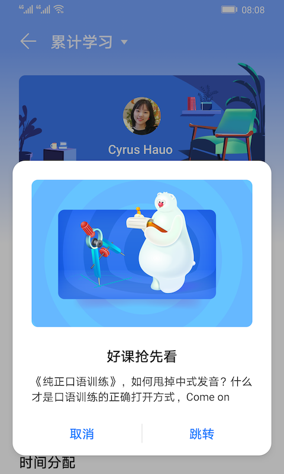
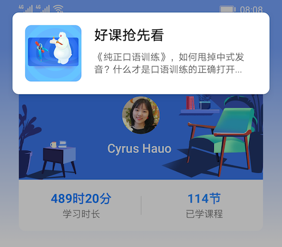
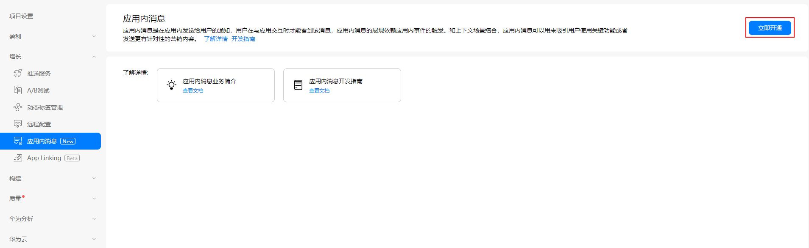

> **注意**：此版本文档已归档不再维护，请移步至 [最新版本](https://service.cocos.com/document/zh/agc-appmessaging.html)。

# 应用内消息（AppGallery Connect）快速入门

通过华为 AppGallery Connect（简称 AGC）的 [应用内消息](https://developer.huawei.com/consumer/cn/doc/development/AppGallery-connect-Guides/agc-appmessage-introduction)（App Messaging）服务，可以实现向活跃用户发送有针对性的消息来鼓励用户使用应用的关键功能，从而吸引这些用户。例如，通过应用内消息，开发者可以向用户给出某个关卡的通关提示、鼓励用户订阅，或者推荐某个餐厅活动。

开发者可以定制这些消息的外观和形式，并通过事件作为触发器，在关键的时候呈现给用户。

### 消息类型

应用内消息服务当前支持 **弹框消息**、**图片消息** 和 **Banner 消息**，每种消息包含的内容和展示布局都有差异，开发者可以根据实际的需求，来创建具体的消息内容。

- 弹框消息类似于系统的弹框，包括图片、主题、正文和按钮（最多两个按钮）。如果开发者需要展示较多的消息内容，弹框消息无疑是一个很好的选择。

  

- Banner 消息类似于消息通知，显示在手机的顶部，包括 Banner 缩略图、正文和标题，点击 Banner 弹框可以跳转到指定地址的页面。

  

- 图片消息只是在界面上显示一张图片，比如开发者可以制作一个精美的活动海报作为图片，用户点击图片的时候跳转到相应的活动详情界面。

  

### 工作原理

应用内消息服务提供了客户端 SDK，应用集成 App Messaging SDK 后，SDK 会自动同步 AGC 服务端已经发布的应用内消息，通过消息的开始/结束时间、触发事件等判断是否需要在应用内展示，达到消息展示条件时 App Messaging SDK 将在应用内使用默认布局向用户展示消息。开发者也可以使用 App Messaging SDK 提供的 API 自定义消息的展示布局。

用户看到消息后可以点击消息跳转到创建消息时设置的跳转链接，App Messaging SDK 最终将消息的展示结果上报给 AGC 服务端。开发者可以在 AGC 后台上查看消息的展示、点击和事件转换情况。

### 版本更新说明

- 当前版本：0.5.6_1.4.2.301

    - 升级 SDK 版本到 1.4.2.301。

- v0.5.3_1.4.0

    - 集成华为 AGC 应用内消息服务。

## 一键接入应用内消息

### 开通服务

- 使用 Cocos Creator 打开需要接入应用内消息服务的项目工程。

- 由于应用内消息服务使用了华为分析服务功能，所以在集成应用内消息服务前，请先开通 [分析服务（HMS Core）](./hms-analytics.md#%E5%BC%80%E9%80%9A%E6%9C%8D%E5%8A%A1)。

- 点击菜单栏的 **面板 -> 服务**，打开 **服务** 面板，选择 **应用内消息**，进入服务详情页。然后点击右上方的 **启用** 按钮即可开通服务。详情可参考 [服务面板操作指南](./user-guide.md)。

  

- 登录 AppGallery Connect，点击 **我的项目**，在项目的应用列表中选择需要启动应用内消息服务的应用，然后点击 **增长 -> 应用内消息**，若首次使用请点击页面右上方的 **立即开通** 按钮来开通服务。 

  

### 配置华为参数文件

大部分的华为相关项目都需要用到 `agconnect-services.json` 配置文件。若有新开通服务等操作，请及时更新该文件。

- 登录 [AppGallery Connect](https://developer.huawei.com/consumer/cn/service/josp/agc/index.html) 后台，在 **项目列表 -> 应用列表** 中找到对应的应用。

- 在 **项目设置** 页面的 **应用** 区域，点击 `agconnect-services.json` 下载配置文件。`agconnect-services.json` 文件在下载或者更新完成后，**必须手动拷贝** 到工程目录的 `settings` 目录下。

  

- Cocos Creator v2.4.3 及以上版本，若 [发布到 HUAWEI AppGallery Connect](../publish/publish-huawei-agc.md)，开发者可直接在 **构建发布** 面板中选取下载或更新后的配置文件，不需要手动拷贝。

  

### 验证服务是否接入成功

- 完成 **应用内消息** 服务接入步骤后，我们便可以通过在脚本中添加简单的代码，来验证接入是否成功。

  ```js
  console.log("get AAID =", huawei.agc.appmessaging.appMessagingService.getAAID());
  huawei.agc.appmessaging.appMessagingService.setForceFetch();
  ```

- [发布到 Android 平台](../publish/publish-native.md)。请确保 **构建发布** 面板中的包名与华为后台设置的包名一致。

- 工程运行到手机后，在 **LogCat** 中获取 **AAID**。

  

- 参考 [创建应用内消息](https://developer.huawei.com/consumer/cn/doc/development/AppGallery-connect-Guides/agc-appmessage-create) 文档，创建一组应用内消息。

- 参考 [调试应用内消息](https://developer.huawei.com/consumer/cn/doc/development/AppGallery-connect-Guides/agc-appmessage-debug) 文档，通过之前获取到的 **AAID**，将设备设置为测试设备，将该消息设置为测试消息。

- 再次运行工程到手机，若能看到设置的应用内消息弹出，即为接入成功。

## Sample 工程

开发者可以通过 Sample 工程快速体验应用内消息服务。

- 点击应用内消息服务面板中的 **Sample 工程** 按钮，Clone 或下载 HUAWEI Sample 工程，并在 Cocos Creator 中打开。

- 参照上文开通应用内消息服务并配置华为参数文件后，可通过 Creator 编辑器菜单栏的 **项目 -> 构建发布** 打开 **构建发布** 面板来构建编译工程。Creator v2.4.1 及以上版本，可 [发布到 HUAWEI AppGallery Connect](../publish/publish-huawei-agc.md)。Creator v2.4.1 以下的版本可 [发布到 Android 平台](../publish/publish-native.md)。

- 需要在已安装 HMS Core 服务的华为或荣耀品牌手机上测试。

- Sample 工程运行到手机后，点击首页的 **AppMessaging** 按钮，即可进入功能界面进行测试。

  

## 开发指南

当达到消息展示的触发条件后，App Messaging SDK 会自动以默认的消息展示布局在应用中展示消息。开发者 **不需要编写任何代码**，就可以拥有展示消息的能力。如果开发者需要对展示消息或用户对消息的操作进行一些特殊的配置，可以通过 App Messaging SDK 提供的 API 完成。

本文档对应 AppGallery Connect 文档 - [展示应用内消息](https://developer.huawei.com/consumer/cn/doc/development/AppGallery-connect-Guides/agc-appmessage-display)，使用 JavaScript 调用时，请以本文档和 [API 文档](https://service.cocos.com/document/api/modules/huawei.agc.appmessaging.html) 为准。

**注意**：由于 JavaScript 层限制，应用内消息插件不支持 [自定义消息布局](https://developer.huawei.com/consumer/cn/doc/development/AppGallery-connect-Guides/agc-appmessage-display#h1-1586403550092) 相关功能。

### 应用内消息的展示条件

App Messaging SDK 展示消息的条件包括以下几点：

1. App 必须在前台运行。

2. App 触发消息展示的事件：用户在 App 的操作触发消息预设的事件后，App Messaging SDK 会去同步 AGC 服务端或本地缓存的消息数据，获取到消息后，判断消息是否需要显示。

    App Messaging SDK 支持数据拉取开关的设置，方便开发者随时开启/停用从 AGC 服务端数据拉取功能（默认为开启）。

    调用 [setFetchMessageEnable](https://service.cocos.com/document/api/classes/huawei.agc.appmessaging.appmessagingservice.html#setfetchmessageenable)，设置是否同步 AGC 服务端数据的开关。

    ```js
    huawei.agc.appmessaging.appMessagingService.setFetchMessageEnable(true);
    ```
  
    **说明**：

    - App Messaging SDK 并不是每次触发事件都会去 AGC 服务端请求消息，而是在一定的时间内只请求一次（通常为 App 启动时），然后把所有的消息缓存到本地，在过期时间之内事件触发时只会从本地读取消息。
    - 在消息数据过期时间内，如果在 AGC 创建了新的消息，由于 App Messaging SDK 不会再次到 AGC 请求数据，新创建的消息将不会被获取。

3. AGC 上创建了应用内消息，且消息处于发布状态，消息需要满足以下条件：

    - 消息的开始时间和结束时间：当前时间（手机时间）需要大于消息的开始时间且小于结束时间。
    - 消息的展示频率：消息没有被展示过，展示的次数或者频率没有超过限制。
    - 消息的触发事件：消息的触发事件列表中需要包含此次 App 的触发事件。

    App Messaging SDK 支持消息展示开关的设置，方便开发者随时开启/停用消息展示功能（默认为开启）。

    调用 [setDisplayEnable](https://service.cocos.com/document/api/classes/huawei.agc.appmessaging.appmessagingservice.html#setdisplayenable)，设置是否允许展示消息的开关。

    ```js
    huawei.agc.appmessaging.appMessagingService.setDisplayEnable(true);
    ```

### 当用户与消息交互时进行响应

通过 App Messaging SDK，开发者可以进一步定制应用内消息的行为，在用户与消息交互时进行响应，App Messaging SDK 支持对消息的展示、点击，以及消失事件的监听。可以通过 `huawei.agc.appmessaging.appMessagingService.on` 监听回调，或者通过 `huawei.agc.appmessaging.appMessagingService.once` 获取单次回调。

```js
huawei.agc.appmessaging.appMessagingService.on(huawei.agc.appmessaging.AGC_APP_MESSAGING_LISTENER_NAME.ON_MESSAGE_CLICK, (result) => {
    console.log('getId: ', result.getId());
}, this);

huawei.agc.appmessaging.appMessagingService.once(huawei.agc.appmessaging.AGC_APP_MESSAGING_LISTENER_NAME.ON_MESSAGE_DISPLAY, (result) => {
    console.log('getMessageType: ', result.getMessageType());
}, this);
```

## 相关参考链接

- [创建应用内消息](https://developer.huawei.com/consumer/cn/doc/development/AppGallery-connect-Guides/agc-appmessage-create)
- [发布应用内消息](https://developer.huawei.com/consumer/cn/doc/development/AppGallery-connect-Guides/agc-appmessage-release)
- [查看分析数据](https://developer.huawei.com/consumer/cn/doc/development/AppGallery-connect-Guides/agc-appmessage-analysis)
- [FAQ](https://developer.huawei.com/consumer/cn/doc/development/AppGallery-connect-Guides/agc-appmessage-faq)

## API 文档

详细的功能接口和 API 说明，请参考 [应用内消息 - API 文档](https://service.cocos.com/document/api/modules/huawei.agc.appmessaging.html)。
