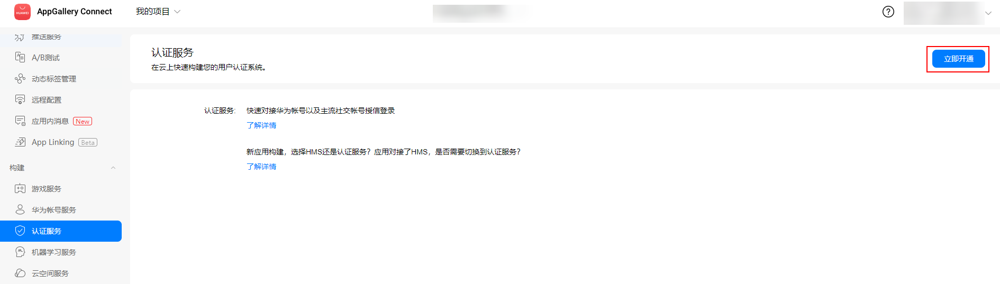
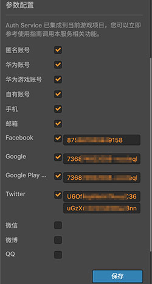
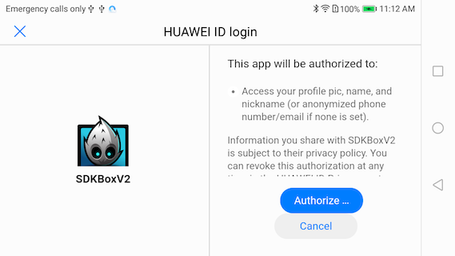
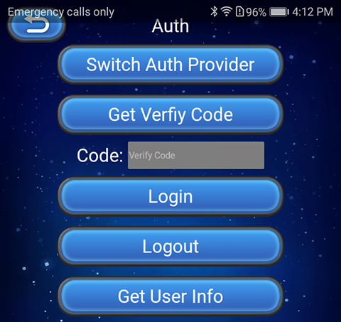

> **注意**：此版本文档已归档不再维护，请移步至 [最新版本](https://service.cocos.com/document/zh/agc-auth.html)。

# 认证服务（AppGallery Connect）快速入门

华为 AppGallery Connect（简称 AGC）[认证服务](https://developer.huawei.com/consumer/cn/doc/development/AppGallery-connect-Guides/agc-auth-introduction-0000001053732605)，提供了云侧服务和 SDK，可以为应用快速构建安全可靠的用户认证系统，以便应用可以对用户进行身份认证。

认证服务支持多种认证方式，并与其他 Serverless 服务紧密集成，开发者可以通过简单的规则定义来保护用户的数据安全。

### 与 HMS 帐号服务的区别和关系

认证服务和 HMS 帐号服务关注的是开发者两个不同层面的诉求。

- 认证服务致力于帮助开发者快速低成本的构建一个安全可靠的用户认证系统。

- HMS 帐号服务则致力于华为帐号的开放，可以让用户方便快捷地使用华为帐号登录应用和游戏。

两者并不冲突，认证服务支持与多种第三方认证系统（包括 HMS 帐号服务）对接，支持用户采用多种认证方式（包括华为帐号）来登录应用和游戏。无论开发者的应用和游戏是否已经集成了 HMS 帐号服务，或者是否打算集成 HMS 帐号服务，我们都推荐使用认证服务来构建用户认证系统，这有助于减少开发者在用户认证系统构建和运维上的投入和成本。

### 主要功能

使用认证服务可将以下的一种或多种认证方式集成到应用中，方便用户轻松快速地注册和登录应用。

- 自有帐号：用于支撑开发者已有的认证系统的接入，以便存量用户能够以安全的方式访问其他 Serverless 服务。
- 匿名帐号：可以支撑应用的游客访问方式。认证服务可以为游客分配用户标识，以便游客可以以安全的方式访问其他 Serverless 服务。游客后续可通过注册来转化为正式用户，并保留其原来的用户标识，以使其业务保持连贯。
- 第三方账号：通过对接第三方认证服务对用户进行身份认证。认证服务支持用户使用他们对应的帐号进行身份认证。目前支持以下几种第三方认证方式：

  - 华为帐号
  - 华为游戏帐号
  - 手机
  - 邮箱
  - 微信
  - 微博
  - QQ

  以下几种海外认证方式 **仅支持海外站点**，例如数据存储位置为德国、新加坡或俄罗斯时。其中 **Google 帐号** 和 **Google Play Game 帐号** 这两种认证方式仅支持在安装了 GMS（Google Mobile Services）服务的设备上使用。

  - Google
  - Google Play Game
  - Facebook
  - Twitter

### 工作原理

- 获取认证凭据

  认证方式不同，其认证凭据的获取方式也不相同。
  
  - 对于第三方帐号认证，认证凭据是第三方认证服务颁发的 OAuth 令牌。
  - 对于匿名帐号，认证凭据是认证服务 SDK 为该应用安装实例生成的唯一标识。
  - 对于自有帐号，认证凭据是开发者已有认证系统通过 Server SDK 生成 Token。

- 上报认证凭据

  应用将认证凭据通过认证服务 SDK 上报给认证服务。

- 验证认证凭据

  认证服务在云侧对认证凭据进行验证。

- 返回认证结果

  认证服务将认证结果返回给应用。此时应用可以访问和维护该用户的基本个人资料信息（昵称、头像），也可以访问和操作其他 Serverless 服务中的受安全规则保护的数据。

### 版本更新说明

- 当前版本：0.5.2_1.4.1.300

    - 更新 SDK，新增部分接口。

- v0.5.1_1.3.1

    - 集成华为 AGC 认证服务。
 
## 一键接入认证服务

### 开通服务

- 使用 Cocos Creator 打开需要接入认证服务的项目工程。

- 点击菜单栏的 **面板 -> 服务**，打开 **服务** 面板，选择 **认证服务**，进入服务详情页。然后点击右上方的 **启用** 按钮即可开通服务。详情可参考 [服务面板操作指南](./user-guide.md)。

  

- 登录 AppGallery Connect，点击 **我的项目**，在项目的应用列表中选择需要启动认证服务的应用，然后点击 **构建 -> 认证服务**，若首次使用请点击页面右上方的 **立即开通** 按钮来开通服务。具体内容可参考 [启用服务](https://developer.huawei.com/consumer/cn/doc/development/AppGallery-connect-Guides/agc-auth-android-getstarted-0000001053053922#ZH-CN_TOPIC_0000001053053922__section916641174412) 文档。

  

- 选择所需的认证方式，点击右侧的 **启用** 按钮。

  

- 填写所需参数。各认证方式的参数申请，可参考 [启用服务](https://developer.huawei.com/consumer/cn/doc/development/AppGallery-connect-Guides/agc-auth-android-getstarted-0000001053053922#ZH-CN_TOPIC_0000001053053922__section916641174412) 文档。

  

- 设置完成后回到 Creator 服务面板，勾选所需的认证方式，填入该认证方式客户端所需的参数。

  

  **注意**：若使用 **Google 帐号** 或 **Google Play Game 帐号** 认证方式，在发布到 Android 平台时，**构建发布** 面板中的 **生成 App Bundle（Google Play）** 选项 **请勿勾选**。

### 配置华为参数文件

大部分的华为相关项目都需要用到 `agconnect-services.json` 配置文件。若有新开通服务等操作，请及时更新该文件。

- 登录 [AppGallery Connect](https://developer.huawei.com/consumer/cn/service/josp/agc/index.html) 后台，在 **项目列表 -> 应用列表** 中找到对应的应用。

- 在 **项目设置** 页面的 **应用** 区域，点击 `agconnect-services.json` 下载配置文件。`agconnect-services.json` 文件在下载或者更新完成后，**必须手动拷贝** 到工程目录的 `settings` 目录下。

  

- Cocos Creator v2.4.3 及以上版本，若 [发布到 HUAWEI AppGallery Connect](../publish/publish-huawei-agc.md)，开发者可直接在 **构建发布** 面板中选取下载或更新后的配置文件，不需要手动拷贝。

  

### 验证服务是否接入成功

- 我们以 **华为账号** 认证方式为例。登录 [AppGallery Connect](https://developer.huawei.com/consumer/cn/service/josp/agc/index.html) 后台，打开对应项目，进入 **构建 -> 认证服务**，启用 **华为账号** 认证方式并填写参数。

  

- 在脚本中添加代码。

  ```js
  huawei.agc.auth.authService.switchAuthType(huawei.agc.auth.AuthProvider.HMS_Provider);
  huawei.agc.auth.authService.login();
  ```

- [发布到 Android 平台](../publish/publish-native.md)。请确保 **构建发布** 面板中的包名与华为后台设置的包名一致。

- 工程运行到手机后，若能看到登录界面，即为接入成功。

  

## Sample 工程

开发者可以通过 Sample 工程快速体验认证服务。

- 点击认证服务面板中的 **Sample 工程** 按钮，Clone 或下载 HUAWEI Sample 工程，并在 Cocos Creator 中打开。

- 参照上文开通认证服务并配置华为参数文件后，可通过 Creator 编辑器菜单栏的 **项目 -> 构建发布** 打开 **构建发布** 面板来构建编译工程。Creator v2.4.1 及以上版本，可 [发布到 HUAWEI AppGallery Connect](../publish/publish-huawei-agc.md)。Creator v2.4.1 以下的版本可 [发布到 Android 平台](../publish/publish-native.md)。

- 需要在已安装 HMS Core 服务的华为或荣耀品牌手机上测试。

- Sample 工程运行到手机后，点击首页的 **Auth** 按钮，即可进入功能界面进行测试。

  

## 开发指南

Cocos Service 中的认证服务插件，对原有 SDK 的各种认证方式进行了统一封装。使用 JavaScript 接入时，请以本文档和 [认证服务 - API 文档](https://service.cocos.com/document/api/modules/huawei.agc.auth.html) 为准。

### 监听和回调

认证服务插件将各认证登录方式的回调进行统一封装，开发者需要设置监听并绑定方法，在绑定方法中统一处理回调逻辑。

回调枚举值 [AuthRetCode](https://service.cocos.com/document/api/enums/huawei.agc.auth.authretcode.html) 有三种长度类型：

- 四位数的 **1XXX** 为认证服务插件封装的 **统一回调事件枚举值**，开发者需要对关键事件进行处理。
- 九位数的 **2038XXXXX** 为 SDK 返回的后端服务器的错误信息。
- 一位数的从 **1 ~ 7** 为 SDK 内部错误信息。

后面两种长度类型都是 SDK 的错误码，可以根据需要进行处理。

**示例**：

```js
huawei.agc.auth.authService.setAuthListener(this.onAuthResult, this));

onAuthResult: function (code, msg) {
    switch (code) {
      ...
    }
}
```

### switchAuthType

`switchAuthType(authType: AuthProvider): void`

选取当前认证登录方式。需要先调用该方法，才能调用 `login` 等方法。可通过 [getSupportAuthType](#getsupportauthtype) 方法先获取支持的认证登录方式。

**参数说明**：

| 参数 | 说明 |  
| :---------- | :------------- |  
|  authType  | [AuthProvider](https://service.cocos.com/document/api/enums/huawei.agc.auth.authprovider.html) 第三方认证登录方式枚举值 | 

**示例**：

```js
huawei.agc.auth.authService.switchAuthType(huawei.agc.auth.AuthProvider.HMS_Provider);
```

### login

`login(): void`

调用当前认证登录方式的 **登录** 方法。

**示例**：

```js
huawei.agc.auth.authService.login();
```

### logout

`logout(): void`

调用当前认证登录方式的 **登出** 方法。

**示例**：

```js
huawei.agc.auth.authService.logout();
```

### getUserInfo

`getUserInfo(): any`

获取当前用户信息。返回信息可能包括：
- `isAnonymous`：是否为游客账号
- `uid`：用户 ID
- `displayName`：用户显示名称
- `photoUrl`：头像 URL
- `email`：邮箱地址
- `phone`：手机号码
- `providerId`：[AuthProvider](https://service.cocos.com/document/api/enums/huawei.agc.auth.authprovider.html) 第三方认证登录方式枚举值
- `providerInfo`：认证登录信息
- `emailVerified`：是否已通过邮箱验证
- `passwordSetted`：是否已设置密码

**示例**：

```js
let userInfo = huawei.agc.auth.authService.getUserInfo();
console.log('getUserInfo...', 'info =', JSON.stringify(userInfo));
```

### setLoginInfo

`setLoginInfo(loginInfo: any): void`

设置用户注册或登录信息（邮箱或手机认证登录方式），该方法需要在其他方法前调用。

**参数说明**：

| 参数 | 说明 |  
| :---------- | :------------- |  
|  loginInfo  | JSON 对象，按手机或邮箱认证登录方式的需要，传入以下参数：<br>`email`：邮箱账号，邮箱认证登录方式需要传入。<br>`phoneNumber`：手机号码，手机认证登录方式需要传入。<br>`countryCode`：国家码，即国际电话区号，手机认证登录方式需要传入。<br>`verifyCode`：调用 `register` 或 `getVerifyCode` 方法后让用户填写的验证码，用于重置登录信息。<br>`action`：`register`（用于注册）或 `reset`（用于重置）。<br>`locale`：可选，[updatePhone](#updatePhone) 和 [updateEmail](#updateEmail) 方法发送的验证码的语言，默认为当前系统语言。 | 

**示例**：

```js
let loginInfo = {
  email: '953xxxxx@gmail.com',
  phoneNumber: "181XXXXXXXX",
  countryCode: "86",
  verifyCode: code,
  action: "register",
  locale: "zh",
}
huawei.agc.auth.authService.setLoginInfo(loginInfo);
```

### register

`register(): void`

用户注册（邮箱或手机认证登录方式）

**示例**：

```js
huawei.agc.auth.authService.register();
```

### getVerifyCode

`getVerifyCode(): void`

获取验证码（邮箱或手机认证登录方式）

**示例**：

```js
huawei.agc.auth.authService.getVerifyCode();
```

### getSupportAuthType

`getSupportAuthType(): string`

获取支持的认证登录方式，例如 "[0, 1, 2]"。枚举值对应 [AuthProvider](https://service.cocos.com/document/api/enums/huawei.agc.auth.authprovider.html)。

**示例**：

```js
let supAuthType = huawei.agc.auth.authService.getSupportAuthType();
console.log("getSupportAuthType...", "type = ", supAuthType);
```

### getToken

`getToken(forceRefresh: boolean): void`

获取用户的 Access Token 信息。通过异步回调更新结果。回调 Code 为 `huawei.agc.auth.AuthRetCode.GET_TOKEN_SUCCESS` 或 `huawei.agc.auth.AuthRetCode.GET_TOKEN_FAIL`。

**参数说明**：

| 参数 | 说明 |  
| :---------- | :------------- |  
|  forceRefresh  | 是否强制刷新用户的 Access Token 信息。<br>`true`：强制刷新。<br>`false`：获取缓存的 Access Token。| 

**示例**：

```js
huawei.agc.auth.authService.getToken(true);
```

### link

`link(authType: AuthProvider): void`

为当前用户关联新的认证登录方式。

**参数说明**：

| 参数 | 说明 |  
| :---------- | :------------- |  
|  authType  | [AuthProvider](https://service.cocos.com/document/api/enums/huawei.agc.auth.authprovider.html) 第三方认证登录方式枚举值 | 

**示例**：

```js
huawei.agc.auth.authService.link(huawei.agc.auth.AuthProvider.HMS_Provider);
```

### unlink

`unlink(authType: AuthProvider): void`

为当前用户解除关联的认证登录方式。

**参数说明**：

| 参数 | 说明 |  
| :---------- | :------------- |  
|  authType  | [AuthProvider](https://service.cocos.com/document/api/enums/huawei.agc.auth.authprovider.html) 第三方认证登录方式枚举值 | 

**示例**：

```js
huawei.agc.auth.authService.unlink(huawei.agc.auth.AuthProvider.HMS_Provider);
```

### updateProfile

`updateProfile(displayName: string, photoUrl: string): void`

更新当前用户的个人信息（图像和昵称）。

此接口会验证用户 Access Token 和 Refresh Token，请确保用户 Refresh Token 在有效期内，否则会抛出 `INVALID_REFRESH_TOKEN = 203817986`（用户 Refresh Token 无效错误码）。开发者收到此错误码后，应该让用户重新登录，获取新的 Access Token 和 Refresh Token。

**参数说明**：

| 参数 | 说明 |  
| :---------- | :------------- |  
|  displayName  | 用户显示名称（昵称） | 
|  photoUrl  | 用户头像 URL |

**示例**：

```js
huawei.agc.auth.authService.updateProfile("name1", photoUrl);
```

### updatePassword

`updatePassword(newPassword: string, verifyCode: string, provider: AuthProvider): void`

更新当前用户的密码，可参考 [updatePassword](https://developer.huawei.com/consumer/cn/doc/development/AppGallery-connect-References/agconnectuser#updatePassword) 文档，通过异步回调更新结果。密码更新成功后，用户的 Access Token 将会刷新，请用户重新登录，否则会出现 Access Token 不匹配而调用接口失败。

**参数说明**：

| 参数 | 说明 |  
| :---------- | :------------- |  
|  newPassword  | 新密码 | 
|  verifyCode  | 验证码 |
|  provider  | [AuthProvider](https://service.cocos.com/document/api/enums/huawei.agc.auth.authprovider.html) 第三方认证登录方式枚举值，此处用于区分邮箱和电话 |

**示例**：

```js
huawei.agc.auth.authService.updatePassword("neWPaSSwOrd", "1234", huawei.agc.auth.AuthProvider.Phone_Provider);
```

### updateEmail

更新当前用户的邮箱。可参考 [updateEmail](https://developer.huawei.com/consumer/cn/doc/development/AppGallery-connect-References/agconnectuser-0000001054522513#ZH-CN_TOPIC_0000001054522513__section39401634112717) 文档，通过异步回调更新结果。调用此接口之前，请调用 `getVerifyCode` 方法为新邮箱申请验证码，从而确定新邮箱为该用户所有。验证码的语言请在 [setLoginInfo](#setLoginInfo) 方法中设置。

**参数说明**：

| 参数 | 说明 |  
| :---------- | :------------- |  
|  newEmail  | 新邮箱帐号 | 
|  newVerifyCode  | 验证码 |

**示例**：

```js
huawei.agc.auth.authService.updateEmail("newUser1@gmail.com", "1234");
```

### updatePhone

`updatePhone(countryCode: string, phoneNumber: string, newVerifyCode: string): void`

更新当前用户的手机号。可参考 [updatePhone](https://developer.huawei.com/consumer/cn/doc/development/AppGallery-connect-References/agconnectuser-0000001054522513#ZH-CN_TOPIC_0000001054522513__section1668015437285) 文档，通过异步回调更新结果。调用此接口之前，请调用 `getVerifyCode` 方法为新手机申请验证码，从而确定新手机为该用户所有。验证码的语言请在 [setLoginInfo](#setLoginInfo) 方法中设置。

**参数说明**：

| 参数 | 说明 |  
| :---------- | :------------- |  
|  countryCode  | 国家码，即国际电话区号。比如中国为 86、德国 49、俄罗斯 7、新加坡 65。<br>该字段支持多种格式，以中国为例 86、0086、+86 都可以。 | 
|  phoneNumber  | 手机号码。需要去掉“+”号和国家（地区）码，例如：+86132xxxxxxxx，则取值132xxxxxxxx。 |
|  newVerifyCode  | 验证码 |

**示例**：

```js
huawei.agc.auth.authService.updatePhone("0086", "132xxxxxxxx", "1234");
```

### getUserExtra

`getUserExtra(): void`

获取当前用户的 UserExtra，通过异步回调更新结果，可参考 [getUserExtra](https://developer.huawei.com/consumer/cn/doc/development/AppGallery-connect-References/agconnectuser-0000001054522513#ZH-CN_TOPIC_0000001054522513__section191819193315) 文档。此接口会验证用户 Access Token 和 Refresh Token，请确保用户 Refresh Token 在有效期内，否则会抛出错误码 `INVALID_REFRESH_TOKEN = 203817986`，表示用户 Refresh Token 无效错误码。开发者收到此错误码后，应该让用户重新登录，获取新的 Access Token 和 Refresh Token。

**示例**：

```js
huawei.agc.auth.authService.getUserExtra();
```

### deleteUser

`deleteUser(): void`

在 AppGallery Connect 服务器端删除当前用户信息，同时清除缓存信息。

**示例**：

```js
huawei.agc.auth.authService.deleteUser();
```

### resetPassword

`resetPassword(emailOrPhone: string, newPassword: string, verifyCode: string, countryCode = ""): void`

重置密码（邮箱或手机认证登录方式）。若传入 `countryCode` 参数则为手机认证登录方式，不传则为邮箱认证登录方式。回调 Code 为 `huawei.agc.auth.AuthRetCode.RESET_PASS_SUCCESS` 和 `huawei.agc.auth.AuthRetCode.RESET_PASS_FAIL`。

**参数说明**：

| 参数 | 说明 |  
| :---------- | :------------- |  
|  emailOrPhone  | 填写邮箱地址或者手机号码 | 
|  newPassword  | 新密码 | 
|  verifyCode  | 验证码 |
|  countryCode  | 国家码，即国际电话区号。比如中国为 86、德国 49、俄罗斯 7、新加坡 65。<br>该字段支持多种格式，以中国为例 86、0086、+86 都可以。 |

**示例**：

```js
huawei.agc.auth.authService.resetPassword("132xxxxxxxx", "neWPaSSwOrd", "1234", "0086");

huawei.agc.auth.authService.resetPassword("newUser1@gmail.com", "neWPaSSwOrd", "1234");
```

## API 文档

详细的功能接口和 API 说明，请参考 [认证服务 - API 文档](https://service.cocos.com/document/api/modules/huawei.agc.auth.html)。
