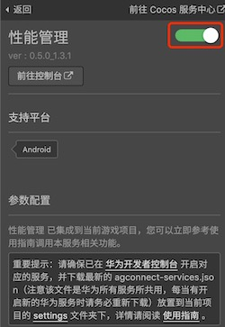
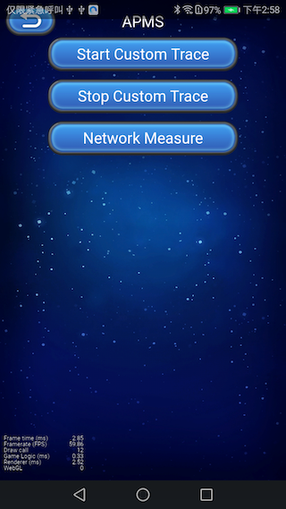

# 远程配置服务（AppGallery Connect）快速入门

华为 AppGallery Connect（简称 AGC）[远程配置服务](https://developer.huawei.com/consumer/cn/doc/development/AppGallery-connect-Guides/agc-remoteconfig-introduction) 提供了在线的配置项管理能力，可以实现应用在线更改行为和外观，而无需用户下载应用更新。

远程配置服务提供云端，管理台和客户端 SDK，应用集成客户端 SDK后可以定期获取云端管理台配置的配置项和配置参数值，实现客户端应用行为和 UI 的修改。

### 主要功能

- **配置项管理**：添加、删除、修改配置项，通过复制方式快速添加配置项，根据不同条件设置不同配置项值。
- **配置条件管理**：添加、删除、修改条件，通过复制方式快速添加条件，当前可以设置的过滤条件包括：应用版本、设备语言、国家地区、用户受众群体、随机百分比用户、日期时间，后续可设置的过滤条件还会持续增强。
- **历史版本管理**：支持最多 90 天 300 个历史版本管理和回滚能力。
- **权限管理**：默认帐号持有者、管理员、App 管理员、开发、运营几种角色具备远程管理服务的权限。

### 应用场景

#### 不同地区展现不同语言

使用远程配置的时间条件，设定特定时间触发内容。使用远程配置的国家地区条件和设备语言条件，设定在不同的国家地区分配不同的参数值，从而呈现不同的促销内容。

#### 不同用户展现不同内容

协同高级分析服务，针对不同的用户受众群组推荐不同内容：根据高级分析（华为分析）服务定义的不同用户受众群体，比如对职场白领和学生推送不同的物品及页面布局。

#### 特定主题特定时间配置

更改应用的颜色以配合特定的主题:使用远程配置的时间条件，设定应用不同的颜色、图片素材，配合经常变化的特定主题。比如下图中毕业季这个特殊的时间段，配置一些相关的内容以吸引用户购买。

#### 功能发布

按百分比发布新功能，在同一时刻面向所有用户发布新功能的风险很高，利用远程配置可以实现按照百分比发布，从而缓慢向用户发布新功能，可以有效避免舆情或者及时修改调整。

## 一键接入远程配置服务

### 开通服务

- 使用 Cocos Creator 打开需要接入远程配置服务的项目工程。

- 点击菜单栏的 **面板 -> 服务**，打开 **服务** 面板，选择 **远程配置服务**，进入服务详情页。然后点击右上方的 **启用** 按钮即可开通服务。详情可参考 [服务面板操作指南](./user-guide.md)。

    
    
-  登录 AppGallery Connect，点击 **我的项目**。在项目下的应用列表中点击需要启动远程配置功能的应用。

- 在左侧导航栏选择 **增长 > 远程配置**。如果首次使用远程配置服务，请点击 **立即开通** 开通服务。

  

- 系统默认在开通远程配置服务时将自动开通远程配置 API，如果需要手动开通，请参见 “开通服务” 打开远程配置的 API 权限。

  

### 配置华为参数文件

大部分的华为相关项目都需要用到 `agconnect-services.json` 配置文件。若有新开通服务等操作，请及时更新该文件。

- 登录 [AppGallery Connect](https://developer.huawei.com/consumer/cn/service/josp/agc/index.html) 网站，点击 **我的项目**。
- 在项目列表中找到对应的项目，在项目下的应用列表中选择对应应用。
- 在 **项目设置** 页面的 **应用**区域，点击 `agconnect-services.json` 下载配置文件。

我们将该文件统一放在工程下的 `/setting` 目录。

- Creator 2.4.3 以上版本可在 **构建** 面板直接配置该文件。
- Creator 2.4.3 以下版本，请将 `agconnect-services.json` 文件拷贝到工程目录下的 `/settings` 目录。

### 验证服务是否接入成功

**远程配置服务** 接入时在 Android 工程中，添加了一个 `/res/xml/remote_config.xml` 本地配置文件，用于测试和指导用户使用。我们可通过在脚本中添加简单的代码，来验证接入是否成功。


```js
let value = huawei.AGC.remoteConfig.getValueAsString('test');
console.log('Get config by key : test, value :' + value);{
```

代码添加后，[**打包发布**](../publish/publish-native.md) 到 **Android** 平台上运行，请确保发布的包名与华为后台设置的包名一致。若能看到 Logcat 中，取到的值为 **testValue**，即为 SDK 接入成功。


## Sample 工程

开发者可以通过 Sample 工程快速体验定位服务。

- 点击性能服务面板中的 **Sample 工程** 按钮，Clone 或下载 HUAWEI Sample 工程，并在 Cocos Creator 中打开。

- [开通分析服务](./hms-analytics.md#开通服务)、[开通远程配置服务](#开通服务) 并 [配置华为参数文件](#配置华为参数文件) 后，可通过 Creator 编辑器菜单栏的 **项目 -> 构建发布** 打开 **构建发布** 面板来构建编译工程。Creator 2.4.3 及以上版本，可参考 [发布到 HUAWEI AppGallery Connect](../../publish/publish-huawei-agc.md)。旧版本用户可构建发布到 Android 平台。

- 需要在安装 HMS Core 服务的华为或荣耀品牌手机上测试。点击 Sample 首页的 **Remote** 按钮，进入该功能界面进行测试。



## 开发指南

本文档对应 [AppGallery Connect - 接入远程配置](https://developer.huawei.com/consumer/cn/doc/development/AppGallery-connect-Guides/agc-remoteconfig-dev-guide) 。

由于 Java 层的 `apply` 方法返回的是参数对象，无法在 JS 层传递。插件舍弃了 Java 层的 `applyDefault` 和 `apply` 方法。并封装了 `applyLastFetched` 和 `fetchAndApply` 两个方法代替。

JS 层调用，以本指南和 [API 文档](https://docs.cocos.com/service/api/modules//huawei.agc.remoteconfig.html) 为准。

### 设置应用内默认值

由于舍弃了 Java 层的 `applyDefault` 方法，所有默认配置需要到 `/res/xml/remote_config.xml` 中编写。

### 获取和更新云端参数值到本地

#### fetchAndApply

`fetchAndApply(intervalSeconds?: number): void`

插件封装了 `fetchAndApply` 方法，建议使用该方法，实现获取和更新云端参数值到本地功能。

对应 Java 层 `fetch()` + `apply()` 方法，从云测获取最新的配置数据，由参数传入间隔时间，间隔内返回缓存数据，`fetch()` 方法获取配置数据 **回调成功** 时，调用 `apply()` 生效配置参数。单位是秒，默认 intervalSeconds 为 -1，更新周期为 12 小时。

若执行 `fetch` 方法获取配置数据 **回调失败** 情况下，会通过 [setRemoteConfigListener](#setRemoteConfigListener) 监听器返回失败回调，用户可选择是否设置监听。**回调成功** 情况下 **不返回回调**。

**参数说明**：

| 参数 | 说明 |  
| :---------- | :------------- |  
|  intervalSeconds  | 获取数据的间隔时间，单位为秒，默认值为 -1，更新周期为 12 小时 | 

**示例**：

```
huawei.AGC.remoteConfig.fetchAndApply();
```

#### fetch

`fetch(intervalSeconds: number): void`

开发者也可只调用 `fetch` 方法，通过监听器 [setRemoteConfigListener](#setRemoteConfigListener) 的回调，再调用 [applyLastFetched](#加载流程) 方法，实现更新参数流程。

**参数说明**：

| 参数 | 说明 |  
| :---------- | :------------- |  
|  intervalSeconds  | 获取数据的间隔时间，单位为秒，默认值为 -1 | 

**示例**：

```
huawei.AGC.remoteConfig.fetch();
```

#### setRemoteConfigListener

`setRemoteConfigListener(listener: RemoteConfigListener): void`

`fetch` 相关方法监听器，可选。

若使用 `fetchAndApply` 方法，**仅失败** 情况下，会通过该监听器给出回调。

若使用 `fetch` 方法，成功或失败情况下，会通过该监听器给出回调。开发者可在成功回调中，再调用 `applyLastFetched` 方法，更新云端参数值。

**示例**：

```
huawei.AGC.remoteConfig.fetch();
```

### 获取参数值

```
getValueAsBoolean(key: String): Boolean { return false; }

getValueAsDouble(key: String): Number { return 0; }

getValueAsLong(key: String): Number { return 0; }

getValueAsString(key: String): String { return ""; }
```

在设置默认值和更新云端参数值后，就可以调用接口来获取参数值进行使用，插件提供了四种数据类型的接口，可根据需求进行使用。

由于 JS 层限制，插件不支持 Java 层 `getValueAsBytArray` 方法。

**参数说明**：

| 参数 | 说明 |  
| :---------- | :------------- |  
|  key  | 远程配置服务配置的 Key 值 | 

**示例**：

```
let values = huawei.AGC.remoteConfig.getMergedAll();
console.log('Get all configs : ' + JSON.stringify(values));
```

可通过 `getSource` 方法获取 Value 值的来源。数据可能有如下三种来源：

- huawei.AGC.remoteConfig.RemoteConfigSource.STATIC = 0: 获取的值是类型默认值
- huawei.AGC.remoteConfig.RemoteConfigSource.DEFAULT = 1: 获取的值是传入的本地默认值
- huawei.AGC.remoteConfig.RemoteConfigSource.REMOTE = 2: 获取的值是云端同步下来的值

### 获取全部参数值

`getMergedAll(): any`

开发者可以获取全部本地默认值和云端参数值，并且相同 key 值的数据使用云端数据。返回值为 JSON 对象。

**示例**：

```
let values = huawei.AGC.remoteConfig.getMergedAll();
console.log('Get all configs : ' + JSON.stringify(values));
```

### 重置参数值

`clearAll(): void`

清除所有的缓存数据，包括从云测拉取的数据和传入的默认值

**示例**：

```
huawei.AGC.remoteConfig.clearAll();
```

### 加载流程

可对照文档 [AppGallery Connect - 加载流程](https://developer.huawei.com/consumer/cn/doc/development/AppGallery-connect-Guides/agc-remoteconfig-dev-guide)

#### 获取数据后立刻生效

该情况对应 [fetchAndApply](#fetchAndApply) 方法。

#### 获取数据后下次启动生效

开发者可以在任何时候 fetch 数据，但是此次运行并不使其生效，在下次应用启动时，才使上次 fetch 的数据生效。这种方式可以无需异步等待即可使用最新的值。

该情况对应 [fetch](#fetch) 方法，在 [setRemoteConfigListener](#setRemoteConfigListener) 成功回调时，调用 `applyLastFetched` 方法更新云端参数值。

`applyLastFetched(): void`

对应 Java 层 `loadLastFetched()` + `apply()` 方法，获取最近一次拉取成功的缓存数据，并生效配置参数。

**示例**：

```
huawei.AGC.remoteConfig.applyLastFetched();
```

### 设置开发者模式

`setDeveloperMode(isDeveloperMode: Boolean): void`

设置开发者模式，将不限制客户端获取数据的次数，云测仍将进行流控。

**参数说明**：

| 参数 | 说明 |  
| :---------- | :------------- |  
|  key  | 远程配置服务配置的 Key 值 | 

**示例**：

```
huawei.AGC.remoteConfig.setDeveloperMode(true);
```

## API 文档

详细的功能接口和 API 说明，请参考 [崩溃服务 - API 文档](https://docs.cocos.com/service/api/modules/huawei.agc.remoteconfig.html)。


