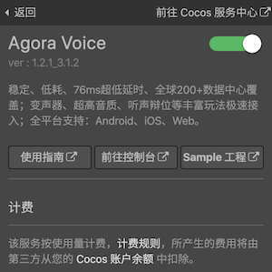
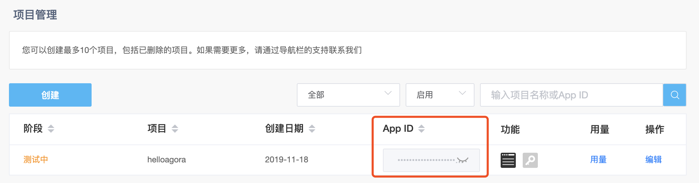
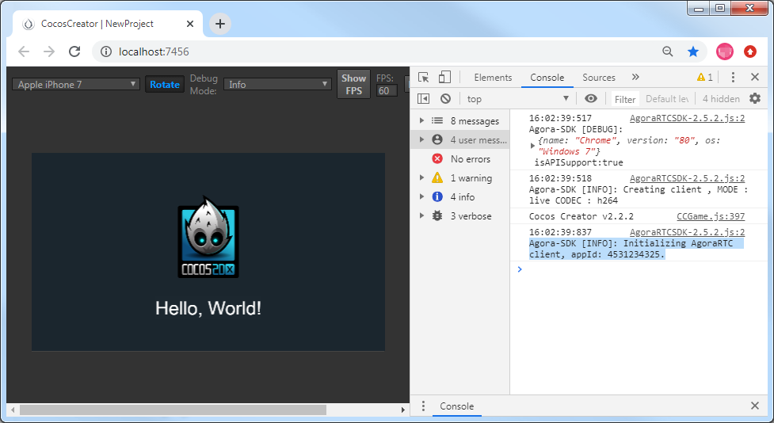
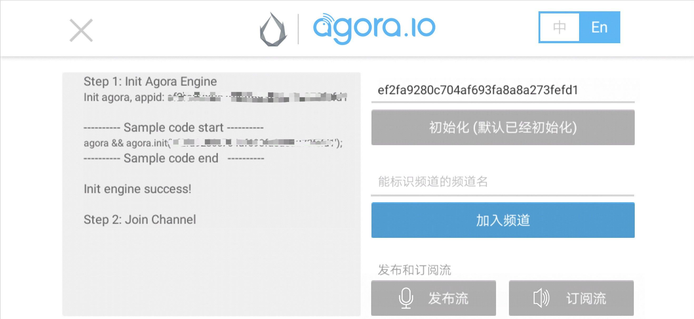

# 声网（Agora Voice）快速入门

成立于 2013 年的 [声网 Agora](https://www.agora.io/cn/) 是实时互动 API 平台行业开创者，是全球领先的专业服务商。开发者只需简单调用 API，即可在应用内构建多种实时音视频互动场景。

[Agora Interactive Gaming SDK](https://docs.agora.io/cn/Interactive%20Gaming/product_gaming?platform=All%20Platforms) 是 Agora 针对游戏开发者提供的音视频通话软件开发包，其主要目的是帮助游戏开发者在游戏中快速集成音视频通话的功能。

### 应用场景

Agora Interactive Gaming SDK 应用丰富，主要适用于需要实时音视频功能的应用，也可以用 Native SDK 在 iOS 和 Android 上进行原生开发。

| 主要功能 | 功能描述 | 典型适用场景 |
| --- | --- | --- |
| 音视频互通 | 实现游戏中的实时音视频互通，可以在游戏中实现开黑语音，实时视频传输的功能 | 开黑工具 |
| 电台语音 | 可在游戏中加入语音电台功能，支持 44.1k 采样率超高音质，也支持观众与主播连麦，实现电台双向互通 | MMO / RPG |
| 听声辨位 | 支持游戏音效 180° 听声辨位，增加游戏角色的方位感，还原真实场景 | FPS |
| 趣味变声 | 支持性别变声，迷惑对手，增加游戏互动趣味性 |  MOBA / 二次元游戏 |

### 版本更新说明

- 当前版本：1.2.1_3.1.2

    - 适配 Cocos Creator 2.4.x。

- v1.1.0_2.2.3.20_2.5.2

    - 适配 Cocos Creator 2.3.x。

- v1.0.2_2.2.3.20_2.5.2

    - Bug 修复。

- v1.0.1_2.2.3.20_2.5.2

    - 新增 Agora service 插件。

## 一键接入 Agora Voice 服务

### 开通服务

- 使用 Cocos Creator 打开需要接入 Agora Voice 服务的项目工程。

- 点击菜单栏的 **面板 -> 服务**，打开 **服务** 面板，选择 **Agora Voice**，进入服务详情页。然后点击右上方的 **启用** 按钮即可开通服务。详情可参考 [服务面板操作指南](./user-guide.md)。

    

    **计费**：Agora Voice 游戏云服务使用 **预付费** 模式，当你的服务使用超过服务商的免费部分，且账户余额不足时，会停止服务。这时候你需要在 Cocos 开发者账户中心进行 **预充值**。具体内容可参考 [计费与充值](./billing-and-charge.md)。

开通服务后，Cocos Service 将自动开通 Agora Voice 服务、联通 Agora 账号，并集成 Agora Interactive Gaming SDK 和所需预览插件到游戏工程中。

### 验证服务是否接入成功

Agora Voice 服务接入完成后，我们可以通过在脚本中添加简单的代码，来验证接入是否成功。

- 点击 Agora Voice 服务面板中的 **前往控制台** 按钮跳转到 [Agora 管理后台](https://console.agora.io/)，点击左侧导航栏的  图标进入项目管理页面，获取对应游戏的 **App ID**。

    

- 在脚本中调用初始化方法，填入从 Agora 后台获取的 App ID：

    ```js
    var appid = '从 Agora 后台获取的 App ID';
    agora && agora.init(appid);
    ```

- 脚本修改完成并保存后，回到编辑器。在编辑器上方选择 **浏览器**，然后点击  [预览](../getting-started/basics/preview-build.md) 按钮，若能在浏览器控制台中看到初始化日志，即为接入成功。

    

## Sample 工程

- 点击 Agora Voice 服务面板中的 **Sample 工程**，Clone 或下载 **Voice-Call-for-Mobile-Gaming/Basic-Voice-Call-for-Gaming/Hello-CocosCreator-Voice-Agora** 项目，并在 Cocos Creator 中打开。该 Sample 工程中包含了以下功能：

  - 加入通话和离开通话
  - 发布音频流和订阅音频流

- 在 **服务** 面板中开通 Agora Voice 服务。

- 在 **资源管理器** 中双击打开 **HelloWorld.js**，然后将 `initAgora` 方法中的 **appid** 替换为 Agora 后台获取的 App ID。

- 脚本修改完成并保存后，回到编辑器。点击编辑器窗口正上方的  [预览](../getting-started/basics/preview-build.md) 按钮，即可在浏览器中调试该项目工程。

  

  **注意**：若在浏览器中调试时发现 Sample 工程初始化成功，但点击 **加入频道** 时没有回调，请确认是否有在 **服务** 面板中开通 Agora Voice 服务。

## 开发指南

请参考 [Agora Voice API 文档](https://docs.agora.io/cn/Interactive%20Gaming/game_coco?platform=Cocos%20Creator)

## 相关参考链接

- [Agora 平台概述](https://docs.agora.io/cn/Agora%20Platform/agora_platform?platform=All%20Platforms)
- [Interactive Gaming SDK 概述](https://docs.agora.io/cn/Interactive%20Gaming/product_gaming?platform=All%20Platforms)
- [校验用户权限 — 获取 App ID](https://docs.agora.io/cn/Agora%20Platform/token?platform=All%20Platforms) 
