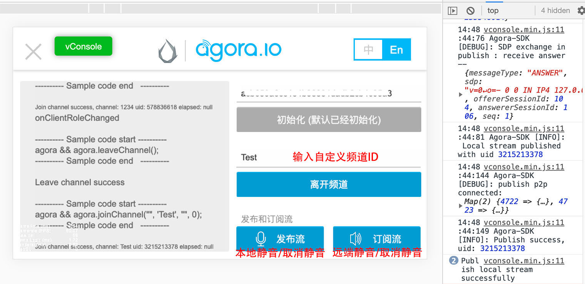

# 基础使用
## Agora Sample 参考和使用
若用户已有一定 Cocos Creator 基础或者已经完成 [**快速开始**](quick-start.md) 步骤，可以继续参考此篇文档。

- 首先 Clone 或下载 [**Agora 示例代码**](https://github.com/AgoraIO/Voice-Call-for-Mobile-Gaming/tree/master/Basic-Voice-Call-for-Gaming/Hello-CocosCreator-Voice-Agora)，并在 Cocos Creator 中打开。
- 在该工程中执行 [**Cocos AppID 设定**](../setting-cocos-appid.md) 和 [**一键开通服务**](../oneclick-provisioning.md) 操作，开通服务操作也会将 Web 所需的预览插件导入工程，然后到 [**Agora 后台**](https://staging-dashboard.agora.io/) 获取 **App ID**。


- 打开工程中的 `HelloWorld.js` ，在 `initAgora` 方法中修改 **appid** 的值。
- 可以点击编辑器窗口正上方的  [**预览**](../../getting-started/basics/preview-build.md) 按钮，调试该 Sample 工程。
- 若发现 Web 环境下，Sample 初始化成功，但加入频道没有回调，检查下该工程是否没有执行 [**一键开通服务**](../oneclick-provisioning.md) 操作。



## Sample 调用方法说明
#### 初始化 Agora

```
agora.init(appid)
``` 
注意: 在整个应用全局，开发者只需要对引擎做一次初始化。

#### 加入频道
```
agora.joinChannel(token, channelId, [info], [uid])
```

| Param | Type | Description |
| --- | --- | --- |
| token | String | 将值设置为 Token 值，可以为空字符串。 如果你已经启用了 App 证书, 请务必使用 Token。 关于如何获取 Token，详见 [校验用户权限 - Token](https://docs.agora.io/cn/Agora%20Platform/token?platform=All%20Platforms#token)。 |
| channelId | String | 标识通话的频道名称，长度在 64 字节以内的字符串。以下为支持的字符集范围（共 89 个字符）: a-z,A-Z,0-9,space,! #$%&,()+, -,:;<=.#$%&,()+,-,:;<=.,>?@[],^_,{  |
| [info] | String | （非必选项）开发者需加入的任何附加信息。一般可设置为空字符串，或频道相关信息。该信息不会传递给频道内的其他用户  |
| [uid] | number | （非必选项）用户 ID，32 位无符号整数。建议设置范围：1 到 (232-1)，并保证唯一性。如果不指定（即设为 0），SDK 会自动分配一个，并在 onJoinChannelSuccess 回调方法中返回，App 层必须记住该返回值并维护，SDK 不对该返回值进行维护，uid 在 SDK 内部用 32 位无符号整数表示，由于 Java 不支持无符号整数，uid 被当成 32 位有符号整数处理，对于过大的整数，Java 会表示为负数，如有需要可以用(uid&0xffffffffL)转换成 64 位整数  |

可简化调用为

```
agora.joinChannel('', channelId)
```

该方法让用户加入通话频道，在同一个频道内的用户可以互相通话，多个用户加入同一个频道，可以群聊。使用不同 App ID 的应用程序是不能互通的。如果已在通话中，用户必须调用 agora.leaveChannel() 退出当前通话，才能进入下一个频道。

#### 离开频道
```
agora.leaveChannel()
```
离开频道，即挂断或退出通话。

joinChannel 后，必须调用 leaveChannel 以结束通话，否则不能进行下一次通话。不管当前是否在通话中，都可以调用 leaveChannel，没有副作用。如果成功，则返回值为 0。leaveChannel 会把会话相关的所有资源释放掉。

leaveChannel 是异步操作，调用返回时并没有真正退出频道。在真正退出频道后，SDK 会触发 onLeaveChannel 回调。

#### 本地静音
```
agora.muteLocalAudioStream(mute)
```

| Param | Type | Description |
| --- | --- | --- |
| mute | Boolean |True/False : 开启/取消本地麦克风静音

本地静音或取消静音。该方法用于允许或禁止往网络发送本地音频流。

该方法绑定在 [**发布流**](https://docs.agora.io/cn/Voice/API%20Reference/web/interfaces/agorartc.client.html#publish) 按钮上，在 Agora SDK 中一般写作 **Publish** 方法。

#### 远端静音
```
agora.muteAllRemoteAudioStreams(mute)
```
| Param | Type | Description |
| --- | --- | --- |
| mute | Boolean |True/False : 停止/允许接收和播放所有远端音频流
该方法用于允许或禁止播放远端用户的音频流，即对所有远端用户进行静音与否。

该方法绑定在 [**订阅流**](https://docs.agora.io/cn/Voice/API%20Reference/web/interfaces/agorartc.client.html#subscribe) 按钮上，在 Agora SDK 中一般写作 **Subscribe** 方法。

#### 监听事件信息
```
agora.on(event, callback, target)
```
各种监听的事件说明请参考 [**Agora 文档**](https://docs.agora.io/cn/Interactive%20Gaming/game_coco?platform=Cocos%20Creator#module_agora.on)


---

继续前往 [**文档链接**](docs-link.md)


