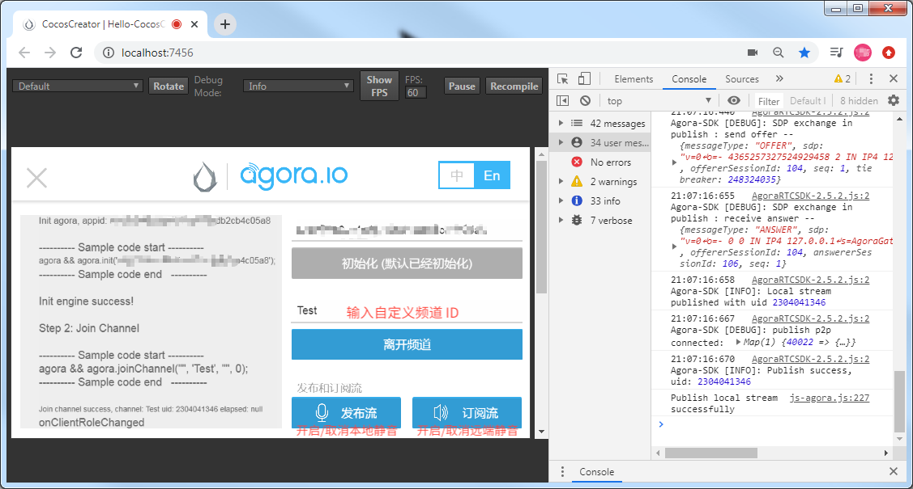

# 声网（Agora Voice）


Cocos Creator 从 v2.0.9 版本开始集成了 Agora 声网。

从硅谷一个车库的几行代码开始，一群程序员创立了 [Agora 声网](https://www.agora.io/cn/)，期待用实时音视频互动 API 改变全世界人们的沟通方式。

[Agora Interactive Gaming SDK](https://docs.agora.io/cn/Interactive%20Gaming/product_gaming?platform=All%20Platforms) 是 Agora 针对游戏开发者提供的音视频通话软件开发包，其主要目的是帮助游戏开发者在游戏中快速集成音视频通话的功能。

## 应用场景

Agora Interactive Gaming SDK 应用丰富，主要适用于需要实时音视频功能的应用，也可以用 Native SDK 在 iOS 和 Android 上进行原生开发。

| 主要功能 | 功能描述 | 典型适用场景 |
| --- | --- | --- |
| 音视频互通 | 实现游戏中的实时音视频互通，可以在游戏中实现开黑语音，实时视频传输的功能 | 开黑工具 |
| 电台语音 | 可在游戏中加入语音电台功能，支持 44.1k 采样率超高音质，也支持观众与主播连麦，实现电台双向互通 | MMO / RPG |
| 听声辨位 | 支持游戏音效 180° 听声辨位，增加游戏角色的方位感，还原真实场景 | FPS |
| 趣味变声 | 支持性别变声，迷惑对手，增加游戏互动趣味性 |  MOBA / 二次元游戏 |

## 一键接入 Agora 服务

### 开通 Agora 服务

1. 使用 Cocos Creator 打开需要接入 Agora 的项目工程。
2. 点击菜单栏的 **面板 -> 服务**，打开 **服务** 面板。设定 Cocos AppID 后，选择 Agora Voice，进入 Agora 服务设置面板。然后点击右上方的 **启用** 按钮以开通 Agora 服务。详情可参考 [Cocos Service 操作指南](../user-guide.md)。

    

    **计费**：Agora 游戏云服务使用 **预付费** 模式，当你的服务使用超过服务商的免费部分，且账户余额不足时，会停止服务。这时候你需要在 Cocos 开发者账户中心进行 **预充值**。具体内容可参考 [计费与充值](../billing-and-charge.md)。

    开通服务后，Cocos Service 将自动开通 Agora 服务、联通 Agora 账号，并集成 Agora SDK 和所需预览插件到游戏工程中。

### 验证 Agora 接入是否成功

完成 Agora 服务接入步骤后，我们便可以通过在脚本中添加简单的代码来验证 Agora 的接入是否成功。

1. 点击 Agora 服务设置面板中的 **前往控制台**，跳转到 [Agora 管理后台](https://staging-dashboard.agora.io/) 来获取参数 **App ID**。具体获取步骤可参考 [文档](https://docs.agora.io/cn/Agora%20Platform/token?platform=All%20Platforms)。

    

2. 修改脚本文件，例如在 `start` 方法中调用 Agora 的初始化，填入在 1 步骤中从 Agora 后台获取的 **App ID**：

    ```js
    cc.Class({
        extends: cc.Component,

        properties: {

        },

        start: function () {
            var appid = '从 Agora 后台获取的 App ID';
            agora && agora.init(appid);
        },

    });
    ```

3. 脚本修改完成并保存后，回到编辑器。在编辑器上方选择 **浏览器**，然后点击  [预览](../../getting-started/basics/preview-build.md) 按钮，若能在浏览器控制台中看到初始化日志，即可验证 Agora 接入成功。

    

## Agora Sample 的集成调试

- 点击 Agora 服务设置面板中的 **Sample 工程** 跳转到 [Agora Sample 工程](https://github.com/AgoraIO/Voice-Call-for-Mobile-Gaming) 页面，然后 Clone 或下载 **Voice-Call-for-Mobile-Gaming/Basic-Voice-Call-for-Gaming/Hello-CocosCreator-Voice-Agora** 项目，并在 Cocos Creator 中打开。该 Sample 工程中包含了以下功能：
  - 加入通话和离开通话
  - 发布音频流和订阅音频流

- 在 **服务** 面板中接入 Agora 服务，具体可参考上部分文档内容 — 开通 Agora 服务。

- 在 **资源管理器** 中双击打开 **HelloWorld.js**，然后将 `initAgora` 方法中的 **appid** 替换为你从 Agora 后台获取的 App ID。

- 脚本修改完成并保存后，回到编辑器。点击编辑器窗口正上方的  [预览](../../getting-started/basics/preview-build.md) 按钮，即可在浏览器中调试该项目工程。

  

  **注意**：若在浏览器中调试时发现 Agora Sample 工程初始化成功，但点击 **加入频道** 时没有回调，请确认是否有在 **服务** 面板中开通 Agora Voice 服务。

## Agore 调用方法说明

### 初始化 Agora

```js
agora.init(appid)
``` 
**注意**：在整个应用全局，开发者只需要对引擎做一次初始化。

### 加入频道

```js
agora.joinChannel(token, channelId, [info], [uid])
```

也可简化为：

```js
agora.joinChannel('', channelId)
```

| 参数 | 类型 | 详细说明 |
| --- | --- | --- |
| token | String | 将值设置为 Token 值，可以为空字符串。如果你已经启用了 App 证书，请务必使用 Token。关于如何获取 Token，详见 [校验用户权限 - Token](https://docs.agora.io/cn/Agora%20Platform/token?platform=All%20Platforms#token)。 |
| channelId | String | 标识通话的频道名称，长度在 64 字节以内的字符串。以下为支持的字符集范围（共 89 个字符）：a-z, A-Z, 0-9, space, ! #$%&, ()+, -, :;<=.#$%&, ()+, -, :;<=., >?@[], ^_, {  |
| [info] | String | （非必选项）开发者需加入的任何附加信息。一般可设置为空字符串，或频道相关信息。该信息不会传递给频道内的其他用户  |
| [uid] | number | （非必选项）用户 ID，32 位无符号整数。建议设置范围：1 到 (232-1)，并保证唯一性。如果不指定（即设为 0），SDK 会自动分配一个，并在 `onJoinChannelSuccess` 回调方法中返回，App 层必须记住该返回值并维护，SDK 不对该返回值进行维护。uid 在 SDK 内部用 32 位无符号整数表示，由于 Java 不支持无符号整数，uid 被当成 32 位有符号整数处理。对于过大的整数，Java 会表示为负数，如有需要可以用 (uid&0xffffffffL) 转换成 64 位整数。  |

该方法让用户加入通话频道，在同一个频道内的用户可以互相通话，多个用户加入同一个频道，可以群聊。使用不同 App ID 的应用程序之间是不能互通的，如果已在通话中，用户必须调用 `agora.leaveChannel()` 退出当前通话，才能进入下一个频道。

### 离开频道

```js
agora.leaveChannel()
```

离开频道，即挂断或退出通话。

`joinChannel` 后，必须调用 `leaveChannel` 以结束通话，否则不能进行下一次通话。不管当前是否在通话中，都可以调用 `leaveChannel`，没有副作用。如果成功，则返回值为 0。`leaveChannel` 会把会话相关的所有资源释放掉。

`leaveChannel` 是异步操作，调用返回时并没有真正退出频道。在真正退出频道后，SDK 会触发 `onLeaveChannel` 回调。

### 本地静音

```js
agora.muteLocalAudioStream(mute)
```

| 参数 | 类型 | 详细说明 |
| --- | --- | --- |
| mute | Boolean | True：开启本地麦克风静音<br>False：取消本地麦克风静音 |

本地静音或取消静音。该方法用于允许或禁止向网络发送本地音频流。

该方法绑定在 Agora Sample 工程的 **发布流** 按钮上，在 Agora SDK 中一般写作 [publish](https://docs.agora.io/cn/Voice/API%20Reference/web/interfaces/agorartc.client.html#publish) 方法。

### 远端静音

```js
agora.muteAllRemoteAudioStreams(mute)
```

| 参数 | 类型 | 详细说明 |
| --- | --- | --- |
| mute | Boolean | True：停止接收和播放所有远端音频流<br>False：允许接收和播放所有远端音频流 |

该方法用于允许或禁止播放远端用户的音频流，即对所有远端用户进行静音与否。

该方法绑定在 Agora Sample 工程的 **订阅流** 按钮上，在 Agora SDK 中一般写作 [subscribe](https://docs.agora.io/cn/Voice/API%20Reference/web/interfaces/agorartc.client.html#subscribe) 方法。

### 监听事件信息

```js
agora.on(event, callback, target)
```

各种监听的事件说明请参考 [Agora 监听事件说明](https://docs.agora.io/cn/Interactive%20Gaming/game_coco?platform=Cocos%20Creator#module_agora.on)。

## 相关参考链接

- [Agora 平台概述](https://docs.agora.io/cn/Agora%20Platform/agora_platform?platform=All%20Platforms)
- [Agora Interactive Gaming SDK 概述](https://docs.agora.io/cn/Interactive%20Gaming/product_gaming?platform=All%20Platforms)
- [Agora API 文档](https://docs.agora.io/cn/Interactive%20Gaming/game_coco?platform=Cocos%20Creator)
- [Agora 校验用户权限 — 获取 App ID](https://docs.agora.io/cn/Agora%20Platform/token?platform=All%20Platforms) 
- [Agora Sample 工程](https://github.com/AgoraIO/Voice-Call-for-Mobile-Gaming/tree/master/Basic-Voice-Call-for-Gaming/Hello-CocosCreator-Voice-Agora)
