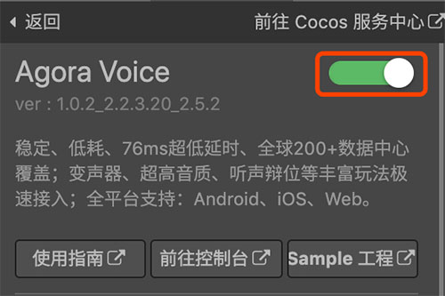
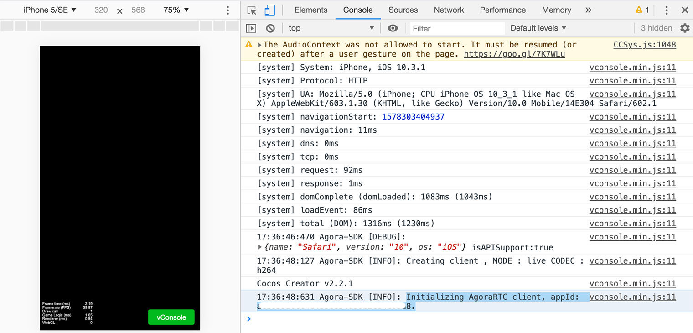

# 快速开始
## 内容简介

- 本文档面向 Cocos Creator 初学者，有一定基础的用户，可以直接参考 [**基础使用**](basic-user-guide.md) 文档。
- 本文档主要指导如何通过简单的操作，在一个 Cocos Creator 空白项目中，通过 Cocos Service 服务面板，一键接入 Agora 的流程，并通过 Agora 初始化成功信息，验证接入效果。
- 需要 v2.0.9 版本以上的 Cocos Creator。

## 创建空白项目

- 如果还不了解如何获取和启动 Cocos Creator，请阅读 [安装和启动](../../getting-started/install.md) 一节。
- 在 Dashboard 中，打开 新建项目 选项卡，选中空白项目模板，创建项目。


## 新建 Scene 场景文件和绑定脚本文件
由于 Agora SDK 文件体积较小，Cocos Service 在集成该 SDK 时使用了直接引入，并设为全局变量的方式。而空白项目在保存之前没有 Scene 场景文件，可能造成加载 SDK 时的问题。在一键接入 Agora 服务前，我们需要先在项目中新建一个 Scene 场景文件，并顺便绑定后续需要使用的脚本文件。

- 在 **资源管理器** 中选中 `assets` 文件夹，然后点击右键，选择 **新建 -> Scene** ，添加场景文件。
- 在 **资源管理器** 中选中 `assets` 文件夹，然后点击右键，选择 **新建 -> JavaScript** ，添加脚本文件。
- 在 **资源管理器** 中双击刚才新建的场景 `New Scene`，然后在 **层级管理器** 中选中 `Canvas` 节点。
- 将 **资源管理器** 中新建的脚本文件 `NewScript` 拖拽到 **属性检查器** 面板中。
    


## 一键接入 Agora 服务
Cocos Creator v2.0.9 以上版本的 **Cocos Service 服务面板** 中，集成了 Agora 服务。若项目已完成 [**Cocos AppID 设定**](../setting-cocos-appid.md)，可以通过点击开通按钮的方式 **一键接入**。

- 在 **服务** 面板中，点击 **Agora 服务面板**，再点击右上角 **开通服务按钮**。

    

- Cocos Service 将自动开通 Agora 服务、联通 Agora 账号，并集成 Agora SDK 和所需预览插件到游戏工程中。此时我们点击面板上的 **前往控制台**，到 [**Agora 管理后台**](https://staging-dashboard.agora.io/)，获取 Agora 的 **App ID** 参数备用：


## 脚本调试

- Agora 的 SDK 文件直接导入工程，以全局变量方式加载，无需再进行 require 操作
- 现在我们修改脚本文件，例如在 `start` 方法中调用 Agora 的初始化，并将接入参数替换为之前 [**Agora 管理后台**](https://staging-dashboard.agora.io/) 获取的 **App ID** ：

```js
// NewScript.js

 cc.Class({
     extends: cc.Component,

     properties: {

     },

     start: function () {
        var appid = '##AppID'; //替换为 Agora 后台获取的 App ID
        agora && agora.init(appid);
     },

 });
```

- 可以点击编辑器窗口正上方的  [**预览**](../../getting-started/basics/preview-build.md) 按钮进行调试。若能在日志中看到初始化的标志，则可验证 Agora 接入成功。



---

继续前往 [**基础使用**](basic-user-guide.md)


