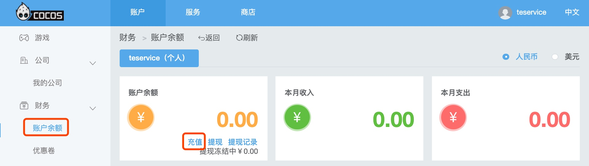
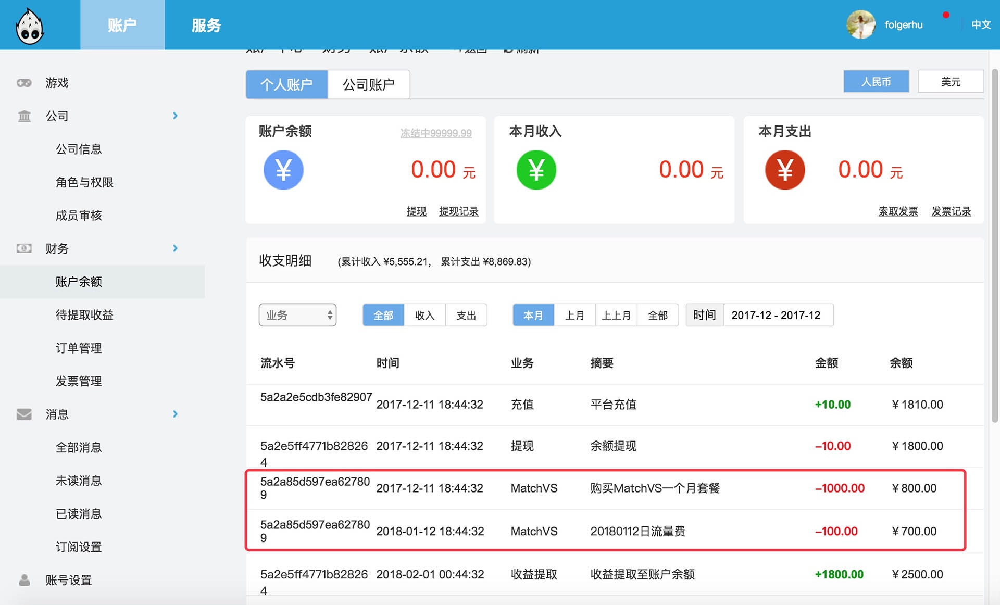

# 计费与充值

## 计费方式

Cocos Service 的服务使用 **预付费** 模式，当用户的服务使用超过服务商的免费部分，且账户余额不足时，会导致 **服务停止**。所以用户需要在 [Cocos 开发者账户中心](https://account.cocos.com/) 进行 **预充值**。

## 充值方式

- 在服务的设置面板中点击右上方的 **前往 Cocos 服务中心** 按钮，跳转到管理后台。
- 切换到 **账户** 页面，点击侧边栏中的 **账户余额** 标签。
- 选择 **个人 / 公司** 类别，点击 **账户余额** 中的 **充值** 按钮。
- 确认开通服务的游戏在 **个人** 类别还是在 **公司** 类别下，以免错误充值。

    

- 填入 **充值金额**，然后选择通过 **支付宝** 或 **微信** 平台充值。

## 查看账单

- 用户的每一笔扣费，在 [Cocos 开发者账户中心](https://account.cocos.com/) 的 **财务 -> 账户余额 -> 收支明细** 中可以查看到：

    

## 服务商计费说明

服务商具体的计费说明请参考：

- [Agora 官方计费说明](https://docs.agora.io/cn/Voice/billing_audio?platform=All%20Platforms)
