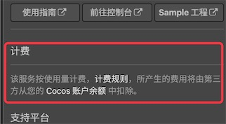
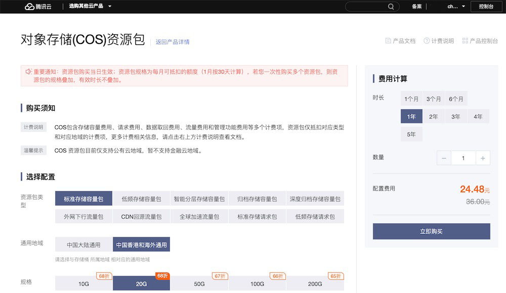
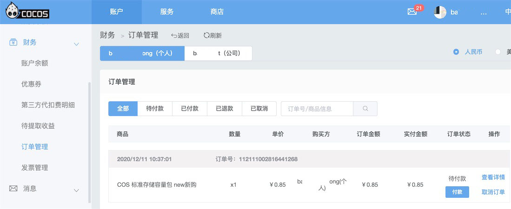

# 计费与充值

Cocos Service 提供的服务有免费的，也有部分是付费的，具体在对应的服务详情页会有明确标明。

* 在使用付费的服务时，所产生的费用都是从对应游戏所属的账户中代扣。当开发者的游戏同时使用了多个付费服务，就不需要非常麻烦地去多个后台充值和管理费用。另外 Cocos 平台还会为开发者在使用第三方服务时多一份资金保障。
* 通常按量计费的服务都是采用 **预付费** 的方式，当开发者的服务使用超过服务商的免费部分，且账户余额不足时，会导致 **服务停止**。所以在使用该类服务时，请务必确保账户余额充足。可以前往 [Cocos 开发者账户中心](https://account.cocos.com/) 进行 **预充值**，且未使用完的资金可以随时取出。

## 充值方式

- 在服务的设置面板中点击右上方的 **前往 Cocos 服务中心** 按钮，跳转到管理后台。
- 切换到 **账户** 页面，点击侧边栏中的 **账户余额** 标签。
- 选择 **个人 / 公司** 类别，点击 **账户余额** 中的 **充值** 按钮。
- 确认开通服务的游戏在 **个人** 类别还是在 **公司** 类别下，以免错误充值。

    

- 填入 **充值金额**，然后选择通过 **支付宝** 或 **微信** 平台充值。

## 查看账单

- 用户的每一笔扣费，在 [Cocos 开发者账户中心](https://account.cocos.com/) 的 **财务 -> 账户余额 -> 收支明细** 中可以查看到：

    

## 腾讯云套餐购买方式说明

由于用户在 Service 中开通的腾讯云账号类型为子账号，若用户需要购买腾讯云（TCB/MGOBE/GME）相关资源包套餐，无法直接在腾讯云后台直接购买。因此，我们开发了一套简易流程供用户自助购买套餐。

- 在腾讯云后台登录账号，并正常选择后台中的套餐购买，直到页面弹出错误提示：您无权查看该订单。

    

    

- 回到 Cocos 后台，在 **财务 -> 订单管理** 查看待支付订单，对应订单将会在 1 分钟内生成。请确认是否是所需购买的套餐包，并支付该订单开通套餐。

    

## 服务商计费说明

服务商具体的计费说明请参考：

- [Agora 官方计费说明](https://docs.agora.io/cn/Voice/billing_rtc?platform=All%20Platforms)
- [TCB 云开发计费概述](https://cloud.tencent.com/document/product/876/18864)
- [MGOBE 游戏联机对战引擎计费概述](https://cloud.tencent.com/document/product/1038/33293)
- [GME 游戏多媒体引擎购买指南](https://cloud.tencent.com/document/product/607/38500)