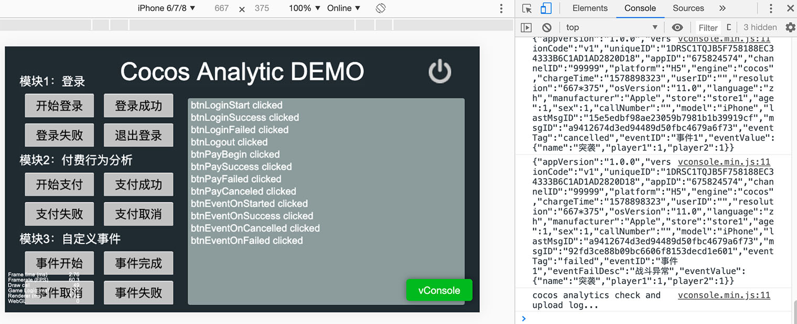
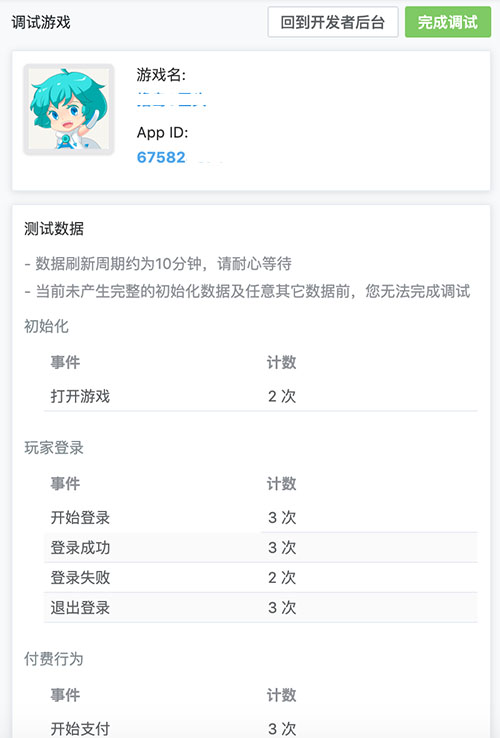

# 基础使用

## Cocos Analytics Sample 参考和使用

若用户已有一定 Cocos Creator 基础或者已经完成 [快速开始](quick-start.md) 步骤，可以继续参考此篇文档。

- 首先 Clone 或下载 [Cocos Analytics 范例工程](https://github.com/CocosService/cocosAnalyticsDemo)，并在 Cocos Creator 中打开。

- 在 **服务** 面板中接入 Cocos Analytics 统计服务，详情可参考 [快速开始 —— 接入 Cocos Analytics 服务](quick-start.md)。

- 接入完成后，点击编辑器窗口正上方的  [预览](../../getting-started/basics/preview-build.md) 按钮，即可调试该 Sample 工程。

  

- Cocos Analytics **不支持模拟器库**。若需要导出在 Android 或 iOS 平台测试，请使用 **真机调试**。详情可参考 [打包发布原生平台](../../publish/publish-native.md)。

- 可将 Sample 工程上所有按钮点击一遍，然后在 Cocos Analytics 服务设置面板点击 **前往控制台** 按钮前往 **调试游戏** 页面，刷新页面直至更新数值，数据刷新周期约为 **10** 分钟。

- 若在调试状态下，所有数据接口调试完成，则接入成功，可以视情况点击上方 **完成调试** 按钮，转为正式模式。

    

## Sample 调用方法说明

Creator 插件加载时会调用 Cocos Analytics 初始化，无需再做初始化操作。

### 启用 Debug 输出模式

```
cocosAnalytics.enableDebug(true); //启用Debug输出模式，调试完成后可删除
```

### 登录模块方法

```
// 开始登录
cocosAnalytics.CAAccount.loginStart({
    channel: '99999',   // 获客渠道，指获取该客户的广告渠道信息   
});

// 登录成功
cocosAnalytics.CAAccount.loginSuccess({
    userID: 'dddddddd',
    age: 1,             // 年龄
    sex: 1,             // 性别：1为男，2为女，其它表示未知
    channel: '99999',   // 获客渠道，指获取该客户的广告渠道信息
});
    
// 登录失败
cocosAnalytics.CAAccount.loginFailed({
    reason: '密码错误' // 失败原因
});
    
// 退出登录 （我们已经考虑和完善处理玩家异常登出操作）
cocosAnalytics.CAAccount.logout();
```

### 付费行为分析模块

```
const paymentInfo = {
  amount: 100,                 // 现金金额或现金等价物的额度。例如1元传入100，100元则传入10000
  orderID: 'od10001000111',    // 订单ID，唯一标识一次交易。
  payType: '支付宝',            // 支付方式。如：支付宝、苹果iap、银联支付、爱贝支付聚合等。
  iapID: '大礼包',              // 商品ID。玩家购买的充值包类型。例如：人民币15元600虚拟币包
  currencyType: 'CNY',         // 请使用ISO 4217中规范的3位字母代码标记货币类型。充值货币类型
  virtualCurrencyAmount: 1000, // 充值获得的虚拟币额度。
  accountID: 'user1001',       // 消费的账号
  partner: '',                 // 账户渠道名称  例如：QQ、微信。
  gameServer: '艾欧尼亚',       // 玩家充值的区服。
  level: 10,                   // 玩家充值时的等级。
  mission: '第10关',            // 玩家充值时所在的关卡或任务。亦可传入一个玩家打到的最高关卡。
  reason: '英雄死亡'            // 充值失败的原因
};

// 开始支付
cocosAnalytics.CAPayment.payBegin(paymentInfo);

// 支付成功
cocosAnalytics.CAPayment.paySuccess(paymentInfo);

// 支付失败
cocosAnalytics.CAPayment.payFailed(paymentInfo);

// 支付取消
cocosAnalytics.CAPayment.payCanceled(paymentInfo);
```

### 自定义事件模块

```
const eventID = "事件1";        //事件ID（必填）可以任意填写, 不得超过30个字符

const eventFailedReason = "战斗异常"; //战斗失败原因

const eventValue = { //事件内容及标签可灵活自定义。后台根据事件内定义的标签进行相关统计和漏斗分析
  name: "突袭",
  player1: 1,
  player2: 1
};

// 事件开始
cocosAnalytics.CACustomEvent.onStarted(eventID, eventValue);

// 事件完成
cocosAnalytics.CACustomEvent.onSuccess(eventID, eventValue);

// 事件取消
cocosAnalytics.CACustomEvent.onCancelled(eventID, eventValue);

// 事件失败
cocosAnalytics.CACustomEvent.onFailed(eventID, eventValue, eventFailedReason);
```

---

继续前往 [文档链接](docs-link.md)
