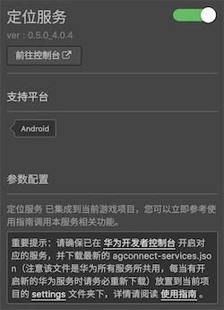
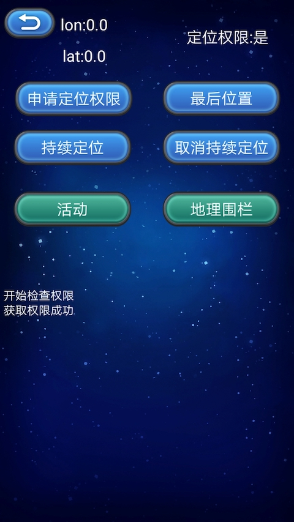

> **注意**：此版本文档已归档不再维护，请移步至 [最新版本](https://service.cocos.com/document/zh/hms-location.html)。

# 定位服务（HMS Core）

[华为定位服务](https://developer.huawei.com/consumer/cn/hms/huawei-locationkit)（HUAWEI Location Kit）采用 GPS、Wi-Fi、基站等多途径的混合定位模式进行定位，赋予应用开发者快速、精准地获取用户位置信息的能力，构建全球定位服务能力，助力开发者发展全球业务。当前华为定位服务的主要能力包含三个部分：融合定位、活动识别和地理围栏，开发者可以根据自己的需求，调用相应的能力。

- 融合定位：结合 GPS、Wi-Fi 和基站位置数据，为应用开发者提供一套简单易用的 API，方便开发者快速获取设备位置信息。

- 活动识别：通过加速度传感器、蜂窝网络信息、磁力计识别用户运动状态，便于开发者通过了解用户行为来调整应用程序。

- 地理围栏：应用开发者通过 API 设置感兴趣的位置区域，在指定操作（如离开、进入、驻留）发生时，即可及时收到一个通知。

### 主要功能

#### 融合定位

如果应用需要请求设备位置信息，开发者可以为应用申请位置权限，然后调用 HMS Core 的请求位置更新接口 [requestLocationUpdates()](#%E6%8C%81%E7%BB%AD%E8%8E%B7%E5%8F%96%E4%BD%8D%E7%BD%AE%E4%BF%A1%E6%81%AF)，根据需要指定定位方式，获取持续的位置信息回调。如果获取位置信息后，想取消位置信息回调，可以调用移除位置更新接口 [removeLocationUpdates()](#%E6%8C%81%E7%BB%AD%E8%8E%B7%E5%8F%96%E4%BD%8D%E7%BD%AE%E4%BF%A1%E6%81%AF)，达到取消回调的目的。

#### 活动识别

如果应用需要获取设备的运动状态，例如：步行、跑步、骑自行车等，或者应用需要检测用户的运动状态变化，那么开发者可以为应用申请活动状态识别权限，通过调用活动状态识别更新接口 [createActivityIdentificationUpdates()](#%E6%B3%A8%E5%86%8C%E6%B4%BB%E5%8A%A8%E8%AF%86%E5%88%AB%E6%9B%B4%E6%96%B0)，获取当前用户的活动状态，而移除活动识别更新只需要调用 [deleteActivityIdentificationUpdates()](#%E7%A7%BB%E9%99%A4%E6%B4%BB%E5%8A%A8%E8%BF%87%E6%B8%A1%E6%9B%B4%E6%96%B0) 接口即可。如果需要检测用户的运动状态变化，那么可以调用活动状态转换接口 [createActivityConversionUpdates()](#%E6%B4%BB%E5%8A%A8%E8%BF%87%E6%B8%A1%E6%9B%B4%E6%96%B0)，通过此接口可以监听当前设备的活动状态转换，而移除监听时，只需要调用 [deleteActivityConversionUpdates()](#%E7%A7%BB%E9%99%A4%E6%B4%BB%E5%8A%A8%E8%BF%87%E6%B8%A1%E6%9B%B4%E6%96%B0) 接口即可。

#### 地理围栏

如果开发者对某些地点比较关注，可以根据关注地点的位置，创建地理围栏 [createGeofenceList()](#%E5%88%9B%E5%BB%BA%E6%B7%BB%E5%8A%A0%E5%9C%B0%E7%90%86%E5%9B%B4%E6%A0%8F%E7%9A%84%E8%AF%B7%E6%B1%82)，地理围栏可以感知当前设备所在位置和关注目标之间的距离，当用户进入围栏区域时，会向应用发起通知。同时，开发者可以检测用户在围栏内的停留时间，当用户在围栏内停留一段时间之后，再发起通知。

地理围栏同时支持页面操作，通过基于地图的拖拽和参数填写创建地理围栏，详情参见 [服务端开发](https://developer.huawei.com/consumer/cn/doc/HMSCore-Guides-V5/server-dev-0000001050170474-V5)。

### 版本更新说明

- 当前版本：0.5.8_5.0.2

    - 更新 SDK，新增部分接口。

- v0.5.6_4.0.4

    - 集成华为 HMS 位置服务。

## 一键接入定位服务

### 开通服务

- 使用 Cocos Creator 打开需要接入定位服务的项目工程。

- 点击菜单栏的 **面板 -> 服务**，打开 **服务** 面板，选择 **定位服务**，进入服务详情页。然后点击右上方的 **启用** 按钮即可开通服务。详情可参考 [服务面板操作指南](./user-guide.md)。

  

- 参考 [华为定位服务开发准备](https://developer.huawei.com/consumer/cn/doc/development/HMS-Guides/location-preparation) 文档，完成开发者注册、创建应用、**生成/配置签名证书指纹以及打开相关服务**。

- 定位服务可以直接使用，无需在 AppGallery Connect 后台额外操作。

### 配置华为参数文件

大部分的华为相关项目都需要用到 `agconnect-services.json` 配置文件。若有新开通服务等操作，请及时更新该文件。

- 登录 [AppGallery Connect](https://developer.huawei.com/consumer/cn/service/josp/agc/index.html) 后台，在 **项目列表 -> 应用列表** 中找到对应的应用。

- 在 **项目设置** 页面的 **应用** 区域，点击 `agconnect-services.json` 下载配置文件。`agconnect-services.json` 文件在下载或者更新完成后，**必须手动拷贝** 到工程目录的 `settings` 目录下。

  

**注意**：

1. 务必确认完成 [生成/配置签名证书指纹](https://developer.huawei.com/consumer/cn/doc/development/HMSCore-Guides/config-agc-0000001050166285#ZH-CN_TOPIC_0000001054452903__section21591342135811) 步骤，配置 SHA256 证书指纹。

2. 在构建时若勾选了 **调试模式**，开发者需要在 Android Studio 的 `app/build.gradle` 文件中，自行配置 Keystore 签名文件。

    

3. Cocos Creator v2.4.3 及以上版本，若 [发布到 HUAWEI AppGallery Connect](../publish/publish-huawei-agc.md)，开发者可直接在 **构建发布** 面板中选取下载或更新后的配置文件，不需要手动拷贝。

    

### 验证服务是否接入成功

- 完成 **定位服务** 接入步骤后，我们便可以通过在脚本中添加简单的代码来验证接入是否成功。

  ```js
  huawei.hms.location.locationService.once(huawei.hms.location.HMS_LOCATION_EVENT_LISTENER_NAME.HMS_LOCATION_PERMISSION, (result) => {
      if (result.code === huawei.hms.location.LocationActivityService.StatusCode.success)
      {
          console.log('requestLocationPermission...', 'success');
      } else {
          console.log('requestLocationPermission...', 'fail:', result.errMsg);
      }
  });

  huawei.hms.location.locationService.requestLocationPermission();
  ```

- 代码添加完成后，即可 [发布到 Android 平台](../publish/publish-native.md)，请确保 **构建发布** 面板中的包名与华为后台设置的包名一致。

- 工程第一次运行到手机后，若弹出申请位置权限的对话框（见下图），即表示接入成功。

  

- 若已经申请过权限可在 Logcat 中查看日志。

## Sample 工程

开发者可以通过 Sample 工程快速体验定位服务。

- 点击定位服务面板中的 **Sample 工程** 按钮，Clone 或下载 HUAWEI Sample 工程，并在 Cocos Creator 中打开。

- 参照上文开通分析服务并配置华为参数文件后，可通过 Creator 编辑器菜单栏的 **项目 -> 构建发布** 打开 **构建发布** 面板来构建编译工程。Creator v2.4.1 及以上版本，可 [发布到 HUAWEI AppGallery Connect](../publish/publish-huawei-agc.md)，Creator v2.4.1 以下的版本可 [发布到 Android 平台](../publish/publish-native.md)。

- 需要在已安装 HMS Core 服务的华为或荣耀品牌手机上测试。

- Sample 工程运行到手机后，点击首页的 **Location** 按钮，即可进入功能界面进行测试。

  

## 开发指南

定位服务所有的 API 均是异步回调。可使用 `huawei.hms.location.locationService.once` 获取单次回调，或者使用 `huawei.hms.location.locationService.on` 监听回调。

### 定位服务

`huawei.hms.location.locationService`

可参考 [定位服务开发步骤](https://developer.huawei.com/consumer/cn/doc/development/HMSCore-Guides/location-develop-steps-0000001050746143) 文档。

#### 检查应用权限

`checkLocationSettings(): void`

检查定位服务相关应用权限。

**示例**：

```js
huawei.hms.location.locationService.once(huawei.hms.location.HMS_LOCATION_EVENT_LISTENER_NAME.HMS_LOCATION_SETTINGS, (result) => {
    if (result.code === huawei.hms.location.LocationActivityService.StatusCode.success) {
        console.log('checkLocationSettings...', 'success');
    } else {
        console.log('checkLocationSettings...', 'fail:', result.errMsg);
    }
});

huawei.hms.location.locationService.checkLocationSettings();
```

#### 动态申请位置权限

`requestLocationPermission(): void`

该方法用于动态申请位置权限。

**示例**：

```js
huawei.hms.location.locationService.once(huawei.hms.location.HMS_LOCATION_EVENT_LISTENER_NAME.HMS_LOCATION_PERMISSION, (result) => {
    if (result.code === huawei.hms.location.LocationActivityService.StatusCode.success) 
    {
        console.log('requestLocationPermission...', 'success');
    } else {
        console.log('requestLocationPermission...', 'fail:', result.errMsg);
    }
});
        
huawei.hms.location.locationService.requestLocationPermission();
```

#### 持续获取位置信息

`requestLocationUpdates(): void`

该方法用于在应用中持续获取设备的位置。

`requestLocationUpdatesEx() void`

扩展的位置信息服务接口，当前支持高精度定位，并兼容普通定位接口.

**示例**：

```js
huawei.hms.location.locationService.once(huawei.hms.location.HMS_LOCATION_EVENT_LISTENER_NAME.HMS_REQUEST_LOCATION_UPDATE, (result) => {
    if (result.code === huawei.hms.location.LocationActivityService.StatusCode.success) {
        console.log('requestLocationUpdates...', 'success');
    } else {
        console.log('requestLocationUpdates...', 'fail:', result.errMsg);
    }
});

huawei.hms.location.locationService.requestLocationUpdates();
huawei.hms.location.locationService.requestLocationUpdatesEx(); //若需要高精度定位，可调用该方法代替
```

`removeLocationUpdates(): void`

当开发者的应用程序不再需要接收位置更新时，应当停止位置更新，以便降低功耗。

**示例**：

```js
huawei.hms.location.locationService.once(huawei.hms.location.HMS_LOCATION_EVENT_LISTENER_NAME.HMS_REMOVE_LOCATION_UPDATE, (result) => {
    if (result.code === huawei.hms.location.LocationActivityService.StatusCode.success) {
        console.log('removeLocationUpdates...', 'success');
    } else {
        console.log('removeLocationUpdates...', 'fail:', result.errMsg);
    }
});

huawei.hms.location.locationService.removeLocationUpdates();
```

#### 获取最后的已知位置

`getLastLocation(): void`

返回最后一次请求的可用位置。该接口并不会主动请求位置，将使用上一次请求的缓存位置。

以下场景可能导致返回 null：

- 从未使用过定位功能。
- 位置开关关闭。
- 恢复出厂设置。

如果对位置的实时性有较高要求，推荐主动调用 `requestLocationUpdates` 替代调用 `getLastLocation`。

**示例**：

```js
huawei.hms.location.locationService.once(huawei.hms.location.HMS_LOCATION_EVENT_LISTENER_NAME.HMS_LAST_LOCATION, (location) => {
    if (location.code === huawei.hms.location.LocationActivityService.StatusCode.success) {
        console.log('getLastLocation...', 'success', lon:' + location.longitude + ",lat:" + location.latitude);
    } else {
        console.log('getLastLocation...', 'fail:', location.errMsg);
    }
});

huawei.hms.location.locationService.getLastLocation();
```

`getLastLocationWithAddress(): void`

返回最后一次请求的可用位置，包括详细地址信息。如果某个位置不可用，则返回 `null`。

**示例**：

```js
huawei.hms.location.locationService.once(huawei.hms.location.HMS_LOCATION_EVENT_LISTENER_NAME.HMS_GET_HWLOCATION, (result) => {
    if (result.code === huawei.hms.location.LocationService.StatusCode.success) {
        console.log('getLastLocationWithAddress success, data is ', JSON.stringify(result));
    } else {
        console.log('getLastLocationWithAddress fail, reason ', result.errMsg);
    }
});

huawei.hms.location.locationService.getLastLocationWithAddress();
```

#### 刷新位置

`flushLocations(): void`

刷新当前正在处理的位置。

**注意**：当前 HMS 提供的 SDK 版本并未提供 flushLocations() 功能，SDK 中为空实现。

**示例**：

```js
huawei.hms.location.locationService.once(huawei.hms.location.HMS_LOCATION_EVENT_LISTENER_NAME.HMS_FLUSH_LOCATIONS, (result) => {
    if (result.code === huawei.hms.location.LocationService.StatusCode.success) {
        console.log('flushLocations success,data is ', result.toString());
    } else {
        console.log('flushLocations fail ,reason ', result.errMsg);
    }
});

huawei.hms.location.locationService.flushLocations();
```

#### 使用模拟位置信息功能

该功能用于测试环境。<br>打开 Android 手机的 **设置** 页面，点击 **系统和更新 -> 开发人员选项 -> 选择模拟位置信息应用 -> 选择要 mock 的应用** 即可开启该功能。如果没有找到 “开发人员选项”，请在 **设置** 页面的 **关于手机 -> 版本号** 上连续点击 7 次，“开发人员选项” 便会出现在 “系统和更新” 页面中。

在 AndroidManifest.xml 文件中配置模拟定位权限。

```
<uses-permission
android:name="android.permission.ACCESS_MOCK_LOCATION"
tools:ignore="MockLocation,ProtectedPermissions" />
```

**设置 mock 模式**：

`setMockMode(mockMode: boolean): void`

设置为 true 时，将不再使用 GPS 或网络位置，直接返回通过 `setMockLocation` 设置的位置信息（`setMockLocation` 的设置见下方）。

**传入参数**：

| 参数 | 说明 |  
| :---------- | :------------- |  
| mockMode | 若调用该方法并设置为 **true**，则打开 mock 模式。若不再需要使用 mock 模式，则需要设置为 **false**。 | 

**示例**：

```js
huawei.hms.location.locationService.once(huawei.hms.location.HMS_LOCATION_EVENT_LISTENER_NAME.HMS_MOCK_MODE, (result) => {
    if (location.code === huawei.hms.location.LocationActivityService.StatusCode.success) {
        console.log('setMockMode...', 'success');
    } else {
        console.log('setMockMode...', 'fail:', result.errMsg);
    }
});

huawei.hms.location.locationService.setMockMode(true);
```

**设置模拟位置信息**

`setMockLocation(latitude: string, longitude: string): void`

调用此方法之前必须先调用 `setMockMode` 并设置为 `true`。

**参数说明**：

| 参数 | 说明 |  
| :---------- | :------------- |  
| latitude | 经度值 | 
| longitude | 纬度值 |

**示例**：

```js
huawei.hms.location.locationService.once(huawei.hms.location.HMS_LOCATION_EVENT_LISTENER_NAME.HMS_MOCK_LOCATION, (result) => {
    if (location.code === huawei.hms.location.LocationActivityService.StatusCode.success)
    {
        console.log('setMockLocation...', 'success');
    } else {
        console.log('setMockLocation...', 'fail:', result.errMsg);
    }
});

//set longitude and latitude
huawei.hms.location.locationService.setMockLocation(24.4813889,118.1590724);
```

### 活动识别服务

`huawei.hms.location.locationActivityService`

可参考 [活动识别服务开发步骤](https://developer.huawei.com/consumer/cn/doc/development/HMSCore-Guides/activity-recognition-develop-steps-0000001050706110) 文档。

#### 动态申请活动识别权限

`requestRecognitionPermission(): void`

[活动识别权限](https://developer.huawei.com/consumer/cn/doc/development/HMSCore-Guides/activity-recognition-develop-steps-0000001050706110#ZH-CN_TOPIC_0000001050706110__section12461453154011) 属于危险权限，使用时需要动态申请。

**示例**：

```js
huawei.hms.location.locationActivityService.requestRecognitionPermission();
```

#### 注册活动识别更新

`createActivityIdentificationUpdates(intervalMillis: number): void`

可参考 [注册活动识别更新](https://developer.huawei.com/consumer/cn/doc/HMSCore-References-V5/activityidentificationservice-0000001050986183-V5#ZH-CN_TOPIC_0000001050986183__section177364246397) 文档。

**参数说明**：

| 参数 | 说明 |  
| :---------- | :------------- |  
| intervalMillis | 活动检测更新间隔，对应 Java 侧 long 型。以毫秒为单位，值越大，活动检测越少，值越小，活动检测越频繁。 | 

**示例**：

```js
huawei.hms.location.locationActivityService.once(huawei.hms.location.HMS_LOCATION_EVENT_LISTENER_NAME.HMS_CREATE_ACTIVITY_IDENTIFICATION_UPDATES, (result) => {
    if (result.code === huawei.hms.location.LocationActivityService.StatusCode.success) {
        console.log('requestActivityUpdates...', 'success');
    } else {
        console.log('requestActivityUpdates...', 'fail:', result.errMsg);
    }
});

huawei.hms.location.locationActivityService.createActivityIdentificationUpdates(parseInt(time) || 5000);
```

#### 设置活动识别更新监听

需要设置监听来获取活动识别更新时的返回信息，无主动调用方法。

**示例**：

```js
huawei.hms.location.locationActivityService.on(huawei.hms.location.HMS_LOCATION_EVENT_LISTENER_NAME.HMS_ACTIVITY_UPDATES, (result) => {
    console.log('HMS_ACTIVITY_UPDATES...', JSON.stringify(result));
}, this);

huawei.hms.location.locationActivityService.on(huawei.hms.location.HMS_LOCATION_EVENT_LISTENER_NAME.HMS_CONVERSION_UPDATES, (result) => {
    //todo
    console.log('HMS_CONVERSION_UPDATES...', JSON.stringify(result));
}, this);
```

#### 移除活动识别更新

`deleteActivityIdentificationUpdates(): void`

移除所有活动识别更新。

**示例**：

```js
huawei.hms.location.locationActivityService.once(huawei.hms.location.HMS_LOCATION_EVENT_LISTENER_NAME.HMS_REMOVE_ACTIVITY_CONVERSION_UPDATES, (result) => {
    if (result.code === huawei.hms.location.LocationActivityService.StatusCode.success) {
        console.log('deleteActivityUpdates...', 'success');
    } else {
        console.log('deleteActivityUpdates...', 'fail:', result.errMsg);
    }
}); 

huawei.hms.location.locationActivityService.deleteActivityIdentificationUpdates();
```

#### 活动过渡更新

`createActivityConversionUpdates(params: any): void`

接口提供检测活动转换条件（进入、退出）的功能，例如需要检测用户从走路变为骑自行车的状态等。

**示例**：

```js
huawei.hms.location.locationActivityService.once(huawei.hms.location.HMS_LOCATION_EVENT_LISTENER_NAME.HMS_CREATE_ACTIVITY_CONVERSION_UPDATES, (result) => {
    if (result.code === huawei.hms.location.LocationActivityService.StatusCode.success) {
        console.log('createActivityConversionUpdates...', 'success');
    } else {
        console.log('createActivityConversionUpdates...', 'fail:', result.errMsg);
    }
});
let cls = huawei.hms.location.ConversionInfo;
let type = huawei.hms.location.ACTIVITY_IDENTIFICATION_ENUM;
let cType = huawei.hms.location.ACTIVITY_CONVERSION_TYPE;
let infoList = [
    new cls(type.STILL, cType.ENTER_ACTIVITY_CONVERSION),
    new cls(type.STILL, cType.EXIT_ACTIVITY_CONVERSION),
];

huawei.hms.location.locationActivityService.createActivityConversionUpdates(infoList);
```

#### 移除活动过渡更新

`deleteActivityConversionUpdates(): void`

移除活动过渡更新。

**示例**：

```js
huawei.hms.location.locationActivityService.once(huawei.hms.location.HMS_LOCATION_EVENT_LISTENER_NAME.HMS_REMOVE_ACTIVITY_CONVERSION_UPDATES, (result) => {
    if (result.code === huawei.hms.location.LocationActivityService.StatusCode.success) {
        console.log('deleteActivityConversionUpdates...', 'success');
    } else {
        console.log('deleteActivityConversionUpdates...', 'fail:', result.errMsg);
    }
});

huawei.hms.location.locationActivityService.deleteActivityConversionUpdates();
```

### 地理围栏服务

`huawei.hms.location.locationGeofenceService`

可参考 [地理围栏服务开发步骤](https://developer.huawei.com/consumer/cn/doc/development/HMSCore-Guides/geofence-develop-steps-0000001050986159) 文档。

#### 设置地理围栏监听

**示例**：

```js
huawei.hms.location.locationGeofenceService.on(huawei.hms.location.HMS_LOCATION_EVENT_LISTENER_NAME.HMS_RECEIVE_GEOFENCE_DATA, (result) => {
    console.log('HMS_RECEIVE_GEOFENCE_DATA...', JSON.stringify(result));
}, this);
```

#### 创建添加地理围栏的请求

`createGeofenceList(list: Array<GeofenceData>, type: HMS_LOCATION_GEOFENCEREQUEST)`

**示例**：

```js
huawei.hms.location.locationGeofenceService.once(huawei.hms.location.HMS_LOCATION_EVENT_LISTENER_NAME.HMS_CREATE_GEOFENCE_LIST, (result) => {
    if (result.code === huawei.hms.location.LocationActivityService.StatusCode.success) {
        console.log('createGeofenceList...', 'success');
    } else {
        console.log('createGeofenceList...', 'fail:', result.errMsg);
    }
});
let cls = huawei.hms.location.GeofenceData;
let type = huawei.hms.location.GEOFENCE_TYPE;
let list = [
    new cls(
        this.editBox.string,    //setUniqueId
        type.DWELL_GEOFENCE_CONVERSION | type.ENTER_GEOFENCE_CONVERSION | type.EXIT_GEOFENCE_CONVERSION,  //setConversions
        24.4813889,             //setRoundArea, latitude
        118.1590724,            //setRoundArea, longitude
        2000,                   //setRoundArea, radius
        60 * 60 * 1000,         //setValidContinueTime
        1000                    //setDwellDelayTime
)];
let requestType = huawei.hms.location.HMS_LOCATION_GEOFENCEREQUEST;
let initType = requestType.EXIT_INIT_CONVERSION | requestType.ENTER_INIT_CONVERSION | requestType.DWELL_INIT_CONVERSION;
console.log('createGeofenceList...', 'params=', JSON.stringify(list), 'init type=', initType);

huawei.hms.location.locationGeofenceService.createGeofenceList(list, initType);
```

#### 移除地理围栏

`removeWithIntent(): void`

**示例**：

```js
huawei.hms.location.locationGeofenceService.once(huawei.hms.location.HMS_LOCATION_EVENT_LISTENER_NAME.HMS_REMOVE_GEOFENCE_WITH_INTENT, (result) => {
    if (result.code === huawei.hms.location.LocationActivityService.StatusCode.success) {
        console.log('removeWithIntent...', 'success');
    } else {
        console.log('removeWithIntent...', 'fail:', result.errMsg);
    }
});

huawei.hms.location.locationGeofenceService.removeWithIntent();
```

#### 通过 ID 移除地理围栏

`removeWithID(removeID: string): void`

**示例**：

```js
huawei.hms.location.locationGeofenceService.once(huawei.hms.location.HMS_LOCATION_EVENT_LISTENER_NAME.HMS_REMOVE_GEOFENCE_WITH_ID, (result) => {
    if (result.code === huawei.hms.location.LocationActivityService.StatusCode.success) {
        console.log('removeWithID...', 'success');
    } else {
        console.log('removeWithID...', 'fail:', result.errMsg);
    }
});

var removeID = "ID1";
huawei.hms.location.locationGeofenceService.removeWithID(removeID);
```

## API 文档

详细的功能接口和 API 说明，请参考 [定位服务 - API 文档](https://service.cocos.com/document/api/modules/huawei.hms.location.html)。
