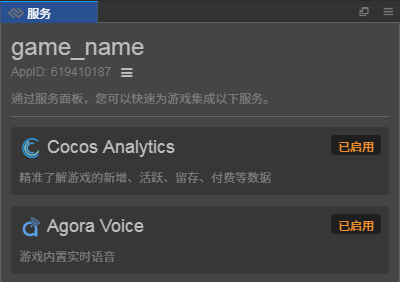

# 一键接入第三方服务

## Cocos Service 简介

Cocos Service 是集成在 Cocos Creator 内的服务面板。我们甄选优质技术方案商，提供高性价比服务接入，致力于给用户一键式的接入体验，以及提供相应的技术支撑。同时依托广大 Cocos 开发者群体，我们也将为开发者争取到更加优惠的价格。

Cocos Service 目前提供的服务包括：

- [Cocos 数据统计](https://www.cocos.com/analytics/)：精准了解游戏的新增、活跃、留存、付费等数据。
- [Matchvs 游戏云](https://www.matchvs.com/)：专业成熟的移动游戏联网与服务端解决方案。
- [Agora Voice](https://www.agora.io/cn/)：游戏内置实时音频 SDK。

更多第三方服务还在不断接入中。

## Cocos Service 目录

- [关于 Cocos Service](about-cocos-service.md)
    - [Cocos Service 操作指南](user-guide.md)
    - [设定 Cocos AppID](setting-cocos-appid.md)
    - [一键开通服务](oneclick-provisioning.md)
    - [服务面板说明](about-service-panel.md)
    - [计费与充值](billing-and-charge.md)
- [Cocos Analytics 统计](cocos-analytics/index.md)
- [Matchvs 游戏云](matchvs/index.md)
- [Agora 声网](agora/index.md)
