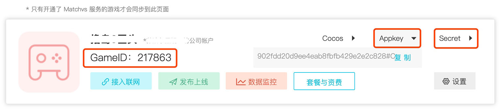
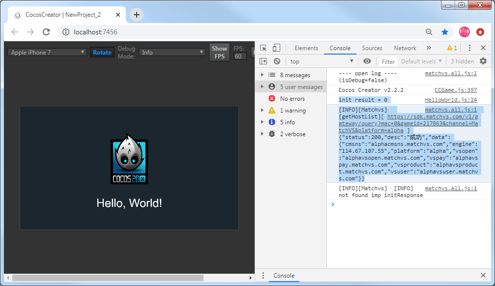
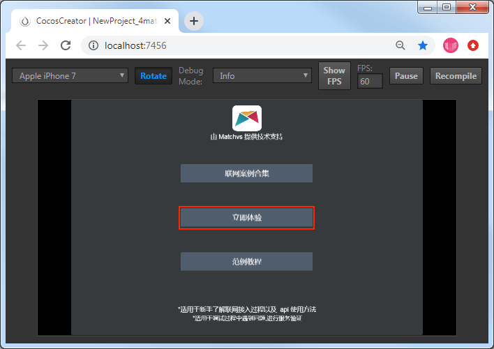
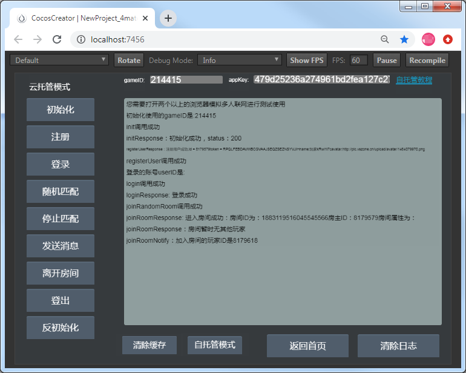

# Matchvs 游戏云简介


[Matchvs 游戏云](https://doc.matchvs.com/matchvs) 是一款商业化游戏服务器引擎，与游戏服务器开源框架不同，Matchvs 将一整套联网功能集成为一个高可用的 SDK，适用于包括立项之初接入与后续单机改造的多场景应用。开发者只需根据自身设计的游戏逻辑，通过 SDK 提供的 API 接口来调整所需参数，即便是无服务端开发经验的工程师也能在短时间打造出一款标准的多人实时在线联网游戏。Matchvs 为开发者提供游戏联网通信解决方案，拥有快速接入联网、多节点、低延迟、云端一键部署、可定制扩展等特色，帮助开发者节省开发成本，大幅缩短开发周期。

Matchvs 游戏云为 Cocos Creator 提供联网与服务端能力，可以在 Cocos 官方商店中下载相关内容，并支持在 Cocos Creator 中直接导入全局或项目。Matchvs 游戏云支持多类型游戏的即时通信，多节点服务器将有效保障延迟和稳定。支持将游戏的后端服务一键部署至云端，并由 Matchvs 提供数据监控、日志服务与扩容机制。

## 一键接入 Matchvs 服务

### 开通 Matchvs 服务

1. 使用 Cocos Creator 打开需要接入 Matchvs 服务的项目工程。
2. 点击菜单栏的 **面板 -> 服务**，打开 **服务** 面板。设定 Cocos AppID 后，选择 Matchvs 项，进入 Matchvs 服务面板。然后点击右上方的 **启用** 按钮以开通 Matchvs 服务。详情可参考 [Cocos Service 操作指南](./user-guide.md)。

    

    **计费**：Matchvs 游戏云服务使用 **预付费** 模式，当你的服务使用超过服务商的免费部分，且账户余额不足时，会停止服务。这时候你需要在 Cocos 开发者账户中心进行 **预充值**。具体内容可参考 [计费与充值](./billing-and-charge.md)。

    开通服务后，Cocos Service 将自动开通 Matchvs 服务、联通 Matchvs 账号，并集成 Matchvs SDK 到游戏工程中。

### 验证 Matchvs 接入是否成功

完成 Matchvs 服务接入步骤后，我们可以通过在脚本中添加简单的代码来验证 Matchvs 的接入是否成功。

1. 点击 Matchvs 服务设置面板中的 **前往控制台**，跳转到 [Matchvs 管理后台](https://www.matchvs.com/manage/)，获取接入参数 **GameID** 和 **Appkey**：

    

2. 在脚本中调用 Matchvs 的初始化，填入在 1 步骤中从 Matchvs 后台获取的 **GameID** 和 **Appkey**：

    ```js
    // 获取 Matchvs 引擎对象
    var engine = new window.MatchvsEngine(); 
    // 创建回调对象，在进行注册、登录、发送消息等操作之后，该对象的方法会被异步调用
    var response = new window.MatchvsResponse();
    var gameid = '从 Matchvs 后台获取的 GameID';
    var appkey = '从 Matchvs 后台获取的 Appkey';
    // 调用初始化方法 init
    var result = engine.init(response, 'MatchVS', 'alpha', gameid, appkey, 1);
    // result = 0 为初始化成功
    console.log("init result = " + result);
    ```

3. 脚本修改完成并保存后，回到编辑器。在编辑器上方选择 **浏览器**，然后点击  [预览](../getting-started/basics/preview-build.md) 按钮，若能在控制台中看到初始化和登录日志，即为接入成功。

    

## Matchvs Sample 的集成调试

因为 Matchvs SDK 接口较多，建议直接参考 Matchvs Sample 工程，以及使用其封装方法。

- 打开 Cocos Creator，在 Dashboard 的 **新建项目** 中创建一个 Matchvs 的 **联网游戏范例**：

  

- Matchvs Sample 工程主要的文件结构如下，可点击编辑器右上方的 **项目** 按钮打开工程目录。详细的封装方法及使用可参考 [Matchvs 官方文档](http://doc.matchvs.com/QuickStart/QuickStart-CocosCreator#%E7%AC%AC%E4%B8%80%E8%A1%8C%E4%BB%A3%E7%A0%81)。

    ```js
    project-folder
     |--assets
         |--scripts
             |--1  // 以下 5 个文件，在接入时可直接放到自己的游戏工程中使用
                 |--ExamplesData.js      // 参数配置文件，可替换为你从 Matchvs 管理后台获取的参数
                 |--Matchvs.js           // 用于 Matchvs 的 JS 加载
                 |--MatchvsEngine.js     // 封装了 Matchvs 引擎对象的方法
                 |--MatchvsResponse.js   // 封装了 Matchvs 的各回调方法
                 |--MatchvsMessage.js    // Matchvs 网络事件定义
             |--2
                 |--NetworkFlow.js       // Matchvs Demo 实现部分，接入时可参考其代码
             |--matchvs
                 |--matchvs.all.js       // Matchvs SDK 文件，通过服务面板一键接入时，会以插件的形式导入，无需再做 require 处理。
    ```

- 点击编辑器窗口正上方的  [预览](../getting-started/basics/preview-build.md) 按钮，在浏览器上运行 Matchvs Sample 工程。点击 **立即体验** 开始调试和服务验证。

  

- 本地调试时，需要在 **两个不同的浏览器** 上运行 Matchvs Sample 工程来模拟多人联网进行测试。例如，在一个浏览器的 Matchvs Sample 工程中进入 **立即体验** 页面，然后点击 **初始化 -> 注册 -> 登录 -> 随机匹配** 进入房间后，再打开另一种浏览器执行同样的步骤，可以看到在第一个浏览器中提示 “加入房间的玩家 ID 是 XXXXXXX”。

  

## 相关参考链接

- [Matchvs 管理后台](https://www.matchvs.com/manage/)
- [Matchvs 游戏云简介](https://doc.matchvs.com/matchvs)
- [Matchvs 开发文档](https://doc.matchvs.com/QuickStart/Guide-Matchvs)
- [Matchvs 官方付费说明](https://doc.matchvs.com/PaymentHelp)
- [Matchvs 官方游戏案例](https://github.com/matchvs/)

更多使用文档可直接在 [Matchvs 文档阅读指引](https://doc.matchvs.com/ReadGuide) 中查阅。
