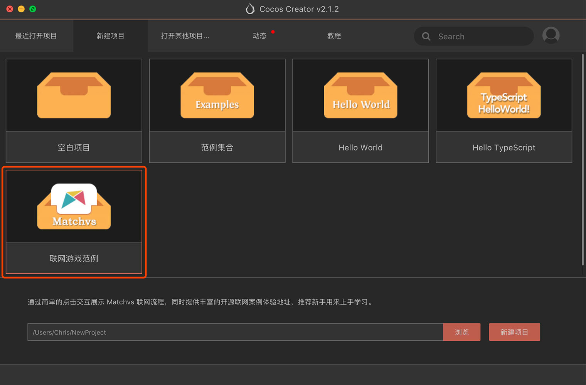
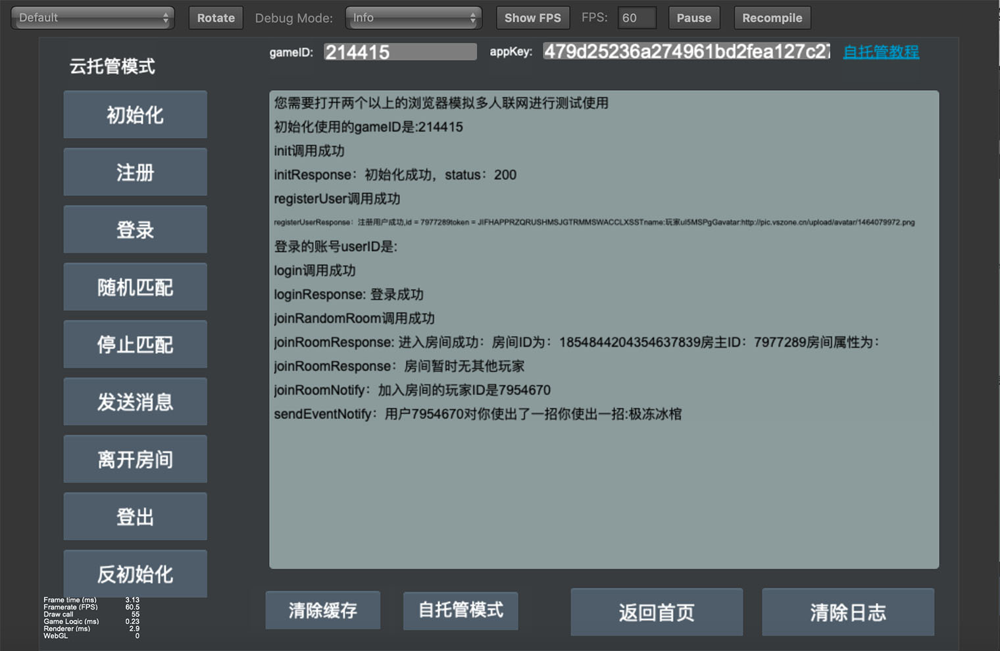

# 基础使用
## Matchvs Sample 参考和使用
若用户已有一定 Cocos Creator 基础或者已经完成 [**快速入门**](quick-start.md) 步骤，可以继续参考此篇文档。

Matchvs SDK 接口较多，建议直接参考 Matchvs 提供的 Sample，和使用其封装的方法。

- 首先在 Dashboard 中，创建一个 Matchvs **联网游戏范例**： 



- 打开范例工程，主要关注以下文件：

```

Project
 |--assets
    |--scripts
        |--1                        // 以下5个文件，可以直接放到自己的游戏工程中使用
            |--ExamplesData.js      // 参数配置文件，可替换为自己的参数
            |--Matchvs.js           // 用于 Matchvs 的 JS 加载
            |--MatchvsEngine.js     // 封装了 Matchvs 引擎对象的方法
            |--MatchvsResponse.js   // 封装了 Matchvs 的各回调方法
            |--MatchvsMessage.js    // Matchvs 网络事件定义
        |--2
            |--NetworkFlow.js       // Matchvs Demo 实现部分，接入时可参考其代码
        |--matchvs
            |--matchvs.all.js       // Matchvs SDK 文件，通过服务面板一键接入时，以插件形式导入

``` 

- 可将 **ExamplesData.js** 中的参数替换为 [**Matchvs 管理后台**](https://www.matchvs.com/manage/) 申请的参数，运行 Sample 工程，点击 **立即体验**，进行调试和服务验证。
- 本地调试需要打开 **两个不同浏览器** 运行 **http://localhost:7456/** 模拟多人联网进行测试使用。



- 需要接入到自己的游戏工程时，可以直接使用 **/assets/scripts/1/** 目录下已封装的 5 个文件，接入代码可以参考 **NetworkFlow.js** 中的部分。

---

继续前往 [**文档链接**](docs-link.md)


