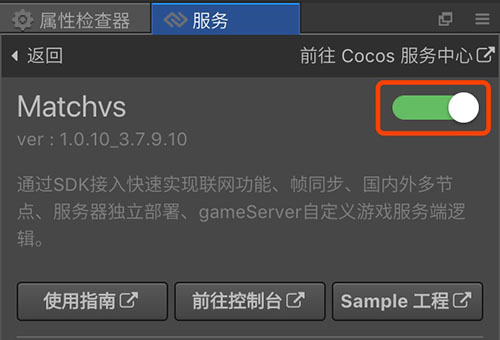
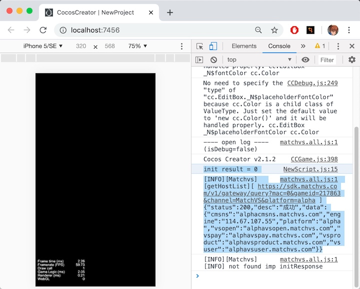

#快速开始
##内容简介
- 本文档面向 Cocos Creator 初学者，有一定基础的用户，可以直接参考 [**基础使用**](basic-user-guide.md) 文档。
- 本文档主要指导如何通过简单的操作，在一个 Cocos Creator 空白项目中，通过 Cocos Service 服务面板，一键接入 Matchvs 的流程，并通过 Matchvs 初始化成功信息，验证接入效果。
- 需要 v2.0.7 版本以上的 Cocos Creator。

##创建空白项目
- 如果还不了解如何获取和启动 Cocos Creator，请阅读 [安装和启动](/../../getting-started/install.md) 一节。
- 在 Dashboard 中，打开 **新建项目** 选项卡，选中 **空白项目** 模板，创建项目。

    

##一键接入 Matchvs 服务
Cocos Creator v2.0.7 以上版本的 **Cocos Service 服务面板** 中，集成了 Matchvs 服务。若项目已完成 [**Cocos AppID 设定**](./../setting-cocos-appid.md)，可以通过点击开通按钮的方式 **一键接入**。

若完成 [**Cocos AppID 设定**](./../setting-cocos-appid.md) 操作后，点击 **Matchvs 服务面板**，再点击右上角 **开通服务按钮**。



Cocos Service 将自动开通 Matchvs 服务、联通 Matchvs 账号，并集成 Matchvs SDK 到游戏工程中。此时我们点击面板上的 **前往控制台**，到 Matchvs 管理后台，获取以下接入参数备用：

- **GameID**
- **Appkey**


##脚本调试
完成 Matchvs 服务接入步骤后，我们便可以在场景中添加简单的代码，验证 Matchvs的接入是否成功。

- 在左下角 **资源管理器 > assets** 右键，**新建 > JavaScript** ，添加脚本文件。
- 在左上角 **层级管理器** 中，选定 **Canvas** 。
- 将新建的 JS 文件拖动到右侧 **属性检查器** 面板中


- Matchvs 的 SDK 已通过 **插件** 形式导入工程，无需再做 require 处理。相关内容可参考 [插件脚本](/../../scripting/plugin-scripts.md) 文档。
- 现在我们修改脚本文件，例如在 onLoad 方法中调用 Matchvs 的初始化，将接入参数替换为之前 Matchvs后台获取的 **GameID** 和 **Appkey**：

```js
// NewScript.js

 cc.Class({
     extends: cc.Component,

     properties: {

     },

     onLoad: function () {
     	var engine =  new window.MatchvsEngine(); //获取Matchvs引擎对象
     	var response = new window.MatchvsResponse(); //创建回调对象，在进行注册、登录、发送消息等操作之后，该对象的方法会被异步调用
     	var gameid = 217863; //替换为自己的GameID，Matchvs后台获取
     	var appkey = '902fdd20d9ee4eab8fbfb429e2e2c828#C' //替换为自己的AppKey，Matchvs后台获取
     	var result = engine.init(response, 'MatchVS', 'alpha', gameid, appkey, 1); //调用初始化方法init
     	console.log("init result = " + result); //result = 0 为初始化成功

     },

 });
```

- 可以直接在浏览器中 [预览和构建](/../../getting-started/basics/preview-build.md)  ，若能在日志中看到初始化的标志，则可验证 Matchvs 接入是否成功。



---

继续前往 [**基础使用**](basic-user-guide.md) 。


