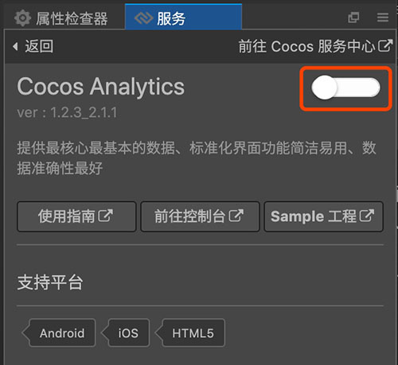
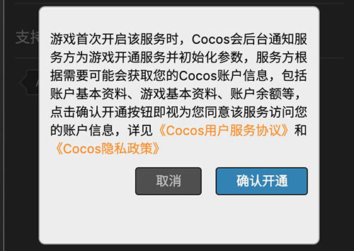

# 一键开通服务
游戏工程设定 Cocos AppID 后，便可以方便的使用一键开通服务。只需要点击一下开通按钮，Cocos Service 将自动完成服务开通、账号联通和SDK集成等工作。

下面以Cocos Analytics 为例：
- 在服务面板中，**点击 Cocos Analytics 面板**。
- 点击右上角 **开通服务按钮**。

    

- 出现开通说明，同意后点击 **确认开通**。

    
    
Cocos Service 将会开通该服务、联通服务商账号，并自动集成该服务的 SDK 到游戏工程，用户可以开始进行余下的 SDK 调用等工作，请参考对应服务的接入文档。

- [**Cocos 数据统计**](cocos-analytics/basic-user-guide.md) 
- [**Matchvs 游戏云**](matchvs/basic-user-guide.md) 
- [**Agora Voice**](agora/basic-user-guide.md) 

---

继续前往 [服务面板说明](about-service-panel.md)。

