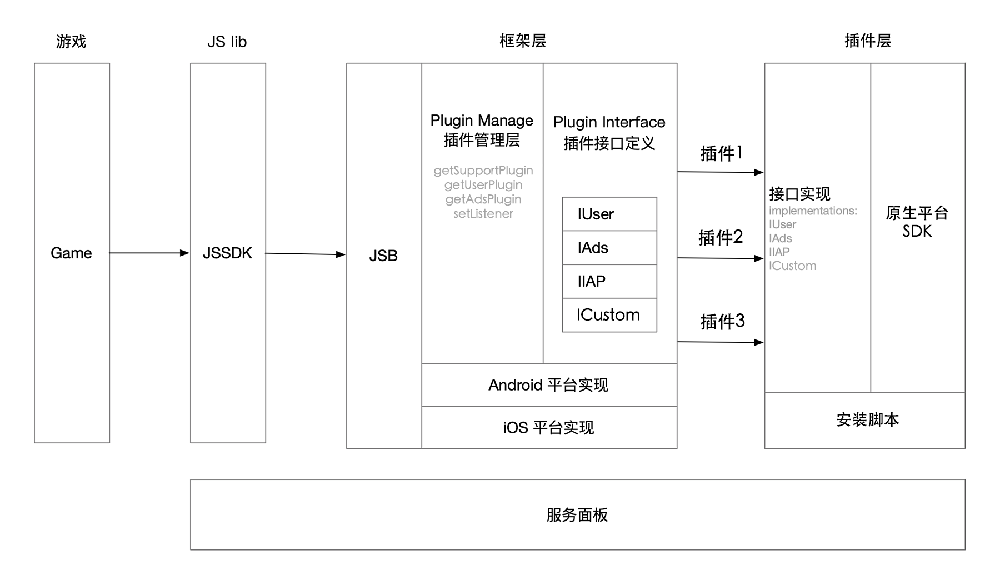
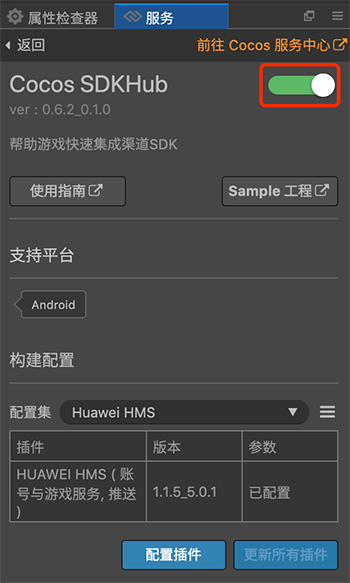
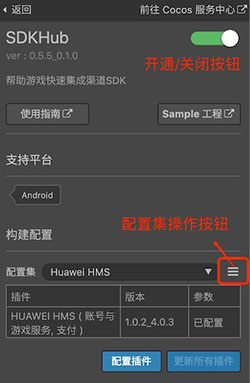
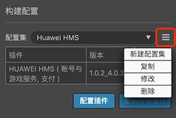
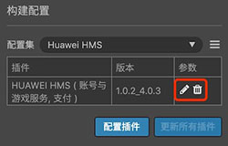
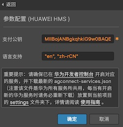
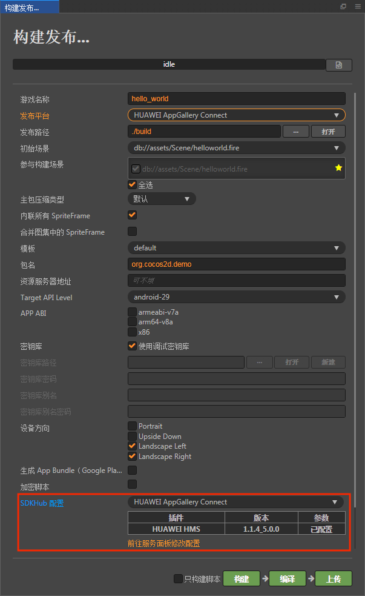
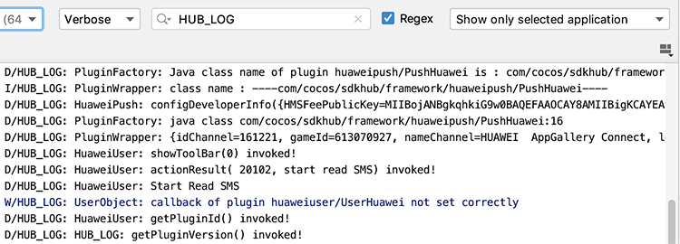

> **注意**：此版本文档已归档不再维护，请移步至 [最新版本](https://service.cocos.com/document/zh/sdkhub.html)。

# Cocos SDKHub 快速入门

Cocos SDKHub 是一套帮助 Cocos Creator 开发者快速接入原生平台 SDK 的接入框架。

游戏在开发完成准备发布到渠道上架时，通常需要接入渠道的 SDK，集成渠道的账户、支付、广告、游戏服务等功能。如果游戏同时要发布到多个渠道，由于同样的功能各家渠道的 SDK 接口却不尽相同，这会使开发者苦不堪言，需要编写很多兼容性代码来维护 SDK 集成工作。因此市面上出现了很多用来抽象这些 SDK 的 “超级 SDK”，例如 Cocos 官方之前推出的 AnySDK，不过后来由于一些原因 AnySDK 不再维护和更新了。

引擎团队为解决这一问题专门开发了 Cocos SDKHub，可以完全用来替代 AnySDK。

使用 Cocos SDKHub 可以让开发者更快速地接入原生平台 SDK，例如 **账号 & 游戏**、**支付**、**广告**、**推送** 和 **自定义** 等 SDK。开发者只需要在 Cocos Service 服务面板中开通并集成 Cocos SDKHub 服务，然后通过 **构建发布** 面板构建工程，就可以快速的接入所需的原生 SDK。

## 产品原理

Cocos SDKHub 主要分为 **框架层** 和 **插件层** 两大部分，由 Cocos SDKHub 服务面板控制和配置。

- 框架层：实现了 JSB 绑定文件、插件和统一回调管理接口、各插件系统接口的统一封装定义和原生平台实现。
- 插件层：实现了框架层定义的各接口和原生平台 SDK 所需的各种其他接口，将原生平台 SDK 的回调进行统一封装，以及在构建工程时，调用安装脚本，对原生工程的原生平台 SDK 进行配置。

开发者在游戏层，仅需调用 Cocos SDKHub 中的方法以及处理统一封装的回调，极大的简化了开发者接入原生平台 SDK 的工作量。



## 一键接入 Cocos SDKHub 服务

### 开通服务

- 使用 Cocos Creator 打开需要接入 Cocos SDKHub 服务的项目工程。

- 点击菜单栏的 **面板 -> 服务**，打开 **服务** 面板，选择 **Cocos SDKHub**，进入服务详情页。然后点击右上方的 **启用** 按钮即可开通服务。详情可参考 [服务面板操作指南](./user-guide.md)。

  

开通服务后，Cocos Service 将自动集成 Cocos SDKHub 框架到游戏工程中。

### 验证服务是否接入成功

Cocos SDKHub 服务接入完成后，我们可以通过在脚本中添加简单的代码，来验证接入是否成功。

- Cocos SDKHub 会自动初始化，但初始化需要时间。我们在脚本中使用 `scheduleOnce` 延时调用方法，调用 Cocos SDKHub 账号 & 游戏对象的登录方法。

    ```js
    this.scheduleOnce(function(){
        sdkhub.getUserPlugin().login();
    },2);
    ```

- 脚本修改完成并保存后，回到编辑器。Cocos SDKHub 调试需要 [发布到 Android 平台](../publish/publish-native.md)。若能在设备中看到 Debug 模式下的登录窗口，即为接入成功。

  
    
## 平台 SDK 配置

上述操作只是将 Cocos SDKHub 的抽象层框架集成到游戏中，但并没有实质地集成我们所说的第三方 SDK。游戏需要发布到哪家渠道，需要集成哪些 SDK，都需要我们通过 Cocos SDKHub 服务详情页中的 **构建配置** 进行添加。



相关参数具体的配置规则如下：

- **配置集**

  配置集是 Cocos SDKHub 的一项重要功能。当我们需要将游戏发布到不同渠道，为不同渠道集成不同的 SDK 时，我们可以创建不同的 **配置集**。我们甚至可以为同一渠道创建多个配置集，以便管理多套不同的参数。然后在构建发布时，通过在构建发布面板的 **Cocos SDKHub 配置** 项中指定对应的配置集，即可构建出集成了不同 SDK 的游戏包。这让我们的游戏集成 SDK 工作妙不可言。

  创建配置集包括以下几个步骤：

  - 如下图所示点击 **新建配置集**

      

  - 进入 **添加配置集** 页面，填写相关参数，填写完成后点击 **确定** 即可

      

    - 配置集名称：通常直接使用渠道名称即可，也可以使用一个比较方便自已识记的名称。
    - 发布平台：用于设置配置集生效的平台，目前仅支持 **HUAWEI AppGallery Connect** 平台。
    - 渠道：需要构建发布的目标渠道，Cocos SDKHub 通常会自动添加渠道方要求的 SDK（插件）。

- **插件管理**

  开发者在创建完配置集后，需要选择并配置该配置集中所需集成的 SDK（插件），并填写原生平台 SDK 所需的参数，才能在构建发布后的工程中使用该平台 SDK 的功能。若不配置插件，则构建出的工程并没有太大实质意义，在调用 Cocos SDKHub 框架相关接口时将自动切换到 Debug 模式。

  

  - 配置插件：添加所需功能的插件，目前支持 **账号 & 游戏**、**支付** 、**广告** 和 **推送** 等类型插件。
  - 更新所有插件：若已下载的插件有线上更新版本，点此全部更新。
  - 编辑参数按钮：配置该平台 SDK 的参数。若填写不完整无法正常构建。具体的填写规则请查看对应平台的要求。

    

  - 删除参数按钮：删除当前填写的参数配置。

## 构建和编译

在创建好配置集，并为配置集配置好插件和参数后，我们需要在构建发布时，选择对应的配置集，才能最终编译出集成有 SDK 的游戏包。

打开 Cocos Creator 顶部菜单的 **项目 -> 构建发布**，当选择 **Android**、**iOS**、**HUAWEI AppGallery Connect** 等平台时（目前 Cocos SDKHub 暂时只支持这些原生平台），会显示 **Cocos SDKHub 配置** 项，并列出开发者在服务面板中创建的配置集（Creator v2.4.1 新增，之前的旧版本会默认使用 **服务** 面板中 Cocos SDKHub 面板选择的配置集），然后选择对应的配置集即可。



如果在编译时出现问题，可能是由于 Creator 原生编译环境配置不正确，可尝试在 **Android Studio** 或 **Xcode** 中直接编译工程，以便获得更多的调试信息。

## Sample 工程

开发者可以通过 Sample 工程快速体验 Cocos SDKHub。

- 点击 Cocos SDKHub 服务面板中的 **Sample 工程** 按钮，Clone 或下载 Cocos SDKHub Sample 工程，并在 Cocos Creator 中打开。

- 以集成 **HUAWEI HMS Core** 为例，具体内容可参考 [HMS Core - Sample 工程](./sdkhub-plugins/sdkhub-hms.md#sample-工程) 文档。

- 若需要修改工程参数配置或者 JS 代码层，修改完成后，在 **构建发布** 面板重新构建即可。

- 若需要删减服务插件配置（例如去掉支付功能），建议删除工程构建后生成的发布包 `build/jsb-link` 或者 `build/jsb-default` 目录，然后重新构建。

## 开发指南

### 获取插件对象

Cocos SDKHub 框架目前支持账号 & 游戏、支付、广告、推送和自定义五种类型，获取插件对象方法，可参考 [API 文档](https://service.cocos.com/document/api/modules/sdkhub.html)。

其中 **广告** 和 **推送** 对象只支持单个插件。以广告对象为例，获取广告对象方法为：

```js
var ads = sdkhub.getAdsPlugin();
```

**账号 & 游戏**、**支付** 与 **自定义** 对象可支持接入多个插件，以账号 & 游戏对象为例，若只接入了单个插件，可直接使用 `getUserPlugin` 方法获取对象：

```js
var user = sdkhub.getUserPlugin();
```

若接入了多个账号 & 游戏插件，可以通过传入 `pluginId` 获取所需对象：

```js
var hwUser = sdkhub.getUserPlugin('HuaweiUser');
```

也可以通过 `getUserPlugins` 方法，直接获取该类型对象 Array，再做处理。

```js
var users = sdkhub.getUserPlugins();
```

### 其他框架方法

#### 获取插件列表

`getSupportPluginIds(): string`

可通过判断是否含有 `User`、`Fee`、`Ads`、`Push` 或 `Custom` 开头的字段来判断是否存在该类型插件，也可通过其中的插件名，获取指定的插件对象。

**示例：**

`var pluginids = sdkhub.getSupportPluginIds();`

#### 获取框架版本号

`getFrameworkVersion(): string`

**示例：**

`var version = sdkhub.getFrameworkVersion();`

#### 获取插件支持的方法

`getPluginMethods(plugin: PluginProtocol): string`

**示例：**

`var methods = sdkhub.getPluginMethods(sdkhub.getUserPlugin());`

### 插件方法调用与回调

#### 专有方法调用

Cocos SDKHub 框架中已经对大部分的渠道 SDK 的类型方法进行了归纳，并封装定义了一些常用方法。例如公用方法中的 **获取插件 ID** `getPluginId`，账号 & 游戏对象中的 **登录** 方法 `login()`，支付对象中的 **支付商品** 方法 `feeForProduct` 等。以登录方法为例：

```js
sdkhub.getUserPlugin().login();
```

一些方法需要按 SDK 要求传入参数，请参考对应插件文档的 **开发指南**，以华为 HMS Core `showAchievement` 方法为例：

```js
var params = {
    "type": "getAchievementList",
    "forceReload": "1"
};
sdkhub.getUserPlugin().showAchievements(params);
```

各类型方法调用前，可以先调用 `isFunctionSupported` 检查插件是否支持该方法，再做调用。例如一些 SDK 没有游戏类型的 `showAchievements` 方法，我们可以通过代码先做判断。

```js
if (sdkhub.getUserPlugin().isFunctionSupported("showAchievements")) {
    var params = {"type": "getShowAchievementListIntent"};
    sdkhub.getUserPlugin().showAchievements(params);
}
```

#### 统一回调

Cocos SDKHub 将原生平台 SDK 的回调进行统一封装，开发者需要在各类型设置监听并绑定方法，在绑定方法中统一处理回调逻辑。以账号 & 游戏对象为例：

```js
sdkhub.getUserPlugin().setListener(this.onUserResult, this);

onUserResult: function (code, msg) {
    switch (code) {
        case sdkhub.UserResultCode.kLoginSucceed:
            console.log("kLoginSucceed", msg);
            break;
    }
}
```

各类型回调值可参考 [API 文档](https://service.cocos.com/document/api/modules/sdkhub.html)。

通过扩展接口调用的方法，可能需要使用扩展回调值。例如支付对象的扩展回调值为 `sdkhub.FeeResultCode.kFeeExtension = 30000`，华为 HMS Core `obtainOwnedPurchases` 方法成功的回调值为 `sdkhub.FeeResultCode.kFeeExtension + 106`。

由于不同 SDK 插件的不同方法，可能使用相同的回调值（例如上面的 `sdkhub.FeeResultCode.kFeeExtension + 106` 回调）。如果一个游戏工程接入了不同的多个渠道，或者多个同类型插件，在处理扩展回调时，建议添加插件 ID 判断，保证该插件获得回调逻辑正确。

```js
case sdkhub.FeeResultCode.kFeeExtension + 106:
// Recommended to check the Plugin ID when using extended callbacks
    if (sdkhub.getFeePlugin().getPluginId() == "FeeHuawei") {
        console.log("HMS obtainOwnedPurchases");
    }
    else if (sdkhub.getFeePlugin().getPluginId() == "FeeHuawei") {
    }
    break;
```

若需要移除回调，可以调用 `removeListener` 方法。

```js
sdkhub.getUserPlugin().removeListener();
```

### 插件公用方法

对应 [Class pluginProtocol](https://service.cocos.com/document/api/classes/sdkhub.pluginprotocol.html)，各类型插件对象均继承于此模块。

#### 扩展方法调用

若接入的 SDK 中的所需方法，不在 Cocos SDKHub 框架的封装定义中，则我们需要通过 **扩展接口调用** `callFuncWithParam` 方式，通过传入方法名与所需参数进行调用。

- 若调用方法不需要传入参数，以华为 HMS Core `cancelAuthorization` 方法为例：

  ```js
  sdkhub.getUserPlugin().callFuncWithParam("cancelAuthorization");    
  ```

- 若调用方法需要按 SDK 要求传入参数，请参考对应插件文档的 **开发指南**，传入参数可能为数字、字符串，或者 JSON 对象。

  - 以传入参数为 `Number` 的华为 HMS Core `getGameSummary` 方法为例：

    ```js
    var params = 0;
    sdkhub.getUserPlugin().callFuncWithParam("getGameSummary", params);
    ```

  - 以传入参数为 JSON 对象的华为 HMS Core `submitEvent` 方法为例：

    ```js
    var params = {
        "eventId": "A123456",
        "growAmount": "20"
    };
    sdkhub.getUserPlugin().callFuncWithParam("submitEvent", params);
    ```

  - 若通过扩展方式调用的 SDK 方法，有直接返回值，则可调用 `callBoolFuncWithParam`、`callFloatFuncWithParam`、`callIntFuncWithParam`、`callStringFuncWithParam` 等方法代替 `callFuncWithParam`：

    ```js
    Boolean isTrue = sdkhub.getUserPlugin().callBoolFuncWithParam("functionName");
    ```

#### 获取插件 ID

`getPluginId(): string`

接入 Cocos SDKHub 的游戏工程，可能接入多个渠道或多个相同系统的 SDK 插件，需要在代码中通过插件 ID 进行判断。

**示例：**

```js
var feePluginId = sdkhub.getFeePlugin().getPluginId();
```

#### 获取插件版本号

`getPluginVersion(): string`

获取该插件完整的版本号，例如 "1.0.0_4.0.3"，下划线前为插件部分的版本号，下划线后为接入平台 SDK 的版本号。

同一个插件中，不同类型的 SDK 版本号也可能存在差异，所以不同类型插件获取的后半部分 **SDK 版本号** 的值也可能不同。例如在同一个华为插件中，通过账号 & 游戏类型插件获取的版本号为 `1.1.5_5.0.0.300`，通过支付类型插件获取的版本号为 `1.1.5_4.0.4.301`。

**示例：**

```js
var pluginVersion = sdkhub.getUserPlugin().getPluginVersion();
```

#### 获取 SDK 版本号

`getSDKVersion(): string`

获取插件对应 SDK 版本号，例如 "4.0.3"，平台 SDK 的版本号。

同一个插件中，不同插件的 SDK 版本号也可能存在差异，可参考上文。

**示例：**

```js
var sdkVersion = sdkhub.getUserPlugin().getSDKVersion();
```

#### 判断插件是否支持该方法

`isFunctionSupported(funcName: string): boolean`

调用各类型方法前，可以先调用本方法，检查插件是否支持该方法，再做调用。

由于 JS 层调用不存在的方法名，也不会导致崩溃，该方法可选。

**示例：**

```js
if (sdkhub.getUserPlugin().isFunctionSupported("showAchievements")) {
    var params = {"type": "getShowAchievementListIntent"};
    sdkhub.getUserPlugin().showAchievements(params);
}
```

### 账号与游戏插件

#### 登录

`login(): void`

调用 SDK 的登录方法。

若 SDK 可以在客户端完成登录验证并获取唯一用户 ID，也会再执行验证方法。否则用户需要通过登录回调信息，自行进行服务端验证，并将验证后所需的登录信息通过 `setUserInfo` 回传给 Cocos SDKHub，完成登录流程。

Cocos SDKHub 框架和插件，基本不涉及当前登录状态处理和服务端验证接口，例如当前用户是否登录等情况，需要游戏端进行判断，避免在用户未登录下，调用账号和游戏插件其他接口导致崩溃。

**示例：**

```js
sdkhub.getUserPlugin().login();
```

#### 登出

`logout(): void`

调用 SDK 的登出方法。游戏端需要在回调中判断当前登录状态。

一些 SDK 将用户登出功能放在平台悬浮窗上，没有主动调用的登出方法，但存在登出回调，需要注意处理。

**示例：**

```js
sdkhub.getUserPlugin().logout();
```

#### 获取用户登录信息

`getUserInfo(): any`

若 SDK 可以在客户端完成登录验证并获取到用户唯一 ID，可通过该方法获取登录信息。可以获取 `userID` 参数作为用户唯一 ID。

若 SDK 需要服务端验证后才能获得唯一用户 ID，则需要通过调用 `setUserInfo` 方法后，再调用本方法才能获取到登录信息。

**示例：**

```js
var userInfo = sdkhub.getUserPlugin().getUserInfo();
```

#### 设置用户登录信息

`setUserInfo(info: any): void`

若 SDK 需要服务端验证后才能获得唯一用户 ID，需要将插件所需的登录信息回传给 Cocos SDKHub。

**示例：**

```js
var params = {
    userID: "890839221",
    userName: "test_name"
};
sdkhub.getUserPlugin().setUserInfo(params);
```

#### 显示浮标

`showToolBar(toolPlace: ToolBarPlace): void`

调用 SDK 显示浮标方法。若 SDK 有需要，插件接入时会在生命周期调用该方法。除特别说明情况下，无需主动调用本接口。

部分插件支持 [ToolBarPlace](https://service.cocos.com/document/api/enums/sdkhub.toolbarplace.html) 参数，作为浮动工具栏初始位置。

```
sdkhub.getUserPlugin().showToolBar(sdkhub.ToolBarPlace.kToolBarTopLeft);
```

#### 隐藏浮标

`hideToolBar(): void`

调用 SDK 隐藏浮标方法。若 SDK 有需要，插件接入时会在生命周期调用该方法。除特别说明情况下，无需主动调用本接口。

```
sdkhub.getUserPlugin().hideToolBar();
```

#### 展示排行榜

`showLeaderBoard(params: any): void`

排行榜相关方法。传入参数需参考对应 SDK 插件文档。

**示例：**

```js
var params = {"type": "getRankingsIntent"};
sdkhub.getUserPlugin().showLeaderBoard(params);
```

#### 提交分数

`submitScore(params: any): void`

排行榜相关方法。传入参数需参考对应 SDK 插件文档。

**示例：**

```js
var params = {"type": "getRankingSwitchStatus"};                         
sdkhub.getUserPlugin().submitScore(params);
```

#### 展示成就

`showAchievements(params: any): void`

成就相关方法，传入参数需参考对应 SDK 插件文档。

**示例：**

```js
var params = {"type": "getShowAchievementListIntent"};
sdkhub.getUserPlugin().showAchievements(params);
```

#### 解锁成就

`unlockAchievement(params: any): void`

成就相关方法，传入参数需参考对应 SDK 插件文档。

**示例：**

```js
var params = {
    "type": "reachWithResult",
    "achievementId": "5D9580837D32CB59CFEC89DAD39470CDF9B672033A2D6F14689BC01335818444"
};
sdkhub.getUserPlugin().unlockAchievement(params);
```

#### 回调值

请参考 [API 文档 - UserResultCode](https://service.cocos.com/document/api/enums/sdkhub.userresultcode.html)。

### 支付插件

考虑过去苹果 AppStore 审核方面等的问题，我们将支付关键字设为 `fee`。

#### 支付商品

`feeForProduct(params: any): void`

调用 SDK 的支付方法。

用户支付成功后，渠道会返回订单信息。国内大部分渠道，会直接将其返回到游戏服务端，请自行处理验签部分和商品发货流程。

华为 HMS Core、AppStore、GooglePlay 等渠道，在支付成功后，会将订单信息返回到客户端。SDKHub 接入时会对返回的订单信息进行本地验签，验签成功后返回支付成功回调。建议游戏层再将回调信息传给游戏服务端，做服务端验签，成功后处理商品发货流程，可能还需要调用插件层的核销商品功能。

我们对大部分的渠道 SDK 进行了归纳，建议开发者调用时传入以下参数，和参考对应插件使用指南文档：

| 传入参数 | 参数说明 |
| --- | --- |
| Product_Id | 商品 ID，一些渠道要与后台配置一致。 |
| Product_Name | 商品名 |
| Product_Price | 商品价格（元），部分渠道只支持整数，集成时会做转换 |
| Product_Count | 商品份数（除非游戏需要支持一次购买多份商品，否则传 1 即可） |
| Product_Desc | 商品描述 |
| Coin_Name | 虚拟币名称（如金币、元宝） |
| Coin_Rate | 虚拟币兑换比例（例如 100，表示 1 元购买 100 虚拟币） |
| Role_Id | 游戏角色 ID |
| Role_Name | 游戏角色名 |
| Role_Grade | 游戏角色等级 |
| Role_Balance | 用户游戏内虚拟币余额，如元宝，金币，符石 |
| Vip_Level | VIP 等级 |
| Party_Name | 帮派、公会等 |
| Server_Id | 	服务器 ID，若无填 "1" |
| Server_Name | 服务器名 |
| EXT | 扩展字段，用于支付透传参数 |

**示例：**

```js
 var params = {
    "Product_Id": "2",
    "Product_Name": "10 元宝",
    "Product_Price": "1",
    "Product_Count": "1",
    "Product_Desc": "gold",
    "Coin_Name": "元宝",
    "Coin_Rate": "10",
    "Role_Id": "123456",
    "Role_Name": "test",
    "Role_Grade": "1",
    "Role_Balance": "1",
    "Vip_Level": "1",
    "Party_Name": "test",
    "Server_Id": "1",
    "Server_Name": "test",
    "EXT": "test",
}
sdkhub.getFeePlugin().feeForProduct(params);
```

#### 回调值

请参考 [API 文档 - FeeResultCode](https://service.cocos.com/document/api/enums/sdkhub.feeresultcode.html)。

### 广告插件

#### 显示广告

`showAds(params: any): void`

调用 SDK 的显示广告方法。部分类型广告显示前，需要调用预加载方法 `preloadAds`。回调成功后才能调用显示广告方法。

若需要显示 Banner 等类型广告，可能使用到 [AdsPos](https://service.cocos.com/document/api/enums/sdkhub.adspos.html) 方位。

**示例：**

```js
var params = {"adType": "Banner", "adId": "testw6vs28auh3", "pos": sdkhub.AdsPos.kPosBottom, "adSize": "BANNER_SIZE_360_144" };
sdkhub.getAdsPlugin().showAds(params);
```

#### 隐藏广告

`hideAds(params: any): void`

调用 SDK 的隐藏广告方法。或者通过插件实现。

**示例：**

```js
var params = {"adType": "Banner"};
sdkhub.getAdsPlugin().hideAds(params);
```

#### 预加载广告

`preloadAds(params: any): void`

调用 SDK 的预加载广告方法。部分类型广告显示前，需要先调用本方法。回调成功后才能调用显示广告方法 `showAds`。

**示例：**

```js
var params = { "adType": "Reward", "adId": "testx9dtjwj8hp" };
sdkhub.getAdsPlugin().preloadAds(params);
```

#### 回调值

请参考 [API 文档 - AdsResultCode](https://service.cocos.com/document/api/enums/sdkhub.adsresultcode.html)。

### 推送插件

推送需要用到 **别名（Alias）** 和 **标签（Tag）** 两个概念。

- 别名（Alias）

    为安装了应用程序的用户，取个别名来标识。以后给该用户 Push 消息时，就可以用此别名来指定。
    
    - 每个用户只能指定一个别名。
    - 同一个应用程序内，对不同的用户，建议取不同的别名。这样，尽可能根据别名来唯一确定用户。
    - 系统不限定一个别名只能指定一个用户。如果一个别名被指定到了多个用户，当给指定这个别名发消息时，服务器端 API 会同时给这多个用户发送消息。
    
    举例：在一个用户要登录的游戏中，可能设置别名为 userid。游戏运营时，发现该用户 3 天没有玩游戏了，则根据 userid 调用服务器端 API 发通知到客户端提醒用户。

- 标签（Tag）

    为安装了应用程序的用户，打上标签。其目的主要是方便开发者根据标签，来批量下发 Push 消息。
    
    - 可为每个用户打多个标签。
    - 不同应用程序、不同的用户，可以打同样的标签。

    举例：game、old_page、women
    
#### 开始推送

`startPush(): void`

调用 SDK 的开始或注册推送方法，在成功回调中获取推送 Token。

**示例：**

```js
sdkhub.getPushPlugin().startPush();
```

#### 关闭推送

`closePush(): void`

调用 SDK 的关闭推送方法。

**示例：**

```js
sdkhub.getPushPlugin().closePush();
```

#### 设置别名

`setAlias(alias: string): void`

调用 SDK 的设置别名方法。

**示例：**

```js
var params = "alias1";
sdkhub.getPushPlugin().setAlias(params);
```

#### 删除别名

`delAlias(alias: string): void`

调用 SDK 的删除别名方法。

**示例：**

```js
var params = "alias1";
sdkhub.getPushPlugin().delAlias(params);
```

#### 设置标签

`setTags(tags: any): void`

调用 SDK 的设置标签方法，需要传入字符串数组。

**示例：**

```js
var params = ["tag1", "tag2"];
sdkhub.getPushPlugin().setTags(params)
```

#### 删除标签

`delTags(tags: any): void`

调用 SDK 的删除标签方法，需要传入字符串数组。

**示例：**

```js
var params = ["tag1", "tag2"];
sdkhub.getPushPlugin().delTags(params)
```

#### 回调值

请参考 [API 文档 - PushResultCode](https://service.cocos.com/document/api/enums/sdkhub.pushresultcode.html)。

### 自定义插件

自定义插件所有方法均需要通过 [扩展方法调用](#扩展方法调用)。请参考对应 SDK 插件文档。

#### 回调值

自定义插件回调值全部走扩展回调，扩展回调初始值为 `10000`。

### 调试信息输出

Cocos SDKHub 的 Log 关键字为 `HUB_LOG`，仅在 **构建发布** 面板中的 **调试模式** 选项 **打开** 的情况下才会输出。若需要查看一些相关调试信息，可以在 **Logcat** 或者 **Xcode** 中筛选。


调试模式下可能会打印一些参数信息，产品上线时需关闭面板中的 **调试模式** 选项，以免一些参数信息泄露。



## API 文档

详细的功能接口和 API 说明，请参考 [Cocos SDKHub - API 文档](https://service.cocos.com/document/api/modules/sdkhub.html)。
