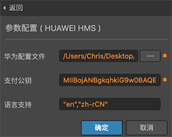
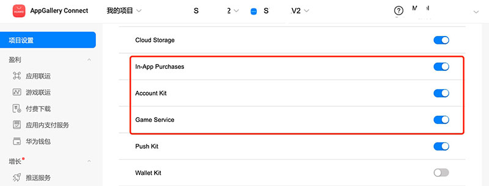
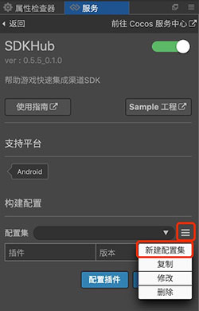
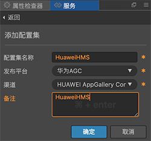
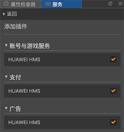
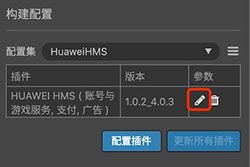
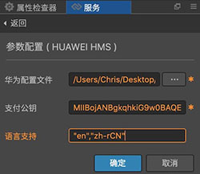

# SDKHub 快速入门

SDKHub 是一套帮助 Cocos Creator 用户快速接入原生平台 SDK 的接入框架。

游戏在开发完成准备发布到渠道进行上架时，通常需要接入渠道的 SDK，集成渠道的账户、支付、广告、游戏服务等功能。如果游戏同时要发布到多个渠道，由于同样的功能各家渠道的 SDK 接口却不尽相同，这将让开发者苦不堪言，需要编写很多兼容性代码来维护 SDK 集成工作。因此市面上出现了很多用来抽象这些 SDK 的 ”超级 SDK”，例如 Cocos 官方之前推出的 AnySDK，但是后来由于一些原因 AnySDK 不再维护和更新了。

SDKHub 是引擎团队针对解决这一问题而为 Creator 而专门开发的功能，可以完全用来替代 AnySDK。

使用 SDKHub 能够让 Cocos Creator 开发者更快速接入的原生平台 SDK ，包括：**账号 & 游戏**、**支付**、**广告**、**推送** 和 **自定义** 等类型的 SDK。开发者只需要在 Cocos Service 服务面板中开通并集成 SDKHub 服务，然后通过服务面板进行配置，构建工程，就可以快速的接入所需的原生 SDK。


## 产品原理

SDKHub 主要分为框架层和插件层两大部分，由 SDKHub 服务面板控制和配置。

- **框架层** 实现了 JSB 绑定文件、插件和回调统一管理接口、各插件系统接口的统一封装定义和原生平台实现部分。
- **插件层** 实现了框架层定义的各接口，和原生平台 SDK 所需的各种其他接口，将原生平台 SDK 的回调进行统一封装。在构建工程时，调用安装脚本，对原生工程进行原生平台 SDK 所需的工程配置。

开发者在游戏层，仅需调用 JSSDK 中的方法和处理统一封装的回调，极大的简化了开发者接入原生平台 SDK 的工作量。


## 开通服务

* 点击菜单栏的 **面板 -> 服务**，打开 **服务** 面板，进入 SDKHub 服务详情页，然后点击右上方的 **启用** 按钮即可。参考 [一键开通服务](./user-guide.md#3、一键开通服务)。


开通服务后，Cocos Service 将自动集成 SDKHub 框架到游戏工程中。

## 验证服务是否接入成功

- 完成 SDKHub 服务接入步骤后，我们便可以通过在脚本中添加简单的代码来验证 SDKHub 的接入是否成功。SDKHub 会自动初始化，但初始化需要时间。我们在脚本中使用 `ScheduleOnce` 延时调用方法，调用 SDKHub 用户系统的登录方法。

    ```js
    this.scheduleOnce(function(){
        SDKHub.AgentManager.getInstance().getUserPlugin().login();
    },2);
    ```

- 脚本修改完成并保存后，回到编辑器。SDKHub 调试，需要 [**打包发布**](../publish/publish-native.md) 到 **Android** 平台。若能在设备看到 Debug 模式下的登录窗口，即可验证 SDKHub 接入成功。

    
    
## 构建配置详解

前述操作只是将 SDKHub 的抽象层框架集成到了游戏中，但并没有实质地集成我们所说的第三方 SDK。游戏需要发布到哪家渠道，需要集成哪些 SDK，需要我们通过 SDKHub 服务详情页中的 **构建配置** 进行添加，接下来我们详细介绍一下：


**配置集管理**：配置集是 SDKHub 的一项重要功能。当我们需要将游戏发布到不同的渠道，为不同的渠道集成不同的 SDK 时，我们可以为之创建不同的“配置集”。我们甚至可以为同一渠道创建多个配置集，以便管理多套不同的参数。然后在构建发布时，指定对应的配置集，即可构建出集成有不同的 SDK 游戏包出来。这让我们的游戏集成 SDK 工作妙不可言。

如何创建配置集如下图所示：


- 配置集名称：通常直接使用渠道名称即可，也可以使用一个比较方便自已识记的名称。
- 发布平台：主要有 Android、iOS，以便接下来添加对应平台的 SDK（插件）。
- 渠道：需要构建并发布的目标渠道，SDKHub 通常会自动为你添加渠道方要求的 SDK（插件）。

**插件管理**：用户在创建完配置集后，需要选择并配置该配置集下面所需集成的 SDK（插件），并填写原生平台 SDK 所需的参数，才能在构建的工程中使用该平台 SDK 的功能。若不配置插件，则构建出的工程并没有太大实质意义，在调用 SDKHub 框架相关接口时将自动切换到 Debug 模式。


- 添加插件：添加所需功能的插件，目前支持 **账号 & 游戏**、**支付** 和 **广告** 等类型插件。
- 更新所有插件：若有已下载的插件有线上更新版本，点此全部更新。
- 编辑参数按钮：填写该平台 SDK 所需的参数。若填写不完整无法正常构建。
- 删除参数按钮：删除当前填写的参数配置。



## 构建和编译

在创建好配置集，并为配置集配置好插件和参数后，我们需要在构建发布时，选择对应的配置集，才能最终编译出集成有 SDK 的游戏包。

打开 Cocos Creator 顶部菜单的 **项目 -> 构建发布**，当选择 **Android**、**iOS**、**HUAWEI AppGallery Connect** 等平台时（目前 SDKHub 暂时只支持这些原生平台），会显示 **SDKHub 配置** 项，并列出您在服务面板中创建的配置集（仅限 Cocos Creator 2.4.1 及以上版本，2.4.1 之前的旧版本会默认使用当前 SDKHub 面板选择的配置集），选择对应的配置集即可。


提示：如果您在构建时出现问题，可能是由于您的 Creator 原生编译环境配置不正确，可尝试在 **Android Studio** 或 **Xcode** 直接编译工程，以便获得更多的调试信息。


## Sample 工程

您可以通过 Sample 工程快速体验 SDKHub 。

- 点击 SDKHub 服务面板中的 **Sample 工程** 按钮，Clone 或下载 [SDKHub Sample 工程](https://github.com/CocosService/sdkhubDemo)，并在 Cocos Creator 中打开。

- 下面我们以集成 **华为 HMS SDK** 为例。需要完成以下前提：

    - 已在 [华为开发者联盟后台](https://developer.huawei.com/consumer/cn/console)注册开发者账号，并创建游戏应用，在该游戏应用的 **API 管理** 页面中开通了 **Account Kit**、**In-App Purchases**、**Game Service** 服务。
      
    
      
    - 在游戏项目设置中配置了包名、[SHA256证书指纹](https://developer.huawei.com/consumer/cn/doc/development/HMS-Guides/game-preparation-v4#certificate)，获得配置文件 `agconnect-services.json`。
      
    - 需要在安装了 HMS 服务的华为或荣耀品牌手机上测试。

- 在 **服务** 面板中开通 SDKHub 服务，具体可参考上文 — 开通服务。

- 在 SDKHub 服务面板上添加一个新配置集。

    

    
    
- 添加后点击 **配置插件** 按钮，勾选 **HUAWEI HMS** 相关服务插件。

    
    
    

- 点击 **插件** 行对应的配置按钮，填写所需的配置。

    
    
- 配置完成后，即可构建到 **HUAWEI AppGallery Connect** 平台，并在构建发布面板选择刚才创建的配置集，然后构建并编译工程，进行测试。

    

- 若修改工程参数配置或者 JS 代码层，在构建发布面板重新构建，即可在 Android Studio 继续编译发布操作。

- 若需要删减服务插件配置（例如去掉支付功能），建议删除工程下的 `/build` 目录，重新构建。

## API 文档

### AgentManager 对象

#### getSupportPlugin

获取插件列表，可在判断是否含有 `User`、`Fee`、`Ads`、`Push` 或 `Custom` 字段来判断是否存在该系统对象。

```
var plugins = SDKHub.AgentManager.getInstance().getSupportPlugin();
```

#### getUserPlugin

获取用户（账号和游戏）系统对象

```
this.user = SDKHub.AgentManager.getInstance().getUserPlugin();
```

若存在多个相同系统对象，可以通过插件 ID 获取该对象，下同。

```
this.hwUser = SDKHub.AgentManager.getInstance().getUserPlugin("UserHuawei");
```

#### getFeePlugin

获取支付系统对象，支持多个支付系统。

```
this.fee = SDKHub.AgentManager.getInstance().getFeePlugin();
```

#### getAdsPlugin

获取广告系统对象。

```
this.ads = SDKHub.AgentManager.getInstance().getAdsPlugin();
```

#### getPushPlugin

获取推送系统对象。

```
this.push = SDKHub.AgentManager.getInstance().getPushPlugin();
```

#### getCustomPlugin

获取自定义系统对象，支持多个自定义系统。

```
this.custom = SDKHub.AgentManager.getInstance().getCustomPlugin();
```

### pluginProtocol 接口

#### 回调

`setListener`：设置该系统的统一回调，回调值和返回信息说明请参考下方各系统部分

`removeListener`：移除该系统回调，可选。

回调 Code 和说明请参考各系统回调列表。

```
this.user.setListener(this.onUserResult, this);

onUserResult:function(code, msg){ 
    console.log("on user result action.");
    console.log("code: " + code);
    console.log("msg: " + msg);
    switch(code) {
        case SDKHub.UserResultCode.kLoginSucceed:
        //todo
        break;
    }
}

this.user.removeListener();
```

#### 扩展方法调用

`callFuncWithParam` 非框架原有的接口，使用该方法调用，需要传入的参数和方法名，请参考各 SDK 插件说明文档。

```
// var params = 0; //若参数值需要单个数字或字符串等情况，也可能用此写法。
var params = {
    "id1" : "value1",
    "id2" : "value2",
    ······
};
this.xxx.callFuncWithParam("functionName", params);
```

例如华为 HMS 的 `getGamePlayerStats` 方法：

```
var params = 0;
this.user.callFuncWithParam("getGamePlayerStats", params);
```

若插件有直接对应类型返回值，需要通过 `callStringFuncWithParam`、`callIntFuncWithParam`、`callBoolFuncWithParam`、`callFloatFuncWithParam` 方法调用。

#### 其他公共方法

`isFunctionSupported` 判断插件是否支持该方法，需要传入方法名。

```
boolean bSupported = this.user.isFunctionSupported("getGamePlayerStats");
```

`getPluginId` 获取系统对象 ID，若同系统下有多个插件，可以通过插件名获取对应插件。

```
var user = this.user.getPluginId();

var hwUser = this.user.getPluginId("HuaweiUser");
```

`getPluginVersion` 获取插件版本，例如 "1.0.0_4.0.3"，下划线前为插件的版本号，下划线后为接入平台 SDK 的版本号。只获取 SDK 版本号可调用 `getSDKVersion`。

```
var userPluginVersion = this.user.getPluginVersion()
```

### 用户 & 游戏系统

#### 登录 login

```js
this.user.login();
``` 

#### 登出 logout

```
this.user.logout();
```

#### 显示浮标 showToolBar

```
this.user.showToolBar(SDKHub.ToolBarPlace place);
```

place：int 型，部分插件需要，浮动工具栏初始位置，仅第一次进入时有效,之后工具栏会显示在用户最后一次停留的位置。

| 对应的状态码 | 对应 int 值 | 描述 |
| --- | --- | --- |
| ToolBarPlace.kToolBarTopLeft | 	1 | 左上角 |
| ToolBarPlace.kToolBarTopRight	 | 2 | 右上角 |
| ToolBarPlace.kToolBarMidLeft	 | 3 | 左边中间 |
| ToolBarPlace.kToolBarMidRight	 | 4 | 右边中间 |
| ToolBarPlace.kToolBarBottomLeft	 | 5 | 左下角 |
| ToolBarPlace.kToolBarBottomRight	| 6 | 右下角 |

#### 隐藏浮标 hideToolBar

```
this.user.hideToolBar();
```

#### 设置用户信息 setUserInfo

一些 SDK 可能在用户做完服务端登录验证，获取用户唯一 ID 后，需要在 SDKHub 端设置登录信息，插件才能返回登录成功回调。可参考具体 SDK 使用文档是否要求调用该方法。

```
var userInfo = {
    "userId" : "123456"
}
this.user.setUserInfo("userInfo");
```

#### 获取用户信息 getUserInfo

若 SDK 可以在客户端完成登录验证并获取到用户唯一 ID，可通过该方法获取登录信息。

```
var userInfo = this.user.getUserInfo();
console.log("userInfo", JSON.stringify(userInfo));
```

#### 展示成就列表 showAchievements

传入参数需参考对应 SDK 文档。

```
var params = { "type": "0" }; 
this.user.showAchievements(params);
```

#### 解锁成就事件 unlockAchievement

传入参数需参考对应 SDK 文档。

```
var params1 = {
    "type": "visualizeWithResult",
    "achievementId": "5D9580837D32CB59CFEC89DAD39470CDF9B672033A2D6F14689BC01335818444"
};
this.user.unlockAchievement(params1);
```

#### 展示排行榜 showLeaderBoard

传入参数需参考对应 SDK 文档。

```
var params = {
    "type": "getRankingsIntent",
};
this.user.showLeaderBoard(params);
```

#### 提交分数 submitScore

传入参数需参考对应 SDK 文档。

```
var params = {
    "type": "getRankingSwitchStatus",
};
this.user.submitScore(params);
```

#### 回调列表

| 状态码 SDKHub.UserReturnCode. | 对应 int 值 | 描述 |
| --- | --- | --- |
| kInitSucceed | 0 | 初始化成功 |
| kInitFailed | 1 | 初始化失败 |
| kLoginSucceed | 2 | 登陆成功 |
| kLoginNetworkError | 3 | 登陆网络出错 |
| kLoginNoNeed | 4 | 无需登陆 |
| kLoginFailed | 5 | 登录失败 |
| kLoginCancel | 6 | 登录取消 |
| kLogoutSucceed | 7 | 登出成功 |
| kLogoutFailed | 8 | 登出取消 |
| kPlatformEnter | 9 | 进入平台中心 |
| kPlatformBack | 10 | 退出平台中心 |
| kPausePage | 11 | 退出暂停界面 |
| kExitPage | 12 | 渠道退出界面回调 |
| kAntiAddictionQuery | 13 | 防沉迷查询结果回调 |
| kRealNameRegister | 14 | 实名注册回调 |
| kAccountSwitchSucceed | 15 | 切换账号成功回调 |
| kAccountSwitchFailed | 16 | 切换账号失败回调 |
| kOpenShop | 17 | 打开商店 |
| kAccountSwitchCancel | 18 | 切换账号取消回调 |
| kGameExitPage | 19 | 游戏退出界面回调 |
| kScoreSubmitSucceed | 20 | 提交分数成功 |
| kScoreSubmitFailed | 21 | 提交分数失败 |
| kAchUnlockSucceed | 22 | 成就解锁成功 |
| kAchUnlockFailed | 23 | 成就解锁失败 |
| KShowLeaderBoardSucceed | 24 | 显示排行榜成功 |
| KShowLeaderBoardFailed | 25 | 显示排行榜失败 |
| KShowAchievementSucceed | 26 | 显示成就榜成功 |
| KShowAchievementFailed | 27 | 显示成就榜失败 |
| ServerVerify | 28 | 返回登录信息，需要做服务端验证 |
| kUserExtension | 20000 | 用户扩展回调值 |

### 支付系统

考虑过去苹果 iAP 审核方面等的问题，我们将支付关键字设为 `fee`。

假定我们将系统对象设置为 `this.fee` ，下同。

```
this.fee = SDKHub.AgentManager.getInstance().getFeePlugin();
```

#### 支付商品 feeForProduct

```
var params =
{
    "Product_Id": "2",          // 商品 ID
    "Product_Name": "10元宝",    // 商品名称
    "Product_Price": "1",       // 商品价格
    "Product_Count": "1",       // 商品数量
    // 所需额外参数请参考 SDK 相关文档
    ······
}

this.fee.feeForProduct(params);
```

#### 回调列表

| 状态码 SDKHub.FeeReturnCode. | 对应 int 值 | 描述 |
| --- | --- | --- |
| kFeeSucceed | 0 | 支付成功回调 |
| kFeeFailed | 1 | 支付失败回调 |
| kFeeCancel | 2 | 支付取消回调 |
| kFeeNetworkError | 3 | 支付网络出错回调 |
| kFeeProductionInforIncomplete | 4 | 支付信息填写不完整回调 |
| kFeeInitSucceed | 5 | 支付初始化成功回调 |
| kFeeInitFailed | 6 | 支付初始化失败回调 |
| kFeeNowPaying | 7 | 支付正在进行中回调 |
| kFeeRechargeSucceed | 8 | 已购商品重新发送成功 |
| kFeeExtension | 30000 | 支付扩展回调值 |

### 广告系统

假定我们将系统对象设置为 `this.ads` ，下同。

```
this.ads = SDKHub.AgentManager.getInstance().getAdsPlugin();
```

#### 预加载广告 preloadAds

部分类型广告显示前，需要做预加载。回调成功后才能调用显示广告方法。

```
var params = { "adType": "Interstitial", "adId": "testb4znbuh3n2" };

this.ads.preloadAds(params);
```

#### 显示广告 ShowAds

Banner 等类型广告，可能使用到 pos 方位参数，也可以直接传 int 值：

| 对应的状态码 | 对应 int 值 | 描述 |
| --- | --- | --- |
| AdsPos.kPosBottom | 0 | 下方 |
| AdsPos.kPosCenter | 1 | 正中 |
| AdsPos.kPosTop	 | 2 | 上方 |

```
var params = { "adType": "Banner", "adId": "testx9dtjwj8hp", pos : SDKHub.AdsPos.kPosBottom};

this.ads.showAds(params);
```

#### 隐藏广告 hideAds

```
var params = { "adType": "Reward", "adId": "testw6vs28auh3" };

this.ads.hideAds(params);
```

#### 回调列表

| 状态码 SDKHub.AdsReturnCode | 对应 int 值 | 描述 |
| --- | --- | --- |
| kAdsReceived | 0 | 广告接受成功回调 |
| kAdsShown | 1 | 广告展示成功回调 |
| kAdsDismissed | 2 | 广告消失回调 |
| kPointsSpendSucceed | 3 | 积分设置成功回调 |
| kPointsSpendFailed | 4 | 积分设置失败回调 |
| kNetworkError | 5 | 网络错误回调 |
| kUnknownError | 6 | 未知错误回调 |
| kOfferWallOnPointsChanged | 7 | 积分改变回调 |
| kRewardedVideoWithReward | 8 | 激励视频奖励回调 |
| kInAppPurchaseFinished | 9 | 应用内购买回调 |
| kAdsClicked | 10 | 广告被点击回调 |
| kAdsFailed | 11 | 广告失败回调 |
| kAdsPreloadFailed | 12 | 广告预加载失败回调 |
| kAdsShownFailed | 13 | 广告展示失败回调 |
| kAdsRetryPreload | 14 | 需要重新预加载回调 |
| kAdsOnLeave | 15 | 广告离开回调 |
| kAdsOnAdImpression | 16 | 广告曝光回调 |
| kAdsExtension | 40000 | 广告扩展回调值 |

### 推送系统

假定我们将系统对象设置为 `this.push`，下同。

```
this.push = SDKHub.AgentManager.getInstance().getPushPlugin();
```

#### 术语说明

**别名（Alias）**

为安装了应用程序的用户，取个别名来标识。以后给该用户 Push 消息时，就可以用此别名来指定。

- 每个用户只能指定一个别名。
- 同一个应用程序内，对不同的用户，建议取不同的别名。这样，尽可能根据别名来唯一确定用户。
- 系统不限定一个别名只能指定一个用户。如果一个别名被指定到了多个用户，当给指定这个别名发消息时，服务器端 API 会同时给这多个用户发送消息。

举例：在一个用户要登录的游戏中，可能设置别名为 userid。游戏运营时，发现该用户 3 天没有玩游戏了，则根据 userid 调用服务器端 API 发通知到客户端提醒用户。

**标签（Tag）**

为安装了应用程序的用户，打上标签。其目的主要是方便开发者根据标签，来批量下发 Push 消息。

- 可为每个用户打多个标签。
- 不同应用程序、不同的用户，可以打同样的标签。

举例： game, old_page, women

#### 开始推送 startPush

```
this.push.startPush();
```

#### 关闭推送 closePush

```
this.push.closePush();
```

#### 设置别名 setAlias

```
this.push.setAlias("SDKHub");
```

#### 删除别名 delAlias

```
this.push.delAlias("SDKHub");
```

#### 设置标签 setTags

```
this.push.setTags(["tag1", "tag2"...]);
```

#### 删除标签 delTags

```
this.push.delAlias(["tag1", "tag2"...]);
```

#### 回调列表

| 状态码 SDKHub.PushReturnCode. | 对应 int 值 | 描述 |
| --- | --- | --- |
| kPushReceiveMessage | 0 | 接受到推送消息 |
| kStartPushSucceed | 1 | 开始推送成功 |
| kStartPushFailed | 2 | 开始推送失败 |
| kClosePushSucceed | 3 | 关闭推送成功 |
| kClosePushFailed | 4 | 关闭推送失败 |
| kSetAliasSucceed | 5 | 设置别名成功 |
| kSetAliasFailed | 6 | 设置别名失败 |
| kDelAliasSucceed | 7 | 删除别名成功 |
| kDelAliasFailed | 8 | 删除别名失败 |
| kSetTagsSucceed | 9 | 设置标签成功 |
| kSetTagsFailed | 10 | 设置标签失败 |
| kDelTagSucceed | 11 | 删除标签成功 |
| kDelTagsFailed | 12 | 删除标签失败 |
| kPushExtension | 50000 | 推送扩展回调值 |

